# 开始学习吧！
# Java Part1 - 语法基础

## 1. 入门

### 1.1 简介

- Java 是 James Gosling 在1995年创建的，属于 sun 公司，与2010年被 Oracle 公司收购
- 为了创建不同类型的应用程序，Java有若干个不同的版本：Java Standard Edition / Java Enterprise Edition / Java Macro Edition / Java Card
- Java 在全球有约900万用户，30亿以上移动设备使用 Java
- Java 的平均月薪在中国为 15 K左右

### 1.2 搭建开发环境

Java Development Kit / JDK ： [https://www.oracle.com/java/technologies/javase-downloads.html](https://www.oracle.com/java/technologies/javase-downloads.html)

IntelliJ IDEA：[https://www.jetbrains.com/idea/download/](https://www.jetbrains.com/idea/download/)

### 1.3 Java程序基本结构

#### 1.3.1 函数

函数（或方法）是 Java 程序中最小的语法结构，它是一段实现某个目的、执行某个任务的代码块。

函数的基本语法：

```java
ReturnType Name() {
  //...
}
```

每一个 Java 程序都至需要一个函数，`main` 函数是 Java 程序的入口函数，当我们执行一个 Java 程序，会首先调用 `main` 函数。

#### 1.3.2 类

在Java程序中，所有的函数都不会单独出现，它们都属于某一个 `class` ，所以 `class` 是相关函数的容器，大部分时候，我们用 `class` 来管理代码。

```java
public class Hello {
  
  void main() {
    //...
  }
  
}
```

在某些语言，例如 Python 中，函数可以定义在类的外面，因此我们称之为函数（ function ），但在 Java 中，函数只能定义在类中，对于在类的内部定义的函数，我们有时候又称之为类的方法（ method ）。

#### 1.3.3 修饰符

在 Java 程序中，所有的类与方法都需要一个访问修饰符，它是一个特别的关键字，表示被修饰的类或者方法，可以怎样被外部的类或方法访问。这样的访问修饰符有 `public` 、 `private` 等。

```java
public class Hello {
  
  public void main() {
    //...
  }
  
}
```

> 常用命名规范1：帕斯卡命名法

每一个单词的首写字母都是大写，例如 `PascalNamingConvention`

> 常用命名规范2：驼峰命名法

每一个单词的首写字母都是大写，除开第一个单词，例如 `camelNamingConvention`

### 1.4 快速上手

首先创建第一个 Java 项目，项目是我们管理 Java 程序的基本单位，有时候叫工程。

在项目中，使用 `package` 来对多个类进行管理，作用有点类似于操作系统中的文件夹。

> 项目的包名称一般是公司域名的反写，例如 com.baidu

创建 `package` 是用来管理命名空间的一种基本方式，主要用来避免命名冲突。

```java
package com.thinkaboutai;

public class Main {

    public static void main(String[] args) {
        // write your code here
        System.out.println("Hello Java");
    }
    
}
```

其中， `static` 是静态修饰符，`main` 方法必须被它修饰。

### 1.5 Java程序运行机制

#### 1.5.1 编译

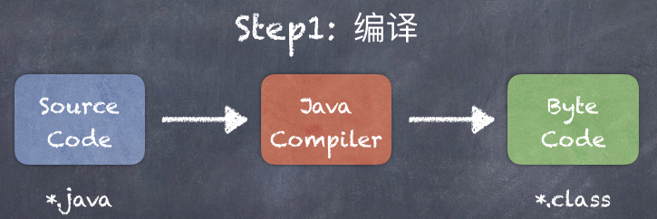

Java Compiler 即是我们在安装 JDK 的时候，自带的编译工具，我们可以使用 javac 来进行调用：

```bash
javac FinalMain.java
```

#### 1.5.2 运行

编译产生的 Java 字节码，是和操作系统无关的，我们可以在任意操作系统运行，前提是这个系统安装了 Java 运行环境（ JRE ，`Java Runtime Environment`），JRE 中有一个组件叫 Java 虚拟机（ JVM ，`Java Virtual Machine` ），会将 Java 字节码转换为当前操作系统的原生代码，而这个原生代码是可以被当前操作系统理解并直接执行的代码。


> JVM 正是 Java程序无需安装、跨平台的原因，这是 Java 程序最大的特点之一。

可以通过如下指令来执行字节码：

```shell
java com.thinkaboutai.Main
```

## 2. 数据类型

### 2.1 变量与常量

我们可以使用变量来在内存中临时保存数据。

```java
// 数据类型 变量名;
// 数据类型 变量名 = 值;

// 一行声明多个变量（不建议）
// 数据类型 变量名1,变量名2...;
public static void main(String[] args) {
  int age = 40;
  int anotherAge = age;
  System.out.println(age);
  System.out.println(anotherAge);
}
```

> 变量的命名规则需遵循驼峰命名法

常量，即不能修改的变量，需使用 `final` 进行修饰

```java
final String SLOGAN = "Think about AI";
```

### 2.2. 数据类型

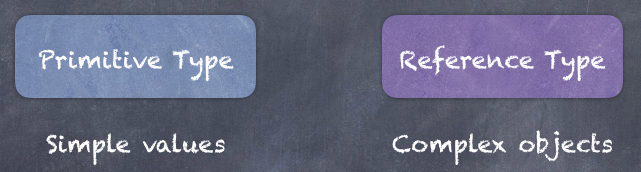

#### 2.2.1 值类型数据

| Type    | Bytes | Range         |
| ------- | ----- | ------------- |
| byte    | 1     | [ -128, 127 ] |
| short   | 2     | [ -32k, 32k ] |
| int     | 4     | [ -2b, 2b ]   |
| long    | 8     |               |
| float   | 4     |               |
| double  | 8     |               |
| char    | 2     | a, b, c...... |
| boolean | 1     | true / false  |

 ```java
    public static void main(String[] args) {
        byte age = 40;
        int score = 95;
        long views = 3_000_000_000L;
        float price = 10.45F;
        char c = 'A';
        boolean flag = true;
    }
 ```


#### 2.2.2 引用类型数据

在 Java 中，除开值类型以外的数据类型，都是引用类型数据，用来存储一些较为复杂的数据，例如对象。

```java
    public static void main(String[] args) {
        Date now = new Date();
        System.out.println(now);
        System.out.println(now.getTime());
    }
```

> 区别

1. 值类型在传递的时候，拷贝的是值：

```java
    public static void main(String[] args) {
        int x = 1;
        int y = x;
        x = 2;
        System.out.println(y);
    }
```


每一个变量的值都是独立存储的，因此，修改一个变量的时候，不会影响其它的变量。

2. 引用类型在传递的时候，拷贝的是对象引用的地址：

```java
    public static void main(String[] args) {
        Point p1 = new Point(0, 1);
        Point p2 = p1;
        p1.x = 1;
        System.out.println(p2);
    }
```


当两个变量的值存储的是同一个对象的引用的时候，通过一个变量修改这个对象的值，会影响到引用这个对象的其它变量。

### 2.3 String

字符串就是字符的序列，我们除开可以使用 `new` 来进行实例化以外，还可以使用字符串字面量（ `Literal` ）来进行创建。

```java
String msg = "Hello";
msg = msg + "Java";

// 常用的方法
// startsWith endsWith
// length
// indexOf
// replace
// toLowerCase toUpperCase
// trim
// 
```

> 注意：由于字符串是不可变（ immutable ）对象，因此其方法不会修改原有字符串，都是通过返回值（如有）的方式返回修改以后的字符串

转义字符，用来表示或者转换一些特殊的字符串：

```java
// 使用"\"来转换一些特殊字符
String s = "Hello \"Java";

//其它转义字符
s = "Hello \nJava";
s = "Hello \tJava";
```

### 2.4 Array

我们可以使用数组来保存一系列的列表项

```java
int[] arr = new int[3];
arr[0] = 1;
arr[2] = 2;
System.out.println(Arrays.toString(arr));
```

可以通过下标来访问数组的每一个元素，也可以对其进行赋值。`Arrays` 是 `JDK` 提供的一个用于操作数组的工具类，里面包含了很多常用的数组方法。


还可以使用字面量来对数组直接进行初始化：

```java
int[] arr = {1, 3, 2};
Arrays.sort(arr);
```

### 2.5 表达式

### 2.6 类型转换

#### 2.6.1 隐式转换

Implicit casting，当我们有一个值，需要转换成存储空间更大的类型，转换会自动完成。

```java
short a = 1;
int b = a + 2;
```

隐式转换不会发生数据丢失，是无损转换。

#### 2.6.2 显示转换

Explicit casting，当可以转换的数据类型之间，发生转换成存储空间更小的类型，即为显式转换，显式转换会发生数据丢失。

```java
double x = 1.5;
int y = (int)x + 2;
```

> 显式和隐式转换都只能用于可互相转换的类型之间，例如数字类型之间的互相转换，但字符串不可以转换为数字。

#### 2.6.3 包装类

所有的数字类型都有相应的包装类，提供了方法把字符串转换成对应的数字类型

```java
String s = "1.5";
int num = Integer.parseInt(s) + 2;
```

### 2.7 Math

```java
// round
// ceil floor
// max min
// random
```

### 2.8 数字格式化

```java
// 货币金额
NumberFormat format = NumberFormat.getCurrencyInstance();
String res = format.format(12345.678);

// 百分比
format = NumberFormat.getPercentInstance();
format.setMinimumFractionDigits(2);
res = format.format(.12345);
```

### 2.9 Scanner

```java
Scanner scanner = new Scanner(System.in);
System.out.print("Name:");
String s = scanner.nextLine().trim();
System.out.println("Your name is " + s);
```

### 2.10 Project 贷款计算器

需求：输入贷款金额、贷款年利率、贷款时长（年），输出月还款金额。
$$
M = P[i(1+i)^n]/[(1+i)^n -1]
$$
M：月还款金额

P：总贷款金额

i：月利率

n：总还款月份


参考：

```java
final byte MONTHS_IN_YEAR = 12;
final byte PERCENT = 100;
Scanner scanner = new Scanner(System.in);

System.out.print("Principal:");
int principal = scanner.nextInt();

System.out.print("Rate:");
float rate = scanner.nextFloat();
float monthlyRate = rate / PERCENT / MONTHS_IN_YEAR;

System.out.print("Period(Years):");
byte years = scanner.nextByte();
int numOfPayments = years * MONTHS_IN_YEAR;

double temp = Math.pow(1 + monthlyRate, numOfPayments);
double mortgage = principal * monthlyRate * temp / (temp - 1);

String formatted = NumberFormat.getCurrencyInstance().format(mortgage);
System.out.println("Mortgage:" + formatted);
```

## 3. 流程控制

### 3.1 比较运算符

顾名思义，是用来比较两个值的，表达式将得到一个布尔值。

```java
// == !=
// < <=
// > >=
```

### 3.2 逻辑操作符

逻辑操作符可以用来组合多个布尔值或布尔表达式

```java
// && 逻辑与 表示两者同时满足
// || 逻辑或 表示两者满足其一即可
// ! 取反
int age = 35;
boolean isMiddle = age >= 20 && age <=50;
```


### 3.3 条件判断

条件判断可以构建基于某些因素来作出决策的程序。

#### 3.3.1 if-else

```java
// 温度高于 30 度，热天
// 温度介于 20 ～ 30 之间，好天气
// 否则 冷天
```

> 简化版条件判断

```java
boolean flag = false;
if(condition)
  flag = true;

boolean flag = (condition);
```

#### 3.3.2 三元表达式

```java
// 语法格式

(条件表达式) ? value1 : value2
```

三元表达式在大部分时候，可以替代 `if-else` 的语法结构

#### 3.3.3 switch

```java
switch(变量) {
  case 值1:
    // code 
    break;
  case 值2:
    // code 
    break;
  //...
  default:
    //code
}
```

#### 3.3.4 练习

```java
// 输入一个数字
// 输出：
// 如可以被 5 整除，输出 fizz
// 如可以被 3 整除，输出 buzz
// 如可以同时被 3 和 5 整除，输出fizzBuzz
// 其余情况，输出原始数字本身
```

### 3.4 循环

当需要重复执行某些任务的时候，可以使用循环语法结构。

#### 3.4.1 for

```java
for (int i = 0; i < 5; i++) {
  //code ...
}
```

`for`循环最大的特点在于语法结构中自带一个循环变量用来控制循环的次数。

#### 3.4.2 while

当不知道确切的循环次数时，可以使用`while`循环。

```java
while (循环条件) {
  //code ...
}
```

> 练习：当用户输入quit的时候，程序退出，而当用户输入其它字符串的时候，在控制台重复输出用户输入的内容。

#### 3.4.3 do-while

`do-while`非常类似`while`，但至少执行一次。

```java
do {
  //code ...
} while (循环条件)
```

#### 3.4.4 break & continue

`break`用来跳出当前循环结构，`continue`用来忽略当前循环单元剩余的逻辑，而继续下一次循环单元。

#### 3.4.5 for-each

与`for`比较而言，`for-each`无法获取到循环变量，但是书写更简洁。

> 练习：Project 贷款计算器

需求：输入贷款金额、贷款年利率、贷款时长（年），输出月还款金额。当用户的输入不满足下述条件时，给出相应的提示，并要求用户重新输入：

- 贷款金额：1,000 ～ 1,000,000
- 贷款年利率：1 ～ 5
- 贷款时长：1 ～ 30

$$
M = P[i(1+i)^n]/[(1+i)^n -1]
$$

- P：贷款金额
- i：月利率
- n：总还款月份

```java
final byte MONTHS_IN_YEAR = 12;
final byte PERCENT = 100;
Scanner scanner = new Scanner(System.in);

int principal = 0;
float monthlyRate = 0;
int numOfPayments = 0;

while (true) {
	System.out.print("Principal:");
	principal = scanner.nextInt();
  if (principal >= 1000 && principal <= 1_000_000)
    break;
  System.out.println("贷款金额必须在1000到10万之间。");
}

while (true) {
  System.out.print("Rate:");
  float rate = scanner.nextFloat();
  if (rate >= 1 && rate <= 5) {
  	monthlyRate = rate / PERCENT / MONTHS_IN_YEAR;
    break;
  }
  System.out.println("贷款年利率必须在1到5之间。");
}

while (true) {
  System.out.print("Period(Years):");
  byte years = scanner.nextByte();
  if (years >= 1 && years <= 30) {
  	numOfPayments = years * MONTHS_IN_YEAR;
    break;
  }
  System.out.println("贷款时长必须在1到30之间。");
}

double temp = Math.pow(1 + monthlyRate, numOfPayments);
double mortgage = principal * monthlyRate * temp / (temp - 1);

String formatted = NumberFormat.getCurrencyInstance().format(mortgage);
System.out.println("Mortgage:" + formatted);
```

## 4. 代码重构

当我们的项目代码量越来越大的时候，如果按照之前的方式记流水账的话，整个项目就会像一个无序、凌乱的房间。

为了解决这个问题，我们会将所有代码分割成不同的“块”，这些小的不同的代码模块将会变得更清洁和更容易阅读，并且，在将来，我们可以更容易的重用其中的某些代码模块。这即是编程中经常用到的模块化编程思想。使用这种思想编写的代码更容易维护，也更容易扩展。

在重构代码之前，首先我们要学会如何定义方法。

### 4.1 方法

一个健康的方法，代码应该在5 ～10行之间，最多也不应超过20行。

```java
// 方法修饰符 返回类型 方法名(参数列表){
		//方法逻辑
//}
```

示例：

```java
public class Main {

    public static void main(String[] args) {
        greeting("Jack");
    }
  
    public static void greeting(String name) {
        System.out.println("Hello " + name);
    }

}
```

有返回值的方法：

```java
public class Main {

    public static void main(String[] args) {
        String msg = greeting("Michael", "Jordan");
        System.out.println(msg);
    }

    public static String greeting(String firstName, String lastName) {
        return "Hello " + firstName + " " + lastName;
    }

}
```

### 4.2 Refactor

Refactor：重构，在编程中指的是改变代码的结构，而不改变代码的行为或结果。

在重构的时候，我们着重思考如下两个问题：

- 哪些代码表达的概念是一致的，且高度关联的（这些代码总是或者必须在一起才能完成某项工作）。
- 代码中的“重复模式”

针对问题1，我们可以抽取月还款金额逻辑为单独的一个方法：

```java
public static double calculateMortgage(int principal, float rate, byte years) {
  float monthlyRate = rate / PERCENT / MONTHS_IN_YEAR;
  float numOfPayments = years * MONTHS_IN_YEAR;
  double temp = Math.pow(1 + monthlyRate, numOfPayments);
  return principal * monthlyRate * temp / (temp - 1);
}
```

针对问题2，我们可以抽取获取输入数字的方法：

```java
public static double readNumber(String prompt, double min, double max) {
  Scanner scanner = new Scanner(System.in);
  double value;
  while (true) {
    System.out.print(prompt);
    value = scanner.nextDouble();
    if (value >= min && value <= max)
      break;
    System.out.println("输入的数字必须在" + min + "到" + max + "之间。");
  }
  return value;
}
```

重构后的主方法：

```java
final static byte MONTHS_IN_YEAR = 12;
final static byte PERCENT = 100;

public static void main(String[] args) {
  int principal = (int) readNumber("Principal:", 1000, 1_000_000);
  float rate = (float) readNumber("Rate:", 1, 5);
  byte years = (byte) readNumber("Period(Years):", 1, 30);

  double mortgage = calculateMortgage(principal, rate, years);

  String formatted = NumberFormat.getCurrencyInstance().format(mortgage);
  System.out.println("Mortgage:" + formatted);
}
```

> 扩展练习：在上述计算月还款金额的基础上，输出每月应还款金额后，再追加输出每月剩余的还款金额

$$
B = L[(1+c)^n-(1+c)^p]/[(1+c)^n -1]
$$

- L - 总贷款金额
- c - 月利率
- n - 总还款月份
- p - 已还款月份

示例：

```java
public static double calculateBalance(int principal, float rate, byte years, int numberOfPaymentsMade) {
  float monthlyRate = rate / PERCENT / MONTHS_IN_YEAR;
  float numberOfPayments = years * MONTHS_IN_YEAR;

  double temp1 = Math.pow(1 + monthlyRate, numberOfPayments);
  double temp2 = Math.pow(1 + monthlyRate, numberOfPaymentsMade);
  return principal * (temp1 - temp2) / (temp1 - 1);
}
```

main

```java
public static void main(String[] args) {
  int principal = (int) readNumber("Principal:", 1000, 1_000_000);
  float rate = (float) readNumber("Rate:", 1, 5);
  byte years = (byte) readNumber("Period(Years):", 1, 30);

  System.out.println();
  System.out.println("MORTGAGE");
  System.out.println("--------");
  double mortgage = calculateMortgage(principal, rate, years);
  String formatted = NumberFormat.getCurrencyInstance().format(mortgage);
  System.out.println("Mortgage:" + formatted);

  System.out.println();
  System.out.println("BALANCE");
  System.out.println("-------");
  for (int month = 1; month <= years * 12; month++) {
    double balance = calculateBalance(principal, rate, years, month);
    System.out.println(NumberFormat.getCurrencyInstance().format(balance));
  }
}
```

上述main方法可以继续优化吗？

## 5. 调试与部署

### 5.1 错误类型

- 编译时错误：即语法错误。

  ```java
  // 定义变量忘记声明类型
  // 每行末尾没有添加分号断句
  // 调用方法没有小括号
  // 使用字符串没有用双引号，或使用单引号定义字符串常量
  // 拼写错误
  // 在定义变量的时候使用了关键字或保留字
  // 条件判断时使用“=”来判断是否相等
  ```

- 运行时错误：运行时才发生的错误

  ```java
  // google & baidu
  // debugger
  // >> step over
  // >> step into
  // >> step out
  // >> resume
  // >> Frames
  
  
  public class Main {
  
      public static void main(String[] args) {
          System.out.println("Start"); // break point
          printNumbers(4);
          System.out.println("Finish");
      }
  
      private static void printNumbers(int num) {
          for (int i = 0; i < num; i += 2)
              System.out.println(i);
      }
  
  }
  ```

### 5.2 部署

1. 创建`artifacts`：File -> Project Structure - > Artifacts

2. `Build Artifacts`

3. 运行

   ```shell
   java -jar Xxx.jar
   ```


# Java Part2 - OOP

## 1. 简介

在计算机科学中，有许多编程范式（编程风格、编程模型）：函数式编程、面向对象编程、事件驱动编程、面向切面编程等等。其中以`函数式编程`和`面向对象编程`最为流行。

在面向对象编程中，所有的一切都是基于对象的概念，这些对象单元包含了如下一些要素：

- Data（State）：数据、状态
- Methods（Behavior）：用来操作数据的方法，即行为

> 在函数式编程中，数据和方法是互相独立的

OOP的好处：

- 降低程序复杂度（把一个大程序拆分成不同的小对象）
- 易于维护（在面向过程编程中，程序最后会演变成一大堆方法的各种组织形式）
- 利于代码重用
- 更快速的开发过程

## 2. Class

### 2.1 类与对象

- class：blueprint（蓝图），是用来创建对象的模版、图纸
- object：是类的某个实例（instance）

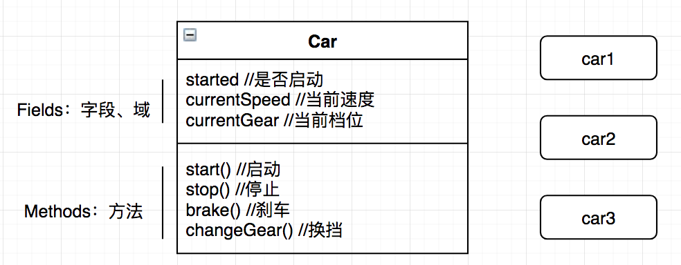

> 描述以下class：TV、文本输入框

创建类

```java
public class TextBox {

    public String text;

    public void setText(String text){
        this.text = text;
    }

    public void clear(){
        text = "";
    }

}
```

创建对象

```java
public class Main {

    public static void main(String[] args) {
//        TextBox tb1 = new TextBox();
      // 类型推断
        var tb1 = new TextBox();
        tb1.setText("abcd");
        System.out.println(tb1.text);

        var tb2 = new TextBox();
        tb2.setText("xyz");
        System.out.println(tb2.text);
    }

}
```

### 2.2 内存分配

```java
// 基本数据类型
var x = 1;
var tb = new TextBox();
```

`Java`通过内存来存储和管理数据，并将其划分为两个区域：

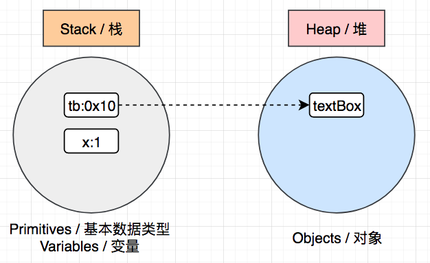

- 基本数据类型：存储在栈这个区域

- 引用数据类型：首先计算赋值表达式的右值，也即是对象，将其保存在堆这个区域，并且得到一个内存地址（引用，例如0x10），然后将这个内存地址通过一个变量，也即赋值表达式的左值（例如tb），保存在栈这个区域。tb这个变量通过内存地址引用了保存在内存堆中的一个对象，这就是我们为什么称之为引用类型数据的原因。

```java
var tb1 = new TextBox();
tb1.setText("Hello");
// tb1和tb2都指向内存中的同一个对象
var tb2 = tb1;
System.out.println(tb2.text); // Hello
```

> `Java`不同于 `C/C++`，它不需要通过编码释放内存，当我们执行完一个代码块，其中保存在栈区域的变量都会被移除掉。同时，后台还会有一个进程（`Garbage Collection`，简称`GC`，即垃圾回收器），随时监控堆区域，如果堆区域的对象没有被引用，那么它们也会在某个时间点被自动释放掉。

### 2.3 面向过程编程

计算员工工资：

```java
public class Main {

    public static void main(String[] args) {
        int baseSalary = 10_000;
        int extraHours = 10;
        int hourlyRate = 20;
        int wage = calculateWage(baseSalary, extraHours, hourlyRate);
        System.out.println(wage);
    }

    private static int calculateWage(int baseSalary, int extraHours, int hourlyRate) {
        return baseSalary + extraHours * hourlyRate;
    }

}
```

上述代码有哪些问题？

> 方法链的复杂度问题

### 2.4 封装（OOP 原则1）

封装，即把数据和操作数据的方法，打包到一个单元或者对象中。

```java
public class Employee {

    public int baseSalary;
    public int hourlyRate;

    public int calculateWage(int extraHours) {
        return baseSalary + extraHours * hourlyRate;
    }

}
```

减肥后的`Main`

```java
public class Main {

    public static void main(String[] args) {
        var emp1 = new Employee();
        emp1.baseSalary = 10_000;
        emp1.hourlyRate = 20;
        int wage = emp1.calculateWage(10);
        System.out.println(wage);
    }

}
```

### 2.5 Getters & Setters

通过以上手段封装的类，仍然存在以下几个问题需要解决：

- 无法限制用户的`read/write`
- 对用户输入的数据，需要在类的外部单独编写逻辑

为了解决上述问题，我们可以给类的属性配备`Getters & Setters`

```java
public class Employee {

    private int baseSalary;
    private int hourlyRate;

    public int getBaseSalary() {
        return baseSalary;
    }

    public void setBaseSalary(int baseSalary) {
        this.baseSalary = baseSalary;
    }

    public int getHourlyRate() {
        return hourlyRate;
    }

    public void setHourlyRate(int hourlyRate) {
        this.hourlyRate = hourlyRate;
    }

    public int calculateWage(int extraHours) {
        return baseSalary + extraHours * hourlyRate;
    }

}
```

相应的操作方式为：

```java
public static void main(String[] args) {
  var emp1 = new Employee();
  emp1.setBaseSalary(10_000);
  emp1.setHourlyRate(20);
  int wage = emp1.calculateWage(10);
  System.out.println(wage);
}
```


在需要校验的地方添加对应逻辑：

```java
public void setBaseSalary(int baseSalary) {
  if (baseSalary < 0) {
    throw new IllegalArgumentException("不能为负数");
  }
  this.baseSalary = baseSalary;
}
```

### 2.6 抽象（OOP原则2）

抽象，即通过隐藏不必要的细节，来降低复杂度（降低外部调用的复杂度）。

例如：TV的遥控器上有很多按钮来对设备进行相关的操作（换台、调节音量等），我们只需要通过相应的按钮来进行操作，而无需关心具体的实现细节。

因此，抽象就是把一些实现的细节隐藏在类中，而是通过一些接口和方法来对它进行操作即可。

```java
public int calculateWage(int extraHours) {
  return baseSalary + extraHours * hourlyRate;
}
```

对于计算员工的薪酬，在使用`Employee`时，我们无需知道具体的计算公式，只需传递相应的参数和初始化相关状态来调用对应的方法来获取结果即可。

### 2.7 耦合度

在面向对象编程中，耦合度，通俗来说即是不同的类之间的关联度。

例如：你非常依赖手机，日常生活中经常用手机来进行电话、刷抖音、购物，以及其它社交活动，当把手机从你身边拿走的时候，你将会变得非常不适应。在这种场景下，就可以说你和手机之间的耦合度非常高。

如果我们在`A`类中使用了`B`类，那么我们就可以说这两个类之间是有关联的，`A`依赖于`B`。

在面向对象编程中，类和类之间总是有关联的，如果修改一个类，那么相应的使用它的其它类也需要相应的做出调整，为了降低修改带来的影响，在`OOP`中，我们的目标之一就是要尽量在类与类之间解藕，也即是降低类之间的关联度。

`Employee`和`Main`在哪些地方体现了耦合度呢？

在`OOP`编程中，使用多个类协作来完成一个任务，类与类之间总会多少存在一定的耦合度，零耦合度的类是几乎不存在的。一个类对外公布的接口或者方法越多，耦合点也就可能越多，因此我们应该尽可能对外少公布这些内容，而把实现的细节隐藏在类当中。

```java 
public class Browser {

    public void navigate(String address){
        String ip = findIpAddress(address);
        String html = sendHttpRequest(ip);
        System.out.println(html);
    }

    private String sendHttpRequest(String ip) {
        return "<html>...</html>";
    }

    private String findIpAddress(String address) {
        return "127.0.0.1";
    }

}
```

Main

```java
public static void main(String[] args) {
  var browser = new Browser();
  browser.navigate("www.baidu.com");
}
```

从上述案例中，我们可以总结出以下几个特点：

- 只有`navigate`方法声明为公共的（`public`），其它方法都是私有的（`private`），因此外部只能访问这个公共的方法，其它具体的执行细节外部无需知道，也不应访问。
- 当私有的方法中，执行细节发生改变时，例如参数发生变化，在入口类的调用不会受到任何影响。
- `Browser`这个封装好的类，对外的耦合点仅有`navigate`这个声明为公共的方法。

### 2.8 构造器

在之前的计算员工薪酬的案例中，我们考虑如下一种特殊的情况：

```java
public static void main(String[] args) {
  var emp1 = new Employee();
  //emp1.setBaseSalary(10_000);
  //emp1.setHourlyRate(20);
  int wage = emp1.calculateWage(10);
  System.out.println(wage);
}
```

如果在使用的时候，忘记对两个属性进行相关的初始化，那么程序运行将会出现错误。

> 我们不能寄希望于用户，或者调用该程序的一方，按我们假定的正确流程来使用程序或者调用代码

我们应该尽量让接口变得简单明了，具体如何实现呢？在类的初始化这一方面，可以使用`constructor`（构造器）。

```java
var emp = new Employee();
```

构造器是一个类中的特殊方法，是用来构造和创建一个新对象的。在上述代码中，我们并没有创建`Employee()`这个方法，是`JVM`在运行时为我们自动创建的一个无参构造器（又称为默认构造器）。由于没有参数，所以类中的属性在初始化时将会设置为默认值：

- 数字初始化为`0`
- 布尔类型初始化为`false`
- 引用类型初始化为`null`

我们可以定义有参构造器来对属性进行初始化：

```java
// 方式1
public Employee(int baseSalary, int hourlyRate) {
  this.baseSalary = baseSalary;
  this.hourlyRate = hourlyRate;
}

// 方式2
public Employee(int baseSalary, int hourlyRate) {
  setBaseSalary(baseSalary);
  setHourlyRate(hourlyRate);
}
```


> 基于抽象的原则，2个`Setter`可以声明为`private`，以此来降低耦合度。

构造器具备如下特点：

- 方法名与类名完全一致
- 方法没有显式的返回值
- 一旦定义了有参构造器，`JVM`将不会创建无参构造器（默认构造器）

### 2.9 方法重载

`Method Overloading`，即创建不同实现逻辑、不同参数的同名方法，体现为“方法名一致，而参数不一致”

```java
public int calculateWage(int extraHours) {
  return baseSalary + extraHours * hourlyRate;
}

public int calculateWage() {
  // return baseSalary;
  return calculateWage(0);
}
```

由于构造器本身也是一个特殊的方法，因此也有重载构在器的语法：

```java
public Employee(int baseSalary, int hourlyRate) {
  setBaseSalary(baseSalary);
  setHourlyRate(hourlyRate);
}

public Employee(int baseSalary) {
  // setBaseSalary(baseSalary);
  // setHourlyRate(0);
  this(baseSalary, 0);
}
```

`this`用来指代当前对象，加一对括号即可以调用当前类的构造器方法。

### 2.10 静态成员

在`OOP`中，一个类可以有两种类型的成员：

- 实例成员
- 静态成员

例如在`Employee`这个类中，我们可以通过一个变量来反应所有员工的数量：

```java
public static int numberOfEmployees;

public Employee(int baseSalary, int hourlyRate) {
  setBaseSalary(baseSalary);
  setHourlyRate(hourlyRate);
  numberOfEmployees++;
}
```

Main

```java
public static void main(String[] args) {
  var e1 = new Employee(10_000);
  System.out.println(Employee.numberOfEmployees);
}
```

当这个属性独立与这个类的所有对象时，我们就可以使用静态属性的方式来定义它，静态属性可以被这个类的所有实例共享，可以直接使用`类名.属性名`进行访问。

同样，也可以定义静态方法：

```java
public static void printNumberOfEmployees(){
  System.out.println(numberOfEmployees);
}
// Employee.printNumberOfEmployees();
```

在静态方法中，只能访问静态成员，而不能访问实例成员（因为它们是属于某个对象实例的）。


> Q1：如何理解类和对象

【下定义】类是关于一系列相似对象的概括描述，描述它们共有的状态、行为，通过这种共性的定义，我们可以重构出许许多多类似的对象。

而对象，即是根据上述类的定义，“克隆”产生的相关实例，这些实例往往在某些属性或行为上是类似但有细节不同的，比如都有姓名，但具体的名字不同。

【组成】类大体包含两种要素，我们统称为成员：

- 成员变量：体现为属性、状态、数据
- 成员方法：体现为函数或方法，或者做某件事情的能力

【关系】类与对象之间的关系：当我们依照类A创建了a1实例的时候，我们可以说 a1 is a member of A

> Q2:如何理解封装和抽象

封装（动词），既可以用于封装类型，也可以用于封装方法。

在封装类型的时候，即是把这个类型的2要素（成员变量和方法）包装到一个单元（class 文件）里面

在封装方法的时候，即是把专注做“某件事情”（执行某一个特定算法）的代码段用方法体包含起来

在封装的时候，要用“抽象”这种思维能力，做到关注主要的（所有实例共有的），忽略次要的（特别的，只有某些特殊实例才具备的）。

抽象还体现在，当我们使用一个类型的实例的时候，在调用其方法时，只需要关注有哪些入参，可以得到什么返回，而无需关注内部的具体实现方式或细节


> 综合练习：用OOP的方式实现学员管理系统

1. 进入系统的时候，显示菜单项

   ```shell
   # 1 显示学员列表信息
   # 2 录入学员信息
   # 3	修改学员信息
   # 4 删除学员信息
   # 0 退出系统
   ```

2. 在系统中根据不同菜单的要求，实现学员信息的列表展示、学员详细信息的查看、根据id展示学员信息、录入学员信息、根据id删除某位学员信息

3. 进入一级菜单项之后，要求二级菜单的设计能满足基本功能实现，可自行合理化设计，流程的设计做到基本人性化，基本满足常规要求即可

   ```shell
   # 例如 当用户选择2 录入学员信息 的时候，逐项提示用户输入学员各个属性值，在后台进行保存，当单个学员信息录入完毕后，按照惯例显示学员列表信息（也可通过展示菜单询问用户是否继续录入）
   ```

   

## 3. 重构 - 房贷计算器

在`Java Part1`中的房贷计算，是基于面向过程的方式编写的，具有如下特点：

- 所有的逻辑集中在`Main`中
- 方法调用方法，且互相之间的关联度较低。

在接下来的章节中，我们将使用`OOP`的方式来对其进行重构。

```java
package com.thinkaboutai;

import java.text.NumberFormat;
import java.util.Scanner;

public class Main {

    final static byte MONTHS_IN_YEAR = 12;
    final static byte PERCENT = 100;

    public static void main(String[] args) {
        int principal = (int) readNumber("Principal:", 1000, 1_000_000);
        float rate = (float) readNumber("Rate:", 1, 5);
        byte years = (byte) readNumber("Period(Years):", 1, 30);

        printMortgage(principal, rate, years);

        printPaymentSchedule(principal, rate, years);
    }

    private static void printMortgage(int principal, float rate, byte years) {
        double mortgage = calculateMortgage(principal, rate, years);
        String formatted = NumberFormat.getCurrencyInstance().format(mortgage);
        System.out.println();
        System.out.println("MORTGAGE");
        System.out.println("--------");
        System.out.println("Mortgage:" + formatted);
    }

    private static void printPaymentSchedule(int principal, float rate, byte years) {
        System.out.println();
        System.out.println("Payment Schedule");
        System.out.println("-------");
        for (int month = 1; month <= years * MONTHS_IN_YEAR; month++) {
            double balance = calculateBalance(principal, rate, years, month);
            System.out.println(NumberFormat.getCurrencyInstance().format(balance));
        }
    }

    public static double readNumber(String prompt, double min, double max) {
        Scanner scanner = new Scanner(System.in);
        double value;
        while (true) {
            System.out.print(prompt);
            value = scanner.nextFloat();
            if (value >= min && value <= max)
                break;
            System.out.println("输入的数字必须在" + min + "到" + max + "之间。");
        }
        return value;
    }

    public static double calculateMortgage(int principal, float rate, byte years) {
        float monthlyRate = rate / PERCENT / MONTHS_IN_YEAR;
        float numOfPayments = years * MONTHS_IN_YEAR;
        double temp = Math.pow(1 + monthlyRate, numOfPayments);
        return principal * monthlyRate * temp / (temp - 1);
    }

    public static double calculateBalance(int principal, float rate, byte years, int numberOfPaymentsMade) {
        float monthlyRate = rate / PERCENT / MONTHS_IN_YEAR;
        float numberOfPayments = years * MONTHS_IN_YEAR;

        double temp1 = Math.pow(1 + monthlyRate, numberOfPayments);
        double temp2 = Math.pow(1 + monthlyRate, numberOfPaymentsMade);
        return principal * (temp1 - temp2) / (temp1 - 1);
    }

}

```


### 3.1 封装class

首要解决的问题是，我们应该封装哪些类？要回答这个问题，我们应该考虑到的是，在这个问题中，涉及到的哪些内容或者责任。

例如：在一个餐厅中，有不同的角色组合在一起来提供各种不同的服务，每个人都有相应的岗位和职责，比如厨师、服务员和收银员等。这些人或者服务都可以说是对象。

为此，我们应该封装出一些类描述这些对象，每个类都应该担当`单一和独立的责任`。依据这些特定的责任，我们可以尝试归纳出以下类：

- Console：负责从控制台读取输入
- MortgageReport：负责生成带有格式的报表
- MortgageCalculator：负责计算房贷相关算法

### 3.2 Console

```java
public class Console {

    private static Scanner scanner = new Scanner(System.in);

    public static double readNumber(String prompt) {
        return scanner.nextDouble();
    }

    public static double readNumber(String prompt, double min, double max) {
        double value;
        while (true) {
            System.out.print(prompt);
            value = scanner.nextDouble();
            if (value >= min && value <= max)
                break;
            System.out.println("输入的数字必须在" + min + "到" + max + "之间。");
        }
        return value;
    }

}
```

### 3.3 MortgageReport

```java
public class MortgageReport {
    public static void printMortgage(int principal, float rate, byte years) {
        double mortgage = MortgageCalculator.calculateMortgage(principal, rate, years);
        String formatted = NumberFormat.getCurrencyInstance().format(mortgage);
        System.out.println();
        System.out.println("MORTGAGE");
        System.out.println("--------");
        System.out.println("Mortgage:" + formatted);
    }

    public static void printPaymentSchedule(int principal, float rate, byte years) {
        System.out.println();
        System.out.println("Payment Schedule");
        System.out.println("-------");
        for (int month = 1; month <= years * Main.MONTHS_IN_YEAR; month++) {
            double balance = MortgageCalculator.calculateBalance(principal, rate, years, month);
            System.out.println(NumberFormat.getCurrencyInstance().format(balance));
        }
    }
}
```

### 3.4 MortgageCalculator

```java
public class MortgageCalculator {

    private int principal;
    private float rate;
    private byte years;

    public MortgageCalculator(int principal, float rate, byte years) {
        this.principal = principal;
        this.rate = rate;
        this.years = years;
    }

    public double calculateMortgage() {
        float monthlyRate = rate / Main.PERCENT / Main.MONTHS_IN_YEAR;
        float numOfPayments = years * Main.MONTHS_IN_YEAR;
        double temp = Math.pow(1 + monthlyRate, numOfPayments);
        return principal * monthlyRate * temp / (temp - 1);
    }

    public double calculateBalance(int numberOfPaymentsMade) {
        float monthlyRate = rate / Main.PERCENT / Main.MONTHS_IN_YEAR;
        float numberOfPayments = years * Main.MONTHS_IN_YEAR;

        double temp1 = Math.pow(1 + monthlyRate, numberOfPayments);
        double temp2 = Math.pow(1 + monthlyRate, numberOfPaymentsMade);
        return principal * (temp1 - temp2) / (temp1 - 1);
    }
}
```

### 3.5 去静态化

由于`MortgageCalculator`的方法为实例方法，因此，`MortgageReport`需要作出相应调整：

```java
public class MortgageReport {

    private MortgageCalculator calculator;

    public MortgageReport(MortgageCalculator calculator) {
        this.calculator = calculator;
    }

    public void printPaymentSchedule() {
        System.out.println();
        System.out.println("Payment Schedule");
        System.out.println("-------");
        for (int month = 1; month <= calculator.getYears() * Main.MONTHS_IN_YEAR; month++) {
            double balance = calculator.calculateBalance(month);
            System.out.println(NumberFormat.getCurrencyInstance().format(balance));
        }
    }

    public void printMortgage() {
        double mortgage = calculator.calculateMortgage();
        String formatted = NumberFormat.getCurrencyInstance().format(mortgage);
        System.out.println();
        System.out.println("MORTGAGE");
        System.out.println("--------");
        System.out.println("Mortgage:" + formatted);
    }
}
```

### 3.6 Main

```java
public class Main {

    public static void main(String[] args) {
        int principal = (int) Console.readNumber("Principal:", 1000, 1_000_000);
        float rate = (float) Console.readNumber("Rate:", 1, 5);
        byte years = (byte) Console.readNumber("Period(Years):", 1, 30);

        var calculator = new MortgageCalculator(principal, rate, years);

        var report = new MortgageReport(calculator);
        report.printMortgage();
        report.printPaymentSchedule();
    }

}
```

### 3.7 去除重复逻辑

```java
public class MortgageCalculator {

    final static byte MONTHS_IN_YEAR = 12;
    final static byte PERCENT = 100;

    private int principal;
    private float rate;
    private byte years;

    public MortgageCalculator(int principal, float rate, byte years) {
        this.principal = principal;
        this.rate = rate;
        this.years = years;
    }

    public double calculateMortgage() {
        float monthlyRate = getMonthlyRate();
        float numOfPayments = getNumOfPayments();
        double temp = Math.pow(1 + monthlyRate, numOfPayments);
        return principal * monthlyRate * temp / (temp - 1);
    }

    public double calculateBalance(int numberOfPaymentsMade) {
        float monthlyRate = getMonthlyRate();
        float numberOfPayments = getNumOfPayments();

        double temp1 = Math.pow(1 + monthlyRate, numberOfPayments);
        double temp2 = Math.pow(1 + monthlyRate, numberOfPaymentsMade);
        return principal * (temp1 - temp2) / (temp1 - 1);
    }

    private int getNumOfPayments() {
        return years * MONTHS_IN_YEAR;
    }

    private float getMonthlyRate() {
        return rate / PERCENT / MONTHS_IN_YEAR;
    }

    public byte getYears() {
        return years;
    }

}
```

### 3.8 调整

在`MortgageReport`中，部分逻辑可以调整到`MortgageCalculator`中：

```java
public double[] getRemainingBalance(){
  double[] balances = new double[getNumOfPayments()];
  for (int month = 1; month <= balances.length; month++) 
    balances[month - 1] = calculateBalance(month);

  return balances;
}
```

```java
public void printPaymentSchedule() {
  System.out.println();
  System.out.println("Payment Schedule");
  System.out.println("-------");
  double[] balances = calculator.getRemainingBalance();
  for (double balance : balances) {
    System.out.println(NumberFormat.getCurrencyInstance().format(balance));
  }
}
```

最后，代码中有2处`NumberFormat.getCurrencyInstance()`，我们可以将其变成属性，然后在构造器中进行初始化。

```java
private final NumberFormat currencyInstance;
private MortgageCalculator calculator;

public MortgageReport(MortgageCalculator calculator) {
  this.calculator = calculator;
  currencyInstance = NumberFormat.getCurrencyInstance();
}
```

## 4. 继承（OOP 原则3）

### 4.1 简介

在我们使用`class`来定义对象的时候，我们经常会发现很多对象之间又一些公共、基础的属性或行为，例如：

- 所有的UI控件（输入框、多选、单选、下拉框）都可以禁用，都有宽高
- 哺乳动物，都有身高、体重、血型等

我们在定义这些类的时候，并不想在所有的类中都定义重复的属性或者行为，那么就可以使用继承这种语法来重用代码。

我们可以把这些通用、公共的属性和行为定义在一个类中，这个类成为`父类（parent） / 基类（base） / 超类（super）`，然后在定义`子类（child/sub）`来继承它。

```java
public class UIControl {

    private boolean isEnabled = true;

    public void enable(){
        isEnabled = true;
    }

    public void disable(){
        isEnabled = false;
    }

    public boolean isEnabled() {
        return isEnabled;
    }

}

public class TextBox extends UIControl {

    private String text;

    public void setText(String text) {
        this.text = text;
    }

    public void clear() {
        text = "";
    }

}

public class Main {

    public static void main(String[] args) {
//        var control = new UIControl();
        var control = new TextBox();
        control.disable();
        System.out.println(control.isEnabled());
    }

}
```

> 关于继承语法的补充：

1. 即使父类型的属性被修饰为`private`也不妨碍子类访问它们（因为getter和setter都是`public`的）
2. 所有类型即使没有显式的声明继承某一个类型，默认都是`Object`的子类型

### 4.2 Object

Java 中，所有的类都直接或间接的继承自`Object`。因此我们定义的类自然也从这个父类获得了如下方法：

- hashCode：得到一个整数值，它是基于内存地址运算出来的
- equals：用来比较两个对象是否相等。
- toString：对象的字符串表现形式

```java
public class Main {

    public static void main(String[] args) {
        var box1 = new TextBox();
        var box2 = box1;
        System.out.println(box1.hashCode());
        System.out.println(box2.hashCode());
        System.out.println(box1.equals(box2));
    }

}
```

### 4.3 构造器

在继承的语法中，构造器的使用有如下语法特点：

- 在创建子类实例的时候，首先调用父类构造器，然后调用子类构造器
- 当父类构造器有参数时，子类构造器必须显式（`explicitly`）调用父类这个有参构造器

### 4.4 访问修饰符

|           | 同包 | 子类 | 其它 |
| --------- | ---- | ---- | ---- |
| public    | Y    | Y    | Y    |
| private   | N    | N    | N    |
| protected | Y    | Y    | N    |
| default   | Y    | /    | N    |

### 4.5 方法重写

`Method Overriding`，当子类不满从父类继承的方法时，可以通过方法重写来改变其具体实现方式。

> 方法重载：同名不同参，即方法签名不一样，仅仅只是方法名相同
>
> 方法重写：同名同参，即方法签名一样

```java
public class TextBox extends UIControl {

    private String text;

    public void setText(String text) {
        this.text = text;
    }

    public void clear() {
        text = "";
    }

    @Override
    public String toString() {
        return "TextBox{" +
                "text='" + text + '\'' +
                '}';
    }
}
```

`@Override`，又称为注解，它会告诉编译器，来检查这个方法的签名是否符合方法重写的语法要求。

> 继承：两个类型之间的这种父子关系的描述，需要使用extends关键字 what
>
> 当我们想要复用、重用代码的时候，就“可以”使用继承
>
> 如果 class A extends B，那么B类型中所有的属性和方法都可以被A类型的实例所使用（私有修饰的成员变量和方法除外）

### 4.6 向上转型 & 向下转型

- UpCasting：向上转换成父类类型
- DownCasting：向下转换成子类类型

```java
public class Main {

    public static void main(String[] args) {
        UIControl control = new UIControl(true);
        show(control);
        var box = new TextBox(true, "hello");
        show(box);
    }

    public static void show(UIControl control) {
        // control.setText(); //无法访问
        System.out.println(control);
    }

}
```

由于TextBox继承了父类的所有成员，因此我们可以说：`文本框是UI控件`，两者的关系可以用`is a`来描述：`A textbox is a uicontrol`。

这就是上例中box可以传参成功的原因，在此处，发生了`box`实例向上转型为`UIControl`类型的一个实例。

> 在`show`方法中，输出方法调用的是`TextBox`的`toString`方法，因为在运行时，这个实例仍然是一个`TextBox`的实例。

由于参数是`UIControl`类型，虽然传递的是一个`TextBox`实例，但无法编码访问`TextBox`自身的方法，如果需要访问的话，需要进行向下转型：

```java
    public static void show(UIControl control) {
        var box = (TextBox) control;
        box.setText("Hello world");
        System.out.println(control);
    }
```

但是如果我们向上述方法传递`control`这个实例时，程序运行就会报错，因为并非每一个`UIControl`都是`TextBox`，为了安全起见，可以进行如下检查：

```java
    public static void show(UIControl control) {
        if (control instanceof TextBox) {
            var box = (TextBox) control;
            box.setText("Hello world");
        }
        System.out.println(control);
    }
```

### 4.7 比较对象

```java
public class Point {
    
    private int x;
    private int y;

    public Point(int x, int y) {
        this.x = x;
        this.y = y;
    }
    
}

public class Main {

    public static void main(String[] args) {
        var p1 = new Point(1, 2);
        var p2 = new Point(1, 2);
        System.out.println(p1 == p2);
        System.out.println(p1.equals(p2));
    }

}
```

在上述案例中，由于`==`是根据引用的地址进行比较的，因此得到`false`，而`equals`在默认情况下，也是基于引用的地址进行比较，所以也得到`false`。

为了实现“两者只要坐标值相等，我们就认为两个实例相等”，可以通过以下方式来实现：

```java
    @Override
    public boolean equals(Object o) {
        if (this == o) return true;
        if (!(o instanceof Point)) return false;
        Point point = (Point) o;
        return x == point.x && y == point.y;
    }

    @Override
    public int hashCode() {
        return Objects.hash(x, y);
    }
```

### 4.8 多态（OOP 原则4）

多态，多种形态或形式，即允许一个对象有多种体现形式。

多态，可以理解为一个行为，在不同的条件下，有不同的效果

```java
public class Main {

    public static void main(String[] args) {
        UIControl[] controls = {new TextBox(), new CheckBox()};

        for (var control : controls) {
            control.render();
        }
    }

}

public class UIControl {

    private boolean isEnabled = true;

    public void enable() {
        isEnabled = true;
    }

    public void disable() {
        isEnabled = false;
    }

    public boolean isEnabled() {
        return isEnabled;
    }

    public void render() {
    }

}

public class TextBox extends UIControl {

    @Override
    public void render() {
        System.out.println("Render TextBox");
    }
}

public class CheckBox extends UIControl {

    @Override
    public void render() {
        System.out.println("Render CheckBox");
    }
}
```

### 4.9 抽象类与抽象方法

抽象类，是在我们不想或不能实例化这个类的实例的时候封装的。

例如上例中的`UIControl`:

```java
UIControl[] controls = {new UIControl(), new TextBox(), new CheckBox()};
```

在上面这行代码中，我们不希望实例化`UIControl`这个实例，因为UI控件这本身是一个抽象的概念，具体这个空间是什么样子，应该由某一个具体的子类来定义。

> 因此，抽象类存在的意义，是为了定义一些公共的成员（属性、方法）让子类来继承。起到代码复用的效果。

因此我们可以声明这个类为抽象类：

```java
public abstract class UIControl {

    //...

}
```

当一个类被声明为`abstract`时，这个类是不能使用`new`来创建一个实例的。

同时，我们还可以更进一步声明`render`为抽象方法：

```java
public abstract class UIControl {

    //...

    public abstract void render();

}
```

当一个类中存在抽象方法时，会强制要求所有子类来实现这个方法。（如果这个子类没有实现这些抽象方法，那么这个子类必须也是一个抽象类，不能被实例化）

### 4.10 final修饰符

如果`abstract`修饰一个类，是为了让子类来继承，那么相对的，`final`修饰一个类，表示它是一个最终版，不能被继承。

在`JDK`中有一个典型的例子，就是`String`。在Java中，字符串是不可变（immutable）对象，这意味着我们调用字符串的方法（toUpperCase、replace），或者通过拼串修改其值，得到的总是一个新的字符串实例，它的内存地址已经发生了改变。

将`String`修饰为`final`，是为了防止我们在继承的时候，重写它的方法，而打破上述`JDK`设定好的底层规则，导致程序发生意外。

相类似的，当某一个方法被修饰为`final`时，那么这个方法不能被子类重写。

### 4.11 多根继承

有些高级语言，允许一个子类可以有多个直接父类，但是`Java`设计之初衷，始终坚持为单根继承的语法体系，即一个子类，最多只能有一个直接父类。

## 5. 接口

### 5.1 什么是接口

`Interface`，接口是`Java`语法中最强大，也最为让人迷惑误解的一种语法，在加之从`Java 8`这个版本以来，接口的语法有了一些变化和更新，使得不少程序员对于接口经常使用不当。

> 接口在设计之初，是为了能编写出`松耦合`、`易扩展`、`可测试`的应用程序。

```java
//当在A类中，使用B类时，我们可以说，A依赖B，或者A与B有耦合

//当我们修改B类逻辑时，A类相应的也有很大可能要进行修改

//如果还有其它类依赖A的话，那么将会像多米诺骨牌一样，因为B的一处修改，整个依赖的生态链都会发生蝴蝶效应带来的修改

//即使是B类的修改，A类及其相关类无需修改任何逻辑也能正常运行，但是它们都需要被重新编译、重新部署，这都需要消耗系统资源和时间
```

针对以上场景，是否能有一种语法来降低类与类之间的耦合度，让其耦合度更松散一些（松耦合）呢？

就好比，小车的引擎坏了，只需要更换或者修理引擎就行了，而不需要动其它部件。

之前，我们学习过的`抽象`，即隐藏实现细节，只对外暴露必要的成员，使用`private`这样的修饰符，可以让`A`尽可能少的“认识”`B`，这样就能降低两者之间的耦合度。但这还不够，使用`interface`我们可以更进一步的来降低这种耦合度。

```java
public interface Draggable {
  void drag();
}
```

接口就像是一个类，但是里面一般只定义方法，而且这个方法没有任何实现细节。换句话说，接口只定义它应该做什么。


要解藕`AB`的话，我们只需要在之间定义一个`interface`，当`B`的具体逻辑修改时，`A`将不再会受到影响，因为`A`根本就不了解`B`是如何实现的。这就是所谓的`面向接口编程`。

- interface，主要用来定义应该做什么（what），例如数据压缩、加密解密、排序、查找
- class，主要用来定义具体怎么做（how）

### 5.2 高耦合度案例 - 个税计算

```java
public class TaxCalculator {

    private double income;

    public TaxCalculator(double income) {
        this.income = income;
    }

    public double calculatorTax() {
        return income * 0.3;
    }

}

public class TaxReport {

    private TaxCalculator calculator;

    public TaxReport() {
        calculator = new TaxCalculator(10_000);
    }

    public void show() {
        var tax = calculator.calculatorTax();
        System.out.println(tax);
    }
}
```

这个案例由于`TaxReport`使用了`TaxCalculator`，造成了后者依赖前者，因此存在如下几个问题：

- `TaxCalculator`的构造器或者方法的签名如果发生改变，那么将会导致另一方需要修改代码。
- 即使第一种情况没有发生，但是计算个税的逻辑如果发生了细微调整，那么也会导致使用它的类重新编译。

### 5.3 创建于实现接口

```java
public interface TaxCalculator {

    double calculateTax();
    
}
```

接口中的方法默认是`public`和`abstract`的。

重新修改`TaxCalculator`，使其实现这个接口：

```java
public class TaxCalculatorImpl implements TaxCalculator {

    private double income;

    public TaxCalculatorImpl(double income) {
        this.income = income;
    }

    @Override
    public double calculateTax() {
        return income * 0.3;
    }

}
```

在实现接口时，必须实现接口中定义的所有方法，且方法的签名保持一致。

> 关于接口，还需要我们了解的是，我们可以让一个类在继承一个父类的同时，根据程序的需要，实现一个或者更多个接口。

### 5.4 依赖注入

`Dependency Injection`，又简称`DI`，根据这一原则，我们的类不应该实例化它的依赖。

在`TaxReport`的构造器中，我们不应该自己实例化它的依赖，而只应该使用它，`DI`原则认为，实例化和使用是两件独立的事情，我们应该尽量分离两者。

例如：在餐厅中，厨师和服务员互相之间有依赖关系，但是服务员确定好客户的点膳后，需要厨师来制作膳食，他不应该自己去厨房制作，而只是把点膳的信息传递给厨师；反之，厨师做好膳食以后，需要把膳食递交给服务员，而不应该自己跑去大堂传膳。每个人的职责都是单一且专业的。

那么，在上述案例中，我们需要把实例化`TaxCalculator`的逻辑交给另一个类来完成，比如`Main`，然后传递这个实例给`TaxReport`使用。

> 这个传递依赖的具体实现（实例）给使用者的过程，就称之为依赖注入。

依赖注入有以下3种实现方式：

- 构造器注入
- Setter注入
- 方法注入

#### 5.4.1 构造器注入

```java
public class TaxReport {

    private TaxCalculator calculator;

    public TaxReport(TaxCalculator calculator) {
        this.calculator = calculator;
    }

    public void show() {
        var tax = calculator.calculateTax();
        System.out.println(tax);
    }
}

public class Main {

    public static void main(String[] args) {
        var calculator = new TaxCalculatorImpl(10_000);
        var report = new TaxReport(calculator);
        report.show();
    }
    
}
```

#### 5.4.2 Setter注入

```java
public class TaxReport {

    private TaxCalculator calculator;

    public void setCalculator(TaxCalculator calculator) {
        this.calculator = calculator;
    }

    public void show() {
        var tax = calculator.calculateTax();
        System.out.println(tax);
    }
  
}

public class Main {

    public static void main(String[] args) {
        var calculator = new TaxCalculatorImpl(10_000);
        var report = new TaxReport();
        report.setCalculator(calculator);
        report.show();
    }

}
```

#### 5.4.3 方法注入

```java
public class TaxReport {

    public void show(TaxCalculator calculator) {
        var tax = calculator.calculateTax();
        System.out.println(tax);
    }
  
}

public class Main {

    public static void main(String[] args) {
        var calculator = new TaxCalculatorImpl(10_000);
        var report = new TaxReport();
        report.show(calculator);
    }

}
```

### 5.5 接口隔离原则

将包含很多方法的大接口切割为多个包含少量且必要方法的小接口。

```java
public interface UIWidget {

    void drag();
    void resize();

}

public class Dragger {

    public void drag(UIWidget widget){
        widget.drag();
    }

}
```

当我们修改`resize`方法，例如给它增加参数，虽然`Dragger`没有使用这个方法，但也会导致这个类重新编译。

因此，在这种场景下，我们应该将`drag`方法单独封装到另一个接口去，使之与其它没有必要一起使用的方法隔离开来。

如果有一个场景，我们必须要同时使用两个方法，可以让相关接口形成继承关系来达到代码复用：

```java
public interface Draggable {
    void drag();
}

public interface UIWidget extends Draggable {
    void resize();
}
```

> 与类的单根继承不同，一个接口可以继承多个接口。

### 5.6 Project - MyTube

见项目资源文件夹 `Mytube.zip`

请定义相关接口并调整项目代码，降低`VideoProcessor`与其依赖的耦合度。

### 5.7 接口新语法

- 定义常量
- 静态方法
- 私有方法

### 5.8 接口与抽象类

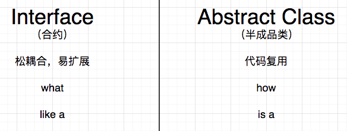

### 5.9 面向接口编程的益处

- 灵活切换实现方式
- 是的程序更容易扩展，同时最小化扩展带来的负面影响
- 更容易进行独立的单元测试


   # Java Part3 - 高级程序设计

## 1. 异常

### 1.1 简介

Exception，异常，就是Java程序中的错误。

```java
public class ExceptionDemo {

    public static void show() {
        sayHello(null);
    }

    public static void sayHello(String name){
        System.out.println(name.toUpperCase());
    }

}

public class Main {

    public static void main(String[] args) {
        ExceptionDemo.show();
    }
}
```

> 异常，就是一个包含了错误信息的对象

在上例中，程序运行时抛出的这个异常，是`java.lang.NullPointerException`这个异常类型的一个实例，控制台的信息包含如下几个方面：

- 异常类型，简要说明（如有）
- 异常发生的具体地点：完整类名、方法名、代码行数

整个异常信息在控制台的输出，我们称之为异常的堆栈跟踪，因为它所显示的方法调用顺序（从下往上），对应到发生时间是刚好是相反的。（堆栈是一种数据结构，往这个结构中新增加的元素，从下至上挨个堆叠起来）

异常发生的细节：

1. 程序运行到第8行的时候，发生错误
2. Java运行环境会在此处寻找是否有处理错误的代码块（暂无），如果此处没有处理错误的代码块，程序则会`throw`（抛出）这个错误给调用方。
3. 如果调用方仍然没有处理错误的代码块，则会一致按照调用链向上追溯，直至追踪到程序的起点（`main`方法）
4. 如果最终都没有找到处理错误的代码块，则程序中断在第8行（也就是异常发生的地点）。

> 我们在编程的时候，应尽量避免异常，或是预测有可能发生的异常，并为之编写适当的处理逻辑

### 1.2 异常类型

#### 1.2.1 受检测异常

`Checked - Exception`，是指程序员“应该”要预测到的异常。

例如，我们编写程序读取一个本地文件，那么文件不存在就会发生异常。

`Java`编译器对于这种异常，强制要求程序员编写逻辑来进行处理。因为这种异常在编译期间就会被检测出来，所以称为受检测异常。

```java
public static void main(String[] args) {
  var reader = new FileReader("readme.md");
}
```

#### 1.2.2 不受检测异常（运行时异常）

`Unchecked - Exception`，也称为`Runtime Exception`，这类异常在编译期间不会被检测出来，只有在程序运行期间才会暴露。

空指针异常就属于典型的运行时异常，这类异常一般是由于程序逻辑不严谨造成的，我们应该从错误的源头来避免它发生。

具体如何避免？

- 反复多次测试
- 凭借良好的编程经验

常见的运行时异常：

```java
// NullPointerException 空指针异常
// IllegalArgumentException 非法参数异常
// IndexOutOfBoundsException 索引越界异常
```

#### 1.2.3 错误

`Error`，程序中出现的致命错误。

```java
// StackOverflowError 堆栈溢出错误
// OutOfMemoryError 内存溢出错误
```

对于这种错误，程序员在错误发生后，也很难挽救，只能在程序执行之前调整参数和逻辑，避免它发生。

### 1.3 异常家族

```java
|- Throwable
	|- Exception
  	|- RuntimeException
  |- Error
```

### 1.4 异常处理

```java
public class ExceptionDemo {

    public static void show() {
        try {
            var reader = new FileReader("readme.md");
            System.out.println("文件已经打开");
        } catch (FileNotFoundException e) {
            e.printStackTrace();
        }
        // System.out.println("文件已经打开");
    }
    
}
```

多异常处理：

```java
public static void show() {
  try {
    var reader = new FileReader("readme.md");
    reader.read();
    System.out.println("文件已经打开");
  } catch (FileNotFoundException e) {
    e.printStackTrace();
  } catch (IOException e) {
    e.printStackTrace();
  }
}
```

### 1.5 finally语句块

```java
public static void show() {
  FileReader reader = null;
  try {
    reader = new FileReader("readme.md");
    var value = reader.read();
    System.out.println("文件已经打开");
  } catch (IOException e) {
    e.printStackTrace();
  } finally {
    if (reader != null) {
      try {
        reader.close();
      } catch (IOException e) {
        e.printStackTrace();
      }
    }
  }
}
```

`finally`语句块无论是否发生异常，始终都会执行。

比上述更优雅的写法：

```java
public static void show() {
  // AutoCloseable
  try (var reader = new FileReader("readme.md")) {
    var value = reader.read();
  } catch (IOException e) {
    e.printStackTrace();
  }
}
```

### 1.6 抛出异常

抛出运行时异常：

我们可以自己设计逻辑，通过手工抛出异常来中断程序。

```java
public class Account {

    public void deposit(float value) {
        if (value <= 0)
            throw new IllegalArgumentException();
    }

}
```

手工抛出异常的这种方式，是一种防御型编程。通过设计逻辑，来防止程序发生较为严重的错误。这种场景，中断程序，比让错误造成严重影响更好。

抛出受检测异常：

```java
public class Account {

    public void deposit(float value) throws FileNotFoundException {
        var reader = new FileReader("xxx.md");
    }

}
```

在方法签名上抛出异常，意味着方法自己不处理，而交给调用方来处理。

> 调用方在调用“声明抛出异常”的方法时，将会收到“这个方法有可能产生异常”的警告，需要做进一步的异常处理。

### 1.7 自定义异常

```java
public class NotEnoughMoneyException extends Exception{

    public NotEnoughMoneyException() {
        super("钱不够");
    }

    public NotEnoughMoneyException(String message) {
        super(message);
    }
}

public class Account {

    private float balance;

    public void withdraw(float value) throws NotEnoughMoneyException {
        if(value > balance)
            throw new NotEnoughMoneyException();
    }

}
```

### 1.8 异常链

有时候我们希望把一些关于某类型错误的一系列具体的异常，封装为更普通的异常，以对他们进行统一处理，这时候就会产生异常链。

例如，账户异常包含余额不足异常、用户名密码错误、账户状态异常（账户锁死）等等：

```java
public class AccountException extends Exception{

    public AccountException(Throwable cause) {
        super(cause);
    }
}

public class Account {

    private float balance;

    public void withdraw(float value) throws AccountException {
        if(value > balance) {
            var e = new NotEnoughMoneyException();
            throw new AccountException(e);
        }
    }

}
```

在这个错误发生的时候，我们可以看到控制台输出的异常堆栈信息中，能清晰呈现什么样的原因（较为具体的异常）造成了什么样的错误（较为普通的异常）。这样，从错误的语义上会让输出的日志更为因果分明，方便程序员后期调试和排查错误。

## 2. 泛型

`Generics`，泛型，是 Java 中一个非常重要的概念，很多 Java 组件都是使用泛型进行封装的，因此掌握什么是泛型、为什么需要泛型，以及如何使用泛型是非常重要的。

### 2.1 Why

```java
public class List {

    private int[] items = new int[8];
    private int count;

    public void add(int item){
        items[count] = item;
    }

    public int get(int index) {
        return items[index];
    }

}

public class Main {

    public static void main(String[] args) {
        var list = new List();
        list.add(2);
    }
    
}
```

上述`List`只能用来存储多个整数，但是如果我们需要存储其它不同的类型（比如用户）呢？我需要封装跟多的`UserList`、`ProductList`等等。

因此这种方式的封装，显然是不太容易扩展，而且会大量出现重复的逻辑。

### 2.2 解决方案

方案1：我们可以把存储数据的类型改为`Object`，因为`Object`是所有引用类型的父类型

```java
public class List {

    private Object[] items = new Object[8];
    private int count;

    public void add(Object item){
        items[count] = item;
    }

    public Object get(int index) {
        return items[index];
    }

}

public class Main {

    public static void main(String[] args) {
        var list = new List();
        list.add(2);
        list.add("Hello");
        list.add(new User());
    }

}
```

但是上述方案不太好的原因在于，当我们需要从这个容器中获取元素时，需要进行类型转换：

```java
int num = (int) list.get(0);
```

上述获取值的时候有如下2点缺陷：

- 代码比较啰嗦
- 容易因为进行错误的类型转换而在运行时出错

方案2：使用泛型

```java
public class GenericList<T> {

    private T[] items = (T[]) new Object[8];
    private int count;
    
    public void add(T item){
        items[count++] = item;
    }
    
    public T get(int index){
        return items[index];
    }

}

public class Main {

    public static void main(String[] args) {
        var list = new GenericList<Integer>();
        list.add(2);
        var num = list.get(0);
    }

}
```

使用泛型后，我们能获得编译时的类型安全（在程序编译期即能检测出来类型是否合乎要求）：

- 在添加元素的时候，能确保只能添加指定类型的元素。
- 在获取元素时，也不再需要强制类型转换了。

### 2.3 装箱与拆箱

泛型参数只能使用引用类型，当我们需要操作基本类型时，需要使用基本类型的封装类型作为泛型参数。

- 装箱：在添加元素的时候，基本类型会自动转换成该类型的封装类
- 拆箱：而在获取的时候，封装类型会自动转换成该类型对应的基本类型

### 2.4 类型约束

```java
public class GenericList<T extends Number> {

    private T[] items = (T[]) new Object[8];
    private int count;

    public void add(T item){
        items[count++] = item;
    }

    public T get(int index){
        return items[index];
    }

}

public class GenericList<T extends Comparable> {

    private T[] items = (T[]) new Object[8];
    private int count;

    public void add(T item){
        items[count++] = item;
    }

    public T get(int index){
        return items[index];
    }

}
```

### 2.5 类型擦除

我们首先单独编译项目：`Build -> Build Project`

然后点击查看`GenericList`的字节码：`View -> Show Bytecode`

类型擦除即，当我们泛型参数时，`JVM`会对具体的类型进行擦除，取决于以下几个情况：

- 单一的泛型参数：类型替换成`Object`
- 单一的类型约束：类型替换成约束类型
- 有多个类型约束：替换成最左边的约束类型

泛型参数只是在编译期间用于对类型进行检测。

### 2.6 Comparable

```java
public class User implements Comparable<User>{

    private String name;
    private int age;

    public User(String name, int age) {
        this.name = name;
        this.age = age;
    }

    @Override
    public int compareTo(User o) {
//        if (age < o.age) return -1;
//        if (age == o.age) return 0;
//        return 1;
        return age - o.age;
    }
}

public class Main {

    public static void main(String[] args) {
        var u1 = new User("a",18);
        var u2 = new User("b",20);

        if (u1.compareTo(u2) < 0 )
            System.out.println("u1 < u2");
    }

}
```

### 2.7 泛型方法

我们还可以在单独的方法上使用泛型：

```java
public class Utils {

    public static <T extends Comparable> T max(T first, T second) {
        return first.compareTo(second) > 0 ? first : second;
    }

}

public class Main {

    public static void main(String[] args) {
        var max = Utils.max(1, 3);
        System.out.println(max);

        var u = Utils.max(new User("a", 18), new User("b", 20));
        System.out.println(u);
    }

}
```

### 2.8 多泛型参数

```java
public class KeyValuePair <K,V> {
    
    private K key;
    private V value;

    public KeyValuePair(K key, V value) {
        this.key = key;
        this.value = value;
    }
}
```

### 2.9 泛型通配符

```java
public class Instructor extends User{
    public Instructor(String name, int age) {
        super(name, age);
    }
}

public class Utils {

    public static <T extends Comparable> T max(T first, T second) {
        return first.compareTo(second) > 0 ? first : second;
    }

    public static void printUsers(GenericList<User> list){
        
    }

}

public class Main {

    public static void main(String[] args) {
        var instructors = new GenericList<Instructor>();
        Utils.printUsers(instructors); // 编译错误
    }

}
```

上述之所以会产生编译错误的原因在于：因为在使用泛型参数的时候，会存在类型擦除，封装了`instructor`的`GenericList`不是封装了`User`的`GenericList`的子类型。（程序中只有`GenericList`这样一个类型）

要解决这个问题，可以使用泛型通配符：

```java
public static void printUsers(GenericList<? extends User> list){
}
```


## 3. 集合框架

### 3.1 简介

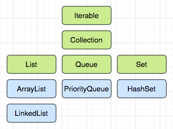

绿色为接口，蓝色为实现类：

`Iterable`：可使用`for-each`进行迭代

`Collection`：常规的集合`CRUD`操作

### 3.2 Iterable

要使用增强版的`for`循环，即`for-each`，必须实现该接口：

```java
public class GenericList<T> implements Iterable<T> {

    private T[] items = (T[]) new Object[8];
    private int count;

    public void add(T item) {
        items[count++] = item;
    }

    public T get(int index) {
        return items[index];
    }

    @Override
    public Iterator<T> iterator() {
        return new ListIterator<>();
    }

    private class ListIterator<T> implements Iterator<T> {

        private int index;

        @Override
        public boolean hasNext() {
            return index < count;
        }

        @Override
        public T next() {
            return (T) items[index++];
        }
    }
}

public class Main {

    public static void main(String[] args) {
        var list = new GenericList<String>();
        list.add("a");
        list.add("b");

        var iterator = list.iterator();
//        while (iterator.hasNext()){
//            var current = iterator.next();
//            System.out.println(current);
//        }
        for (var item : list) {
            System.out.println(item);
        }
    }

}
```

### 3.3 Collection

`Collection`接口包含了操作一个集合的基本动作，即`CRUD`：

```java
public class CollectionsDemo {

    public static void show() {
        Collection<String> collection = new ArrayList<>();
        collection.add("a");
        collection.add("b");
        collection.add("c");
        Collections.addAll(collection, "x", "y", "z");

        for (var item : collection)
            System.out.println(item);

        var arr = collection.toArray(new String[0]);
        System.out.println(arr.length);
        collection.remove("c");
        System.out.println(collection);
        System.out.println(collection.contains("a"));
        collection.clear();
        System.out.println(collection);
        System.out.println(collection.isEmpty());


        Collection<String> other = new ArrayList<>();
        other.addAll(collection);
        System.out.println(collection == other);
        System.out.println(collection.equals(other));
    }

}
```

### 3.4 List

`List`，有序列表，插入的元素是按照放入的顺序排列的，可以根据索引进行访问。

```java
public class ListDemo {

    public static void show() {
        List<String> list = new ArrayList<>();
        list.add("a");
        list.add("b");
        list.add("c");
        list.add(0, "x");
        System.out.println(list.get(0));
        list.set(0, "!");
        System.out.println(list);
        list.remove(0);
        System.out.println(list);
        System.out.println(list.indexOf("c"));
        System.out.println(list.subList(0, 2));
    }

}
```

### 3.5 排序

方案1：使用`Comparable`

```java
public class SortDemo {
    public static void show(){
        List<Customer> list = new ArrayList<>();
        list.add(new Customer("b"));
        list.add(new Customer("c"));
        list.add(new Customer("a"));
        Collections.sort(list);
        System.out.println(list);
    }
}

public class Customer implements Comparable<Customer> {
    private String name;

    public Customer(String name) {
        this.name = name;
    }

    @Override
    public int compareTo(Customer o) {
        return name.compareTo(o.name);
    }

    @Override
    public String toString() {
        return "Customer{" +
                "name='" + name + '\'' +
                '}';
    }
}
```

上述方案不太灵活，主要由于负责比较的逻辑与`Customer`这个类绑定（耦合）在一起，一旦这个类封装好以后，如果比较规则改变（例如按照年龄进行比较），需要重新定义逻辑并且重新编译。

方案2：使用`Comparator`

```java
public class NameComparator implements Comparator<Customer> {
    @Override
    public int compare(Customer o1, Customer o2) {
        return o1.getName().compareTo(o2.getName());
    }
}

public class SortDemo {
    public static void show(){
        List<Customer> list = new ArrayList<>();
        list.add(new Customer("b"));
        list.add(new Customer("c"));
        list.add(new Customer("a"));
        Collections.sort(list, new NameComparator());
        System.out.println(list);
    }
}
```

该方案的好处在于，负责比较的逻辑与实体类的定义是分离的（解藕），我们可以很方便的添加多个负责比较的`Comparator`实现，而无需修改实体类的定义。

### 3.6 Queue

`Queue`，队列，遵循`FIFO`（First In First Out，先进先出原则），常用来处理多任务。

```java
public class QueueDemo {
    public static void show(){
        Queue<String> queue = new ArrayDeque<>();
        queue.add("a");
        queue.add("b");
        queue.offer("c");
        var front = queue.peek();// element()
        System.out.println(front);
        System.out.println(queue);
        front = queue.poll();// remove()
        System.out.println(front);
        System.out.println(queue);
    }
}
```

### 3.7 Set

`Set`，实现该接口的集合不允许有重复元素，且并不保证有序。

```java
public class SetDemo {
    public static void show(){
        Set<String> set = new HashSet<>();
        set.add("sky");
        set.add("is");
        set.add("blue");
        set.add("blue");
        System.out.println(set);

        Collection<String> collection = new ArrayList<>();
        Collections.addAll(collection,"a","b","b");
        set = new HashSet<>(collection);
        System.out.println(set);

        Set<String> s1 = new HashSet<>(Arrays.asList("a","b","c"));
        Set<String> s2 = new HashSet<>(Arrays.asList("b","c","d"));
//        //Union
//        s1.addAll(s2);
//        System.out.println(s1);
//        //Intersection
//        s1.retainAll(s2);
//        System.out.println(s1);
        //Difference
        s1.removeAll(s2);
        System.out.println(s1);
    }
}
```

### 3.8 Map

```java
public class MapDemo {
    public static void main(String[] args) {
        List<Customer> list = new ArrayList<>();
        //O(n) -> O(10)
        for(var customer : list){
            if(customer.getName().equals("xxx"))
                System.out.println("Find!");
        }
    }
}
```

在上述案例中，我们需要从一个集合中查询一个指定姓名的`Customer`对象，如果这个查询的复杂度记为`O(n)`，即如果集合的大小为10，那么耗费的时间为`O(10)`，可以理解为查询所耗费的时间是直接与集合的大小有关的一个结果。

> 上述分析，考虑的是最差的情况，也即是要查询的目标有可能是集合的最后一个元素。

```java
public class MapDemo {
    public static void main(String[] args) {
        var c1 = new Customer("a");
        var c2 = new Customer("b");

        Map<String, Customer> map = new HashMap<>();
        map.put(c1.getName(),c1);
        map.put(c2.getName(),c2);

        var c = map.get("a"); //getOrDefault()
        System.out.println(c);
        var exists = map.containsKey("a");
        System.out.println(exists);
        map.replace("a", new Customer("x"));
        System.out.println(map);

        for(var key : map.keySet()){
            System.out.println(key + ":" +map.get(key));
        }

        for(var entry : map.entrySet()){
            System.out.println(entry.getKey() + ":" + entry.getValue());
        }

        for(var customer : map.values()){
            System.out.println(customer);
        }
    }
}
```


## 4. Lambda表达式 & 函数接口

### 4.1 函数式接口

`Functional Interface`，即只有一个抽象方法的接口。例如`Comparator`、`Comparable`

```java
public interface Printer {
    void print(String msg);
}

public class ConsolePrinter implements Printer {
    @Override
    public void print(String msg) {
        System.out.println(msg);
    }
}

public class LambdasDemo {
    public static void main(String[] args) {
        greet(new ConsolePrinter());
    }

    public static void greet(Printer printer){
        printer.print("Hello world");
    }
}
```

### 4.2 匿名内部类

```java
public class LambdasDemo {
    public static void main(String[] args) {
        greet(new Printer() {
            @Override
            public void print(String msg) {
                System.out.println(msg);
            }
        });
    }

    public static void greet(Printer printer){
        printer.print("Hello world");
    }
}
```

### 4.3 Lambda表达式

`Java8`引进了一个代替上述的更简洁写法，称为`Lambda表达式`

```java
public class LambdasDemo {
    public static void main(String[] args) {
//        greet(msg -> {
//            System.out.println(msg);
//        });
        greet(msg -> System.out.println(msg));
        Printer printer = msg -> System.out.println(msg);
    }

    public static void greet(Printer printer) {
        printer.print("Hello world");
    }
}
```

### 4.4 方法引用

如果在`Lambda表达式`中，我们只是想使用一个方法，可以直接使用方法引用的语法：

```java
public class LambdasDemo {
    
    public LambdasDemo(String msg){
        System.out.println(msg);
    }

    public static void print(String msg){
        System.out.println(msg);
    }

    public void print1(String msg){
        System.out.println(msg);
    }

    public static void main(String[] args) {
        greet(System.out::println);
        greet(LambdasDemo::print);
        var demo = new LambdasDemo("");
        greet(demo::print1);
        greet(LambdasDemo::new);
    }

    public static void greet(Printer printer) {
        printer.print("Hello world");
    }
}
```

### 4.5 内置函数式接口

官方文档：[https://docs.oracle.com/javase/8/docs/api/java/util/function/package-summary.html](https://docs.oracle.com/javase/8/docs/api/java/util/function/package-summary.html)

#### 4.5.1 Consumer

该接口，只接收1个参数，但是没有返回值。

```java
public class ConsumerDemo {
    public static void main(String[] args) {
        List<Integer> list = List.of(1, 2, 3);
//        for (var item : list)
//            System.out.println(item);
        list.forEach(System.out::println);
    }
}
```

消费链：

```java
public class ConsumerDemo {
    public static void main(String[] args) {
        List<String> list = List.of("a", "b", "c");
        Consumer<String> print = item -> System.out.println(item);
        Consumer<String> printUpperCase = item -> System.out.println(item.toUpperCase());
        list.forEach(print.andThen(printUpperCase).andThen(print));
    }
}
```

#### 4.5.2 Supplier

和`Consumer`接口相对的，是`Supplier`接口，它没有参数，但是提供返回值

```java
public class SupplierDemo {
  //DoubleSupplier
    public static void main(String[] args) {
        Supplier<Double> supplier = Math::random;
        var value = supplier.get();
        System.out.println(value);
    }
}
```

#### 4.5.3 Function

```java
// Function<T,R> T-参数类型，R-返回值类型
public class FunctionDemo {
    public static void main(String[] args) {
        Function<String, Integer> fn = String::length;
        var len = fn.apply("Sky is blue");
        System.out.println(len);
    }
}
```

组合函数：

```java
public class FunctionDemo {
    public static void main(String[] args) {
        Function<String, String> fn1 = str -> str.replace(":", "=");
        Function<String, String> fn2 = str -> "{" + str + "}";
        var value = fn1.andThen(fn2).apply("a:b");
        System.out.println(value);
    }
}
```


#### 4.5.4 Predicate

`Predicate<T>`，断言，用来进行逻辑判断，返回布尔值

```java
public class PredicateDemo {
    public static void main(String[] args) {
        Predicate<String> pre = str -> str.length() > 5;
        var value = pre.test("Sky is blue");
        System.out.println(value);
    }
}
```

组合断言

```java
public class PredicateDemo {
    public static void main(String[] args) {
        Predicate<String> pre1 = str -> str.startsWith("{");
        Predicate<String> pre2 = str -> str.endsWith("}");
        var value = pre1.and(pre2).test("{hello}");
        System.out.println(value);
    }
}
```

#### 4.5.5 BinaryOperator

该函数接口主要用来做针对两个参数且有一个返回值的操作：

```java
public class BinaryOperatorDemo {
    public static void main(String[] args) {
        BinaryOperator<Integer> oper = (a, b) -> a + b;
        var value = oper.apply(3, 5);
        System.out.println(value);
    }
}
```

#### 4.5.6 UnaryOperator

该函数接口主要用来做针对一个参数且有一个返回值的操作：

```java
public class UnaryOperatorDemo {
    public static void main(String[] args) {
        UnaryOperator<Integer> op1 = n -> n+1;
        UnaryOperator<Integer> op2 = n -> n*n;
        var value = op1.andThen(op2).apply(2);
        System.out.println(value);
    }
}
```


## 5. Stream

### 5.1 命令式编程 vs 声明式编程

`Stream`主要是用来使用声明式编程来操作集合的，类似于在Java中写查询语句。

`Stream`尝试解决的问题：

```java
public class Movie {
    private String title;
    private int likes;

    public Movie(String title, int likes) {
        this.title = title;
        this.likes = likes;
    }

    public int getLikes() {
        return likes;
    }
}

public class ProblemDemo {
    public static void main(String[] args) {
        List<Movie> movies = List.of(
                new Movie("a", 10),
                new Movie("b", 15),
                new Movie("c", 20)
        );
        int count = 0;
        for (var movie : movies) {
            if (movie.getLikes() > 10)
                count++;
        }
        System.out.println(count);
    }
}
```

- `Imperative Programming`：命令式编程，用具体的指令告诉程序具体怎么做（`how`），在程序中，我们需要明确描述算法。
- `Declarative Programming`：声明式编程，与命令式编程相对立，它描述目标的性质，让程序明白目标，而非流程。（`what`）

使用`Stream`：

```java
public class ProblemDemo {
    public static void main(String[] args) {
        List<Movie> movies = List.of(
                new Movie("a", 10),
                new Movie("b", 15),
                new Movie("c", 20)
        );
        var count = movies.stream()
                .filter(m -> m.getLikes() > 10)
                .count();
        System.out.println(count);
    }
}
```

`movies.stream()`返回的是一个流对象，流，即是我们从集合中有序的获取对象的一种形式，它本身并不存储数据。

就好比我们用水管从水塔中获取水，水塔是具体的集合，它负责保存数据，而水管则是从水塔中获取水源的一种方式。

### 5.2 创建Stream

```java
public class StreamDemo {
    public static void main(String[] args) {
        var list = new ArrayList<Integer>();
        var stream1 = list.stream();

        int[] arr = {1, 2, 3};
        var stream2 = Arrays.stream(arr);
        stream2.forEach(System.out::println);

        var stream3 = Stream.of(1, 2, 3);
      
        var stream4 = Stream.generate(Math::random);
        stream4.limit(4).forEach(System.out::println);

        var stream5 = Stream.iterate(1, n -> n + 1);
        stream5.limit(5).forEach(System.out::println);
    }
}
```

### 5.3 Stream的基本操作

#### 5.3.1 map

转换`Stream`中的数据

```java
public class MapDemo {
    public static void main(String[] args) {
        List<Movie> movies = List.of(
                new Movie("a", 10),
                new Movie("b", 15),
                new Movie("c", 20)
        );
        movies.stream()
                .map(Movie::getTitle)
                .forEach(System.out::println);
    }
}
```

扁平化映射：

```java
public class MapDemo {
    public static void main(String[] args) {
        var stream = Stream.of(List.of(1, 2, 3), List.of(4, 5, 6));
        stream.flatMap(list -> list.stream())
                .forEach(System.out::println);
    }
}
```

#### 5.3.2 filter

旨在用来过滤合乎条件的数据，顾名思义

```java
public class FilterDemo {
    public static void main(String[] args) {
        List<Movie> movies = List.of(
                new Movie("a", 10),
                new Movie("b", 15),
                new Movie("c", 20)
        );
        movies.stream()
                .filter(movie -> movie.getLikes() > 10)
                .forEach(movie -> System.out.println(movie.getTitle()));
    }
}
```

#### 5.3.3 slice

```java
public class SliceDemo {
    public static void main(String[] args) {
        List<Movie> movies = List.of(
                new Movie("a", 10),
                new Movie("b", 15),
                new Movie("c", 20)
        );
        movies.stream()
//                .limit(2)
                .skip(2)
                .forEach(movie -> System.out.println(movie.getTitle()));
    }
}
```

> limit和skip组合使用，可以用来制作分页数据

```java
int pageNum = 3;
int pageSize = 10;
movies.stream()
  .skip((pageNum - 1) * pageSize)
  .limit(pageSize)
  .forEach(movie -> System.out.println(movie.getTitle()))
```

2个与`filter`非常类似的`API`

```java
public static void main(String[] args) {
  List<Movie> movies = List.of(
    new Movie("a", 10),
    new Movie("b", 15),
    new Movie("c", 20)
  );
  movies.stream()
    //.takeWhile(movie -> movie.getLikes() < 15)
    .dropWhile(movie -> movie.getLikes() < 15)
    .forEach(movie -> System.out.println(movie.getTitle()));
}
```

#### 5.3.4 sort

```java
public static void main(String[] args) {
  List<Movie> movies = List.of(
    new Movie("b", 10),
    new Movie("a", 15),
    new Movie("c", 20)
  );
  movies.stream()
    //                .sorted((a,b)->a.getTitle().compareTo(b.getTitle()))
    .sorted(Comparator.comparing(Movie::getTitle).reversed())
    .forEach(movie -> System.out.println(movie.getTitle()));
}
```

#### 5.3.5 其它

去重复

```java
public static void main(String[] args) {
  List<Movie> movies = List.of(
    new Movie("a", 10),
    new Movie("b", 15),
    new Movie("c", 20)
  );
  movies.stream()
    .map(Movie::getLikes)
    .distinct()
    .forEach(System.out::println);
}
```

调试

```java
public static void main(String[] args) {
  List<Movie> movies = List.of(
    new Movie("a", 10),
    new Movie("b", 15),
    new Movie("c", 20)
  );
  movies.stream()
    .filter(movie -> movie.getLikes() < 20)
    .peek(movie -> System.out.println("filter:" + movie.getTitle()))
    .map(Movie::getTitle)
    .peek(title -> System.out.println("map:" + title))
    .forEach(System.out::println);
}
```

### 5.4 从Stream获取答案

- count：获取流中数据的个数
- anyMatch / allMatch / noneMatch：至少有一个匹配 / 全部匹配 / 没有一个匹配 条件
- findFirst / findAny：找到第一个 / 找到任何一个
- max / min：找到最大者 / 最小者

使用`reduce()`统计：

```java
public static void main(String[] args) {
  List<Movie> movies = List.of(
    new Movie("a", 10),
    new Movie("b", 15),
    new Movie("c", 20)
  );
  var sum = movies.stream()
    .map(Movie::getLikes)
    .reduce((a, b) -> a + b);
  System.out.println(sum.orElse(0));
}
```

使用`collect()`收集数据

```java
public static void main(String[] args) {
  List<Movie> movies = List.of(
    new Movie("a", 10),
    new Movie("b", 15),
    new Movie("c", 20)
  );
  var result = movies.stream()
    .filter(movie -> movie.getLikes() < 20)
    //                .collect(Collectors.toList());
    .collect(Collectors.summarizingInt(Movie::getLikes));
  System.out.println(result);
}

public static void main(String[] args) {
  List<Movie> movies = List.of(
    new Movie("a", 10),
    new Movie("b", 15),
    new Movie("c", 20)
  );
  var result = movies.stream()
    .map(Movie::getTitle)
    .collect(Collectors.joining(","));
  System.out.println(result);
}
```

分组

```java
public enum Genre {
    Action,
    War
}

public class Movie {
    private String title;
    private int likes;
    private Genre genre;

    public Movie(String title, int likes, Genre genre) {
        this.title = title;
        this.likes = likes;
        this.genre = genre;
    }

    public Genre getGenre() {
        return genre;
    }

    public String getTitle() {
        return title;
    }


    public int getLikes() {
        return likes;
    }
}


```

```java
public static void main(String[] args) {
  List<Movie> movies = List.of(
    new Movie("a", 10, Genre.Action),
    new Movie("b", 15, Genre.Action),
    new Movie("c", 20, Genre.War)
  );
  var result = movies.stream()
    .collect(Collectors.groupingBy(Movie::getGenre));
}
```

分区操作

```java
public static void main(String[] args) {
  List<Movie> movies = List.of(
    new Movie("a", 10, Genre.Action),
    new Movie("b", 15, Genre.Action),
    new Movie("c", 20, Genre.War)
  );
  var result = movies.stream()
    .collect(Collectors.partitioningBy(movie -> movie.getLikes() > 15));
  System.out.println(result);
}
```

### 5.5 基本类型的Stream操作

```java
IntStream.rangeClosed(1, 5)
                .forEach(System.out::println);
```

## 6. 多线程

### 6.1 简介

现代计算机绝大部分都有多核处理器，使得程序可以并发的执行多个任务。在`Java`中，使用多线程编程，可以使得程序运行速度更快。

### 6.2 进程与线程

- `Process`：进程就是应用程序的一个实例。进程中包含了程序中所需要的所有数据以及相关其它资源，并且占用一定内存空间。操作系统在同一时间可以运行多个进程。（进程级别的并发）
- `Thread`：线程，从技术上来讲，就是由多个指令或操作形成的序列（线程名称的由来），或者说线程就是执行我们所写代码的“主体”。一个进程至少由一个主线程（`main thread`）组成，同时，我们还可以创建更多的线程执行其它的任务。（线程级别的并发）

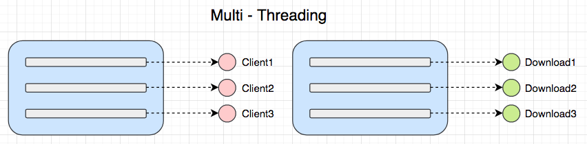

```java
// 获取当前活跃线程数量
System.out.println(Thread.activeCount());
// 获取当前处理器数量
System.out.println(Runtime.getRuntime().availableProcessors());
```

### 6.3 线程基本操作

#### 6.3.1 创建与启动线程

```java
public class DownloadFileTask implements Runnable {
    @Override
    public void run() {
        System.out.println("Download:" + Thread.currentThread().getName());
    }
}

public class ThreadDemo {
    public static void main(String[] args) {
        System.out.println(Thread.currentThread().getName());
        for (int i = 0; i < 3; i++) {
            Thread t0 = new Thread(new DownloadFileTask());
            t0.start();
        }
    }
}
```

#### 6.3.2 暂停线程

```java
public class DownloadFileTask implements Runnable {
    @Override
    public void run() {
        System.out.println("Download:" + Thread.currentThread().getName());
        try {
            Thread.sleep(5000);
        } catch (InterruptedException e) {
            e.printStackTrace();
        }
        System.out.println("Download complete:" + Thread.currentThread().getName());
    }
}
```

- `sleep()`：当前线程进入“睡眠”，它将会挂起（暂停）当前线程，同时使得其它线程有机会使用CPU资源（`processor`）
- 睡眠时间只是“约等于” 5 秒，具体取决于当前操作系统。

> 如果创建的线程数量大于CPU的线程数，情况会如何呢？

在我们的操作系统中，有一个专门的`线程调度器`，它负责给每个线程分配`CPU时间片`，并且在每个线程间进行快速切换，使得每个线程有机会使用`processor`来进行运算，这就造就了“并发”的效果。

#### 6.3.3 join

等待加入

```java
public class ThreadDemo {
    public static void main(String[] args) {
        System.out.println(Thread.currentThread().getName());
        Thread t0 = new Thread(new DownloadFileTask());
        t0.start();
        try {
            t0.join();
        } catch (InterruptedException e) {
            e.printStackTrace();
        }
        System.out.println("下载完毕，可以开始扫描病毒");
    }
}
```

`join()`将会使得当前线程（`main thread`）进入等待状态，直到`t0`线程执行完毕，才能继续往下执行剩余逻辑，在此期间，`main thread`什么都不能做。

#### 6.3.4 interrupt

中断线程

```java
public class DownloadFileTask implements Runnable {
    @Override
    public void run() {
        System.out.println("Download:" + Thread.currentThread().getName());
        for (int i = 0; i < Integer.MAX_VALUE; i++) {
            if (Thread.currentThread().isInterrupted()) return;
            System.out.println("Downloading - " + i);
        }
        System.out.println("Download complete:" + Thread.currentThread().getName());
    }
}

public class ThreadDemo {
    public static void main(String[] args) {
        System.out.println(Thread.currentThread().getName());
        Thread t0 = new Thread(new DownloadFileTask());
        t0.start();
        try {
            Thread.sleep(2000);
        } catch (InterruptedException e) {
            e.printStackTrace();
        }
        t0.interrupt();
    }
}
```

- `interrupt()`并不会强制中断线程，它只是发出一个中断请求，由被中断线程来决定是否应该中断。
- 被中断线程需要持续检查是否收到中断请求，编写相应逻辑进行中断。

### 6.4 并发带来的问题

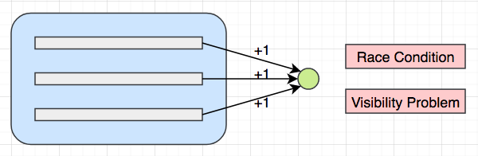

在此前演示的案例中，每个线程都是单独下载自己的文件，这并不会带来任何负面的影响，但是，如果多个线程共同下载同一个文件，便会引发如下问题：

- `Race Condition`：竞争状况。多个线程比赛和竞争，同时想修改同一份数据。
- `Visibility Problem`：可见性一个线程修改了共享数据，但是其修改对其它线程并不可见，导致多个线程针对同一份数据，看到的数据视图是不一样的。

所以，多个线程访问同一个数据，但其中有一个线程想要修改数据，那么以上问题就会出现；如果所有线程只是读取数据，那么这些问题就不存在。

在多个线程访问同一个数据并且想要进行修改时，为了预防以上问题发生，我们就需要编写线程安全的代码（`Thread safe - Code`）来解决并发问题。

> 在`JDK`中，有些类或方法解决了以上并发带来的问题，我们就称之为`线程安全的类`或`线程安全的方法`

### 6.5 竞争状况

```java
public class DownloadStatus {
    private int totalBytes;

    public void incrementTotalBytes(){
        totalBytes++;
    }

    public int getTotalBytes() {
        return totalBytes;
    }
}

public class DownloadFileTask implements Runnable {
    private DownloadStatus status;

    public DownloadFileTask(DownloadStatus status) {
        this.status = status;
    }

    @Override
    public void run() {
        System.out.println("Download:" + Thread.currentThread().getName());
        for (int i = 0; i < 10_000; i++) {
            if (Thread.currentThread().isInterrupted()) return;
            status.incrementTotalBytes();
        }
        System.out.println("Download complete:" + Thread.currentThread().getName());
    }
}

public class ThreadDemo {
    public static void main(String[] args) {
        var status = new DownloadStatus();
        List<Thread> threads = new ArrayList<>();
        for (int i = 0; i < 10; i++) {
            var thread = new Thread(new DownloadFileTask(status));
          	threads.add(thread);
            thread.start();
        }

        for (var thread : threads) {
            try {
                thread.join();
            } catch (InterruptedException e) {
                e.printStackTrace();
            }
        }
        System.out.println(status.getTotalBytes());
    }
}
```

运行该程序以后，我们会观察到最终结果并非是 10 个线程下载的总和，主要原因在于：

```java
public void incrementTotalBytes(){
  totalBytes++;
}
```

在这个方法中，修改状态的代码虽然只有一行，但实际上包含了 3 步操作：

1. 首先从主存储器（`main memory`）把这个状态的值拷贝到`CPU`中
2. `CPU`对这个值进行`add`操作
3. `CPU`将这个更新后的值写回到主存储器（`main memory`）

整个方法的逻辑由于包含了 3 步操作，因此我们称之为`非原子操作`（`non - atomic operation`，不能再进一步细分的操作），假定发生如下场景，那么就会导致对要修改的数据，其中某一个线程的修改操作无效（被另一个线程的修改操作覆盖）：

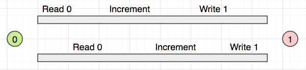

解决方案：

- 将被修改的数据根据访问线程的数量，切割为对应的份数分配给对应的线程，在所有线程操作完毕后再进行合并。

- 待访问的数据使用不可改变（`immutable`）的对象，例如字符串就是不可变对象（当我们把字符串修改为大写时，实际上将会创建一个新的字符串对象）

- 将线程同步化（`synchronization`）：使用锁（`Lock`）防止多个线程在同一时间访问同一个数据

  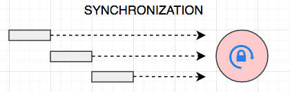

  我们可以给某一部分代码加上`lock`，让这份代码在同一时间只能被一个线程执行，在执行期间，其它线程只能等待前一个线程执行完毕，才能继续访问这块代码。这最终就形成了所有线程对同一个数据的多个操作只能依次有序进行。（线程同步非常容易导致死锁，`dead lock`）

- 使用原子对象（`atomic object`）：原子对象所有的方法或操作都是不可再细分的，这本身就意味着，不可能有两个以上的线程同时修改一份数据。

- 分区技术：允许多个线程访问同一个数据的不同区域或片段

### 6.6 切割与合并数据

```java
public class DownloadFileTask implements Runnable {
    private DownloadStatus status;

    public DownloadFileTask() {
        this.status = new DownloadStatus();
    }

    @Override
    public void run() {
        System.out.println("Download:" + Thread.currentThread().getName());
        for (int i = 0; i < 10_000; i++) {
            if (Thread.currentThread().isInterrupted()) return;
            status.incrementTotalBytes();
        }
        System.out.println("Download complete:" + Thread.currentThread().getName());
    }

    public DownloadStatus getStatus() {
        return status;
    }
}

public class ThreadDemo {
    public static void main(String[] args) {
        var status = new DownloadStatus();
        List<Thread> threads = new ArrayList<>();
        List<DownloadFileTask> tasks = new ArrayList<>();
        for (int i = 0; i < 10; i++) {
            var task = new DownloadFileTask();
            tasks.add(task);
            var thread = new Thread(task);
          	threads.add(thread);
            thread.start();
        }

        for (var thread : threads)
            try {
                thread.join();
            } catch (InterruptedException e) {
                e.printStackTrace();
            }
        var totalBytes = tasks.stream()
                .map(task -> task.getStatus().getTotalBytes())
                .reduce(Integer::sum);
        System.out.println(totalBytes);
    }
}
```

### 6.7 Lock

```java
public class DownloadStatus {
    private int totalBytes;
    private Lock lock = new ReentrantLock();

    public void incrementTotalBytes(){
        lock.lock();
        try {
            totalBytes++;
        } finally {
            lock.unlock();
        }
    }

    public int getTotalBytes() {
        return totalBytes;
    }
}
```

我们还可以使用`synchronized`关键字：

```java
public class DownloadStatus {
    private int totalBytes;

    public synchronized void incrementTotalBytes() {
        totalBytes++;
    }

    public int getTotalBytes() {
        return totalBytes;
    }
}
```

```java
public class DownloadStatus {
    private int totalBytes;
    private final Object totalBytesLock = new Object();

    public void incrementTotalBytes() {
        synchronized (totalBytesLock) {
            totalBytes++;
        }
    }

    public int getTotalBytes() {
        return totalBytes;
    }
}
```

### 6.8 volatile关键字

```java
public class DownloadStatus {
    private int totalBytes;
    private boolean isDone;

    public synchronized void incrementTotalBytes() {
            totalBytes++;
    }

    public int getTotalBytes() {
        return totalBytes;
    }

    public boolean isDone() {
        return isDone;
    }

    public void setDone(boolean done) {
        isDone = done;
    }
}

public class DownloadFileTask implements Runnable {
    private DownloadStatus status;

    public DownloadFileTask(DownloadStatus status) {
        this.status = status;
    }

    @Override
    public void run() {
        System.out.println("Download:" + Thread.currentThread().getName());
        for (int i = 0; i < 1_000_000; i++) {
            if (Thread.currentThread().isInterrupted()) return;
            status.incrementTotalBytes();
        }
        status.setDone(true);
        System.out.println("Download complete:" + Thread.currentThread().getName());
    }
}

public class ThreadDemo {
    public static void main(String[] args) {
        var status = new DownloadStatus();
        var t1 = new Thread(new DownloadFileTask(status));
        t1.start();

        var t2 = new Thread(() -> {
            while (!status.isDone()) {
            }
            System.out.println(status.getTotalBytes());
        });
        t2.start();

    }
}
```

在这个案例中，我们会发现程序一直运行不能停止，且`t2`线程无法输出最终结果，主要原因在于：

- 在计算机的`CPU`运行过程中，存在一套缓存机制：为了优化程序执行速度，会首先把主存储器（`main memory`）中的数据拷贝到自己的缓存（`cache`）中，然后再继续运算。由于直接从自己的`cache`中读取数据的速度更快，因此减少了不断传值带来的时间损耗。
-  `t1`线程和`t2`线程首先都把这个值拷贝到自己的缓存中，然后`t1`线程对这个值做出了修改，由于缓存中的数据只有自己可以访问，因此`t2`线程并看不到这个修改，甚至当`t1`线程将这个修改写回到主存储器，这种修改对于`t2`仍然是不可见的。

这种场景，就称为多线程并发的可见性问题：


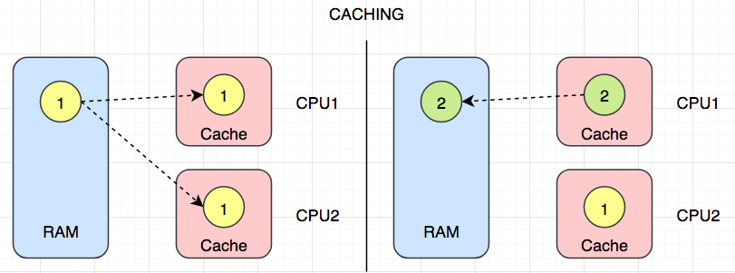

解决方法：

```java
public class DownloadStatus {
    private int totalBytes;
    private volatile boolean isDone;

    public synchronized void incrementTotalBytes() {
            totalBytes++;
    }

    public int getTotalBytes() {
        return totalBytes;
    }

    public boolean isDone() {
        return isDone;
    }

    public void setDone(boolean done) {
        isDone = done;
    }
}
```

当`isDone`被`volatile`修饰时，意味着告诉`JVM`这个变量是不稳定的，不要在计算的时候依赖存储在缓存中的值，而总是从主存储器中读取它，同时，当一个线程修改`isDone`时，会立刻更新存储在主存储器中的值。

### 6.9 线程间通信

上述案例中，`t2`线程通过一个`while`循环不断检测状态值的变化，这个操作有可能会循环很多次，从而浪费CPU的运算时间，我们可以进一步调整为：

```java
public class ThreadDemo {
    public static void main(String[] args) {
        var status = new DownloadStatus();
        var t1 = new Thread(new DownloadFileTask(status));
        t1.start();

        var t2 = new Thread(() -> {
            while (!status.isDone()) {
                synchronized (status) {
                    try {
                        status.wait();
                    } catch (InterruptedException e) {
                        e.printStackTrace();
                    }
                }
            }
            System.out.println(status.getTotalBytes());
        });
        t2.start();
    }
}

public class DownloadFileTask implements Runnable {
    private DownloadStatus status;

    public DownloadFileTask(DownloadStatus status) {
        this.status = status;
    }

    @Override
    public void run() {
        System.out.println("Download:" + Thread.currentThread().getName());
        for (int i = 0; i < 10_000; i++) {
            if (Thread.currentThread().isInterrupted()) return;
            status.incrementTotalBytes();
        }
        status.setDone(true);
        synchronized (status) {
            status.notifyAll();
        }
        System.out.println("Download complete:" + Thread.currentThread().getName());
    }
}
```

- `wait()`：将会导致该线程一直处于等待状态，直到其它线程唤醒它。
- `notifyAll()`：唤醒等待在该对象上的其它线程
- `JVM`要求调用`wait()`和`notifyAll()`的时候，对代码进行同步化。

### 6.10 原子对象

为了更有效的进行线程间通信，同时解决多线程并发带来的问题，最有效的方式是使用原子对象：

```java
public class DownloadStatus {
    private AtomicInteger totalBytes = new AtomicInteger();

    public void incrementTotalBytes() {
        totalBytes.getAndIncrement();
    }

    public int getTotalBytes() {
        return totalBytes.get();
    }
}

public class DownloadFileTask implements Runnable {
    private DownloadStatus status;

    public DownloadFileTask(DownloadStatus status) {
        this.status = status;
    }

    @Override
    public void run() {
        System.out.println("Download:" + Thread.currentThread().getName());
        for (int i = 0; i < 10_000; i++) {
            if (Thread.currentThread().isInterrupted()) return;
            status.incrementTotalBytes();
        }
        System.out.println("Download complete:" + Thread.currentThread().getName());
    }
}

public class ThreadDemo {
    public static void main(String[] args) {
        var status = new DownloadStatus();
        List<Thread> threads = new ArrayList<>();
        for (int i = 0; i < 10; i++) {
            var thread = new Thread(new DownloadFileTask(status));
            threads.add(thread);
            thread.start();
        }

        for (var thread : threads) {
            try {
                thread.join();
            } catch (InterruptedException e) {
                e.printStackTrace();
            }
        }
        System.out.println(status.getTotalBytes());
    }
}
```

### 6.11 同步集合

```java
public class ThreadDemo {
    public static void main(String[] args) {
        Collection<Integer> collection = Collections.synchronizedList(new ArrayList<>());
        var t1 = new Thread(()-> collection.addAll(Arrays.asList(1, 2, 3)));
        var t2 = new Thread(()-> collection.addAll(Arrays.asList(4, 5, 6)));
        t1.start();
        t2.start();
    }
}
```

### 6.12 并发集合

同步集合，会使用`synchronized`机制对代码执行锁，但因此也带来了一些负面影响，即其它线程需要等待前面的线程执行完毕才能继续访问。

而`JDK`中，提供了并发集合来提供更高效的访问方式，即允许多个线程采用分区的方式访问同一个数据的不同区域或片段：

```java
Map<String, Integer> map = new ConcurrentHashMap<>();
```

## 7. 高并发编程（The Executive Framework）

### 7.1 线程池

高并发编程要解决的核心问题：由于创建单独的线程是需要消耗一定的系统资源的，因此线程的数量在一定时间是有限的。

使用一个单独的线程执行任务：

- 需要向系统申请一定的空间资源
- 同时，这个过程（创建和销毁）也需要耗费一定时间

从`JDK 5`开始，提供了线程池（`Thread Pool`）来解决这个问题。线程池，就是存放多个线程的一个容器，这里面的线程可以反复使用。线程池的工作模式具有以下特点：

- 当一个线程执行完任务后，会重新放回到线程池（而不是销毁），这样它可以继续在执行后续的任务中得到重用。
- 线程池中的线程是相对固定和有限的，因此不会因为依据太多的任务创建太多的线程而导致`Out Of Memory，OOM`。
- 同时，线程池还会管理如何将任务分配给执行的线程来执行：当所有线程都处于繁忙时，那么任务将会被放在一个队列（`Queue`）中等待，只要有一个线程空闲了，就会从队列中取出一个任务分配给这个空闲的线程来执行。

有了线程池，我们就不需要直接来创建线程，而只需要向线程池提交任务，有线程池来进行管理任务的具体分配。

### 7.2 Executors

```java
public class Main {
    public static void main(String[] args) {
        var service = Executors.newFixedThreadPool(2);
        try {
            for (int i = 0; i < 5; i++) {
                service.submit(() -> System.out.println(Thread.currentThread().getName()));
            }
        } finally {
            service.shutdown();
        }
    }
}
```

### 7.3 Callable & Future

我们还可以使用`Callable`接口来提交有返回值的任务，得到`Feature`作为结果

```java
public class LongTask {
    public static void simulate(int ms){
        try {
            Thread.sleep(ms);
        } catch (InterruptedException e) {
            e.printStackTrace();
        }
    }
}

public class Main {
    public static void main(String[] args) {
        var service = Executors.newFixedThreadPool(2);
        try {
            var future = service.submit(() -> {
                LongTask.simulate(3_000);
                return 1;
            });
            System.out.println("...");
            var result = future.get();
            System.out.println(result);
        } catch (ExecutionException | InterruptedException e) {
            e.printStackTrace();
        } finally {
            service.shutdown();
        }
    }
}
```

在提交任务之后，程序会立即返回`Future`对象作为返回值，但是任务的返回结果并没有得到，一直等到任务执行完毕，我们才能获取到任务执行的结果。（`submit`方法并不会阻塞程序，但是`get`方法会阻塞直至任务执行完毕得到返回值）。

### 7.4 异步编程

在上述案例中，由于最终获取到任务执行结果是需要消耗时间的，因此在此期间，`get`方法会一直处于阻塞状态。在主线程上，阻塞状态是非常不理想的，因为，它会降低整个程序的响应速度，比如主线程还有其它的事情要做：接收用户的点击事件，同步更新页面上其它数据，等等。这种场景，程序就处于同步状态（`synchronous`）。为了提高整个应用程序的响应速度和用户体验，我们需要继续对上述代码进行异步化处理（`asynchronous`）。

#### 7.4.1 CompletableFuture

```java
public class Main {
    public static void main(String[] args) {
//        Runnable task = () -> System.out.println("a");
//        var future = CompletableFuture.runAsync(task);

        Supplier<Integer> supplier = () -> 1;
        var future = CompletableFuture.supplyAsync(supplier);
        try {
            var result = future.get();
            System.out.println(result);
        } catch (InterruptedException | ExecutionException e) {
            e.printStackTrace();
        }
    }
}
```

#### 7.4.2 Asynchronous API

常规异步案例：

```java
public class MailService {
    public void send() {
        System.out.println("发送邮件ing...");
        LongTask.simulate(3_000);
        System.out.println("发送完毕...");
    }

    public CompletableFuture<Void> sendAsync() {
        return CompletableFuture.runAsync(this::send);
    }
}

public class Main {
    public static void main(String[] args) {
        var service = new MailService();
        service.sendAsync();
        System.out.println("...");
        LongTask.simulate(5_000);
    }
}
```

#### 7.4.3 异步链

```java
public class Main {
    public static void main(String[] args) {
        var future = CompletableFuture.supplyAsync(() -> {
            System.out.println("异步逻辑");
            return 1;
        });
        future.thenRunAsync(() -> {
            System.out.println(Thread.currentThread().getName());
            System.out.println("后续逻辑.");
        });
    }
}
```

异步任务有返回值，在后续任务中获取异步任务处理结果：

```java
public class Main {
    public static void main(String[] args) {
        var future = CompletableFuture.supplyAsync(() -> {
            System.out.println("异步逻辑");
            return 1;
        });
        future.thenAcceptAsync(result -> {
            System.out.println(Thread.currentThread().getName());
            System.out.println("后续逻辑.");
            System.out.println(result);
        });
    }
}
```

#### 7.4.4 异常处理

```java
public class Main {
    public static void main(String[] args) {
        var future = CompletableFuture.supplyAsync(() -> {
            System.out.println("异步逻辑");
            throw new IllegalStateException();
        });
    }
}
```

在上述案例中，如果异步任务中如果发生异常的话，那么在主线程中是获取不到的（因为异常是在另一个新的线程中发生的），如果要获取的异常信息并进行相应处理的话，需要如下编码：

```java
public class Main {
    public static void main(String[] args) {
        var future = CompletableFuture.supplyAsync(() -> {
            System.out.println("异步逻辑");
            throw new IllegalStateException();
        });

        try {
//            var result = future.get();
            var result = future.exceptionally(ex -> "默认值").get();
            System.out.println(result);
        } catch (InterruptedException | ExecutionException e) {
            e.printStackTrace();
        }
    }
}
```

如果直接在`future`上调用`get()`，我们将会得到异常；如果在此之前，调用`exceptionally()`将会得到一个新的`CompletableFuture`对象，我们可以在其中返回一个当异常发生时的默认值作为处理手段。

#### 7.4.5 转换返回结果

对上一次的异步任务的返回结果进行数据类型的转换：

```java
public class Main {
    public static void main(String[] args) {
        var future = CompletableFuture.supplyAsync(() -> 26);
        future.thenApply(c -> Float.toString(c * 1.8f + 32))
                .thenAccept(System.out::println);

    }
}
```

#### 7.4.6 Compose组合

```java
public class Main {
    public static CompletableFuture<String> findEmailByIdAsync(int id) {
        return CompletableFuture.supplyAsync(() -> {
            System.out.println("根据id：" + id + "查询DB");
            return "a@b.com";
        });
    }

    public static CompletableFuture<String> findListByEmailAsync(String email) {
        return CompletableFuture.supplyAsync(() -> {
            System.out.println("根据email：" + email + "查询列表");
            return "播放列表";
        });
    }

    public static void main(String[] args) {
        findEmailByIdAsync(1)
                .thenCompose(Main::findListByEmailAsync)
                .thenAccept(System.out::println);
        LongTask.simulate(1000);
    }
}
```

#### 7.4.7 Combine结果组合

```java
public class Main {
    public static void main(String[] args) {
        var task1 = CompletableFuture.supplyAsync(() -> {
            System.out.println("获取结算金额（美元）");
            return 20;
        });
        var task2 = CompletableFuture.supplyAsync(() -> {
            System.out.println("获取结算汇率");
            return 0.9;
        });
        task1.thenCombine(task2, (price, rate) -> price * rate)
                .thenAcceptAsync(System.out::println);
    }
}
```

#### 7.4.8 多任务等待

等待所有任务：

```java
public class Main {
    public static void main(String[] args) {
        var task1 = CompletableFuture.supplyAsync(() -> 1);
        var task2 = CompletableFuture.supplyAsync(() -> 2);
        var task3 = CompletableFuture.supplyAsync(() -> 3);
        var all = CompletableFuture.allOf(task1, task2, task3);
        all.thenRun(() -> {
            System.out.println("后续逻辑");
            try {
                var res1 = task1.get();
                System.out.println(res1);
            } catch (InterruptedException | ExecutionException e) {
                e.printStackTrace();
            }
        });
    }
}
```

等待首个完成的任务（竞争问题）：

```java
public class Main {
    public static void main(String[] args) {
        var task1 = CompletableFuture.supplyAsync(() -> {
            LongTask.simulate(1000);
            return 1;
        });
        var task2 = CompletableFuture.supplyAsync(() -> 2);
        CompletableFuture.anyOf(task1, task2)
                .thenAccept(System.out::println);
    }
}
```

#### 7.4.9 超时任务

```java
public class Main {
    public static void main(String[] args) {
        var future = CompletableFuture.supplyAsync(() -> {
            LongTask.simulate(3000);
            return 1;
        });
        try {
            var result = future.completeOnTimeout(0, 1, TimeUnit.SECONDS)
                    .get();
            System.out.println(result);
        } catch (InterruptedException | ExecutionException e) {
            e.printStackTrace();
        }
    }
}
```

### 7.5 Project 询价

向各个航空公司售票代理询价，一旦有询价结果，便输出显示

```java
public class Quote {
    private String name;
    private int price;

    public Quote(String name, int price) {
        this.name = name;
        this.price = price;
    }

    @Override
    public String toString() {
        return "Quote{" +
                "name='" + name + '\'' +
                ", price=" + price +
                '}';
    }
}

public class FlightService {
    private final Random random = new Random();

    public Stream<CompletableFuture<Quote>> query() {
        var list = List.of("a", "b", "c");
        return list.stream()
                .map(this::query);
    }

    public CompletableFuture<Quote> query(String name) {
        return CompletableFuture.supplyAsync(() -> {
            System.out.println("询价：" + name);
            var delay = random.nextInt(2_000) + 1_000;
            LongTask.simulate(delay);
            var price = random.nextInt(10) + 100;
            return new Quote(name, price);
        });
    }
}

public class Main {
    public static void main(String[] args) {
        var start = LocalTime.now();
        var service = new FlightService();
        var arr = service
                .query()
                .map(future -> future.thenAccept(System.out::println))
                .toArray(CompletableFuture[]::new);

        var all = CompletableFuture.allOf(arr);
        all.thenRun(() -> {
            var end = LocalTime.now();
            var duration = Duration.between(start, end);
            System.out.println("总耗时：" + duration.toMillis());
        });
        LongTask.simulate(3_000);
    }
}
```


