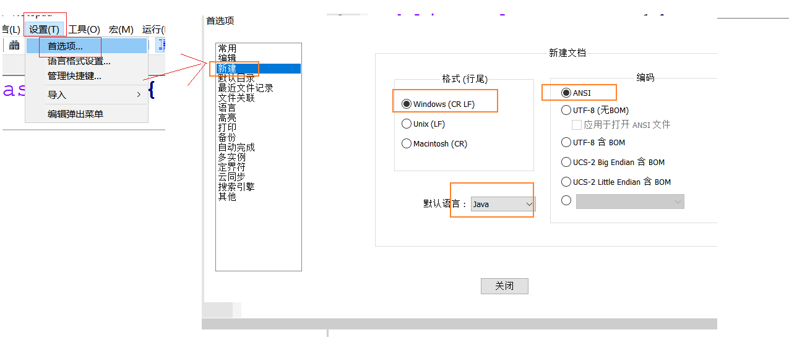
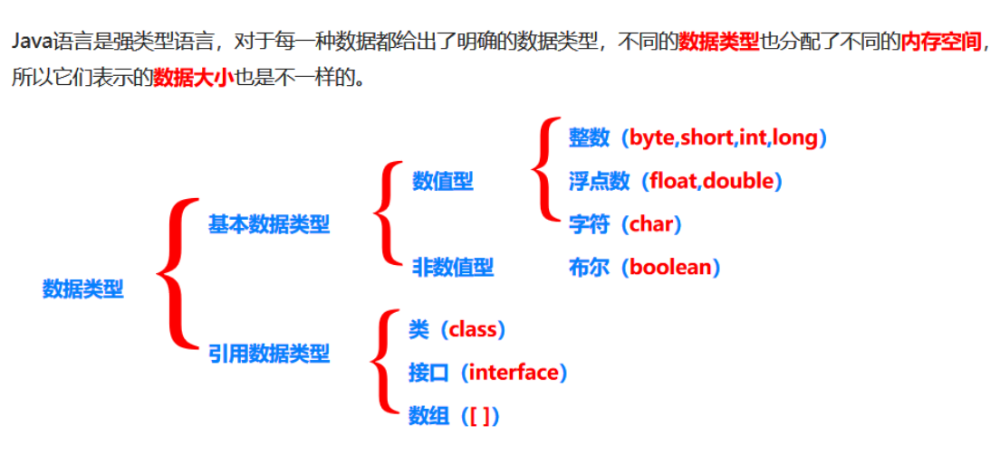
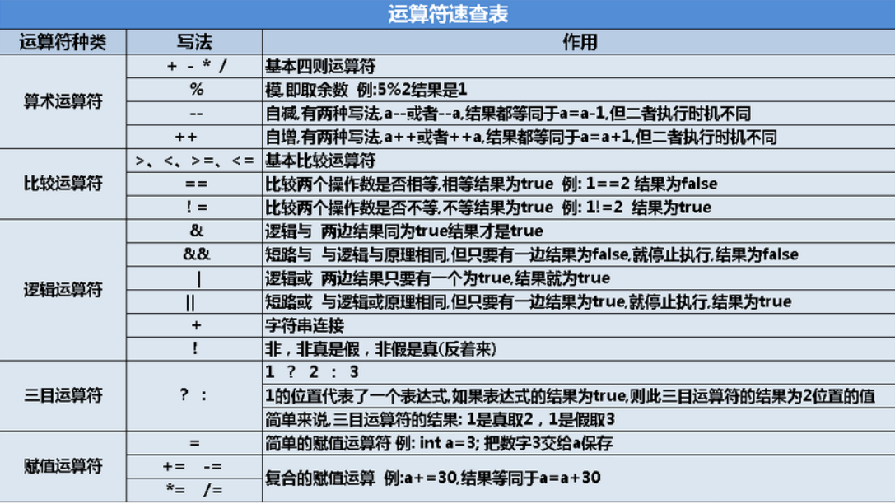
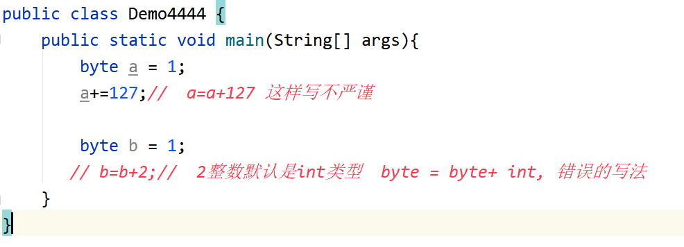

今日内容

1. Notepad++安装和配置
2. java基础语法
   * 关键字(key words)
   * 标识符(identifier)
   * 常量(constant)
   * java的类型
   * 变量(variable)
   * 运算符
   * 类型转换
   * 案例


# 一. Notepad++安装和配置

## 1.1 NodePad++概述

NodePad++本质是就是一个txt文档软件, 比windows系统自带的txt功能要强大很多, 对于很多文件,都会高亮显示,

这样看起来很直观和清晰.

[Notepad++](https://notepad-plus-plus.org/) 是 Windows 操作系统下的一套文本编辑器，有完整的中文化接口及支持多国语言编写的功能（UTF8 技术）。

 Notepad++ 优点：

- 功能比 Windows 中的 Notepad（记事本）强大，除了可以用来制作一般的纯文字说明文件，也十分适合编写计算机程序代码。
- 不仅有语法高亮度显示，也有语法折叠功能，并且支持宏以及扩充基本功能的外挂模组。

* 自带中文，支持所有主流的计算机程序语言。
  Notepad++ 缺点：

- 比起专用的 IDE 缺少语法检查，颜色选取，代码的 outline，注释的解析，TODO，调试工具集成，部署工具集成等等好多功能。
- 打开大文件比较慢

## 1.2 NodePad++下载和安装

* 地址

  https://notepad-plus-plus.org/

* 软件存放位置

  chapter2-章/资料/npp.7.5.8.Installer.x64.exe

* 安装:

  傻瓜式安装,一路next.

* 配置

  

  为什么要配置?

  让编写的java文件的编码 和  windows系统的编码保持一致, 在运行避免出现乱码.


# 二. 关键字(key words)

## 1.1 关键字概述

介绍: 指的java语言已经预先定义好的单词,并且这些单词都有特殊含义,并且用在的特定的位置.

 特点:

1.预先定义好的, 所以我们开发者不能随意使用关键字来**自定义一些名词**(标识符)

2.有特殊含义,并且用在特定的位置.

3.都是小写

举个例子:

古代皇帝的名号和字号, 比如   <font color='red'  >爱新觉罗.玄烨,    名号康熙, </font>,   这些是关键字,那么普通百姓不能随意使用.


## 1.2 常用关键字( 比较多,大家现在不用死记硬背, 用的多了就知道了)

在Java中,有一些单词被赋予了特定的意义,一共有50个关键字。
这关键字单词都是全小写,其中有两个保留字:const和goto。

比如: java中经常使用并且具有特殊含义的单词,虽然不是关键字, 一般情况下不能随意 使用,比如: main


* 数据类型的关键字

  long:  表示整数类型

  float: 表示浮点类型(其实就是小数)

  double: 表示浮点类型(java默认, 其实就是小数)

  char: 表示字符类型(使用单引号括起来的字符,比如: 'A')

  boolean: 表示布尔类型(取值是true或者false)

* 流程语句的关键字

  if, else,  swithc :  用来判断的

  for, do,while: 用来遍历循环的

* **权限修饰符的关键字**

  public:  公共的, 目前修饰类和方法, 表示类是一个公共的类, 表示方法是一个公共的方法,可以在任意位置使用

  private: 私有的,  目前修饰类和方法, 表示类是一个私有的的类, 表示方法是一个私有的方法,只能在特定位置使用

  protected: 受保护的,  目前修饰类和方法, 表示类是一个受保护的的类, 表示方法是一个受保护的方法,只能在特定位置使用

* 定义类, 方法的关键字

  final:  最终的,最后, 目前修饰数据, 通过使用final修饰的数据,称之为常量(constant)

* 定义包的关键字

  package: 定义类所属的包(马上演示)

  import:  导入外部的包名.类名(稍后演示)


## 1.3 package包

* 包的介绍

  包其实就是一个目录, 当然在开发中,通常使用多个目录定义一个包.

  作用: 使用包区分同一个项目下面相同的类名.

* 定义带有包的类

  ~~~~java
  package  cs.yl;
  public class Demo2{
  
  	public static void main(){
  		System.out.println("hello packge");
   	}
  
  }
  ~~~~

  

* 编译带有包的类:

  

  ​			  **-d**  表示 类带有package

  ​			  **.**     表示 类在当前目录

* 运行编译好的类,如图


# 三. 注释

## 1.1 注释概述

注释对java代码的解释说明, 目的提高程序的阅读性.

注意: 注释参与程序的运行.

## 1.2 注释分类

* 单行注释

  ~~~~xml
  // 单行注释内容
  ~~~~

* 多行注释

  ~~~~java
  /*
  多行注释一
  多行注释二
  ----
  */
  ~~~~

* 文档注释

  ~~~~java
  /**
  文档注释一
  文档注释二
  ----
  */
  ~~~~

  

## 1.3 注释区别

文档注释和多行注释

1. 共同点: 一般都在类上或者方法上面进行注释.

2. 不同点:  生成帮助文档里面,会留下文档注释,不会留下多行注释

    使用生成帮助文档的命令:  javadoc   XXX.java  (必须保证执行命令时, XXX.java就在当前目录里面)


# 四. 标识符(idtentifier)

## 1.1 标识符概述

​    标识符指的我们开发者自定义的的名称, 那么自定义的名称就是标识符.

​	注意事项: 标识符不能使用关键字

## 1.2 常用的标识符

 我们开发者在开发中通常会使用标识符来表示 包名, 类名, 方法名称, 参数名称, 常量名称, 变量名称, 接口名称, 注解名称,枚举名称.

* 标识符定义包名

  ~~~~java
  package  com.qianfeng;//  com.qianfeng 自定义的包名, 包名都小写,多个包之间用点连接
  ~~~~

* 标识符定义类名

  ~~~~~java
  public class  Demo1{---} // Demo1就是自定义的类名
  ~~~~~

* 标识符定义方法名称

  ~~~~java
  public class Demo2{
      
      public static void  test1(){----}  // test1就是自定义的方法名称
      
  }
  ~~~~

* 标识符定义方法的参数( 参数就是方法名称后面的小括号里面)

  ~~~~~java
  public class Demo2{// Demo2就是自定义的 类名
      
      public static void  test1(String name){----}  // name就是参数名称,也是自定义的, test1就是自定义的方法名称
      
  }
  ~~~~~

* 标识符定义常量(常量就是在程序运行过程中,不能改变的数据)

  ~~~~java
  public class Demo2{// Demo2就是自定义的 类名
      
     final String  EXIT_RESON = "买多了";//  EXIT_RESON就是常量名称,可以自定义的,都大写,多个单词之间用_连接
         
      
  }
  ~~~~

* 标识符定义常量(常量就是在程序运行过程中,可以改变的数据)

  ~~~~java
  public class Demo2{// Demo2就是自定义的 类名
      
     String color="red";// color就是变量名称,可以自定义的.
         
      
  }
  ~~~~

* 标识符定义接口,注解, 枚举后面再说.

## 1.3 定义标识符, 标识符的构成

 标识符可以由英文字母, 数字,以及下划线(_)和$构成.

比如: 

~~~~~java
class Demo1_${	
}

class Demo2{	
}
class Demo_{	
	
}
class Demo${

}
~~~~~

注意: 标识符可以随意组合.

## 1.4 定义标识符的约束

* 1. 标识符不能以数字开头

* 2. 标识符除了_和$以外,不允许有其他符号

* 如下

  ~~~~java
  /**
   * 演示标识符的约束
   */
  public class Demo3 {
      // String 3name="jack";错误的写法,不能以数字开头
      String name3="jack";
      String name3_="rose";
      String name3$="ship";
     // String -name3="小明";错误的写法,不能用-
  }
  ~~~~

  

## 1.5 定义标识符的命名规则

* 标识符定义类名(接口名,注解名,枚举名), 命名规则

  类名单词的首字母大写,后面每个单词的首字母都写. 这种命名方式叫大驼峰命名法(帕斯卡命名法)

  比如: **S**tudent**M**anagement   学生管理类

* 标识符定义常量

  常量的名称字母都大写, 每个单词之间用下划线连接.

  比如:   **RIGHT_COLOR1**="red";**RIGHT_COLOR2**="Green";**RIGHT_COLOR3**="yellow"

* 标识符定义变量(方法名称, 参数名称)

  变量的名称首字母小写,后面单词的首字母都大写, 这种命名方式叫小驼峰命名法

  比如  **u**ser**N**ame="jack"

* 标识符定义包名

  包名的单词都小写,多个包之间用点号连接.

* 最终使用标识符定义名称时: 做到见名知意.


# 五. 常量(constant)

## 5.1 常量概述

常量指的在程序运行过程中,不能可以改变的数据.

## 5.2 常用的常量

如下图:


​		注意:  空常量不能直接打印,如果打印null, 会报如下错误

​		


# 六 . java的类型


## 1.1 什么是java以及java类型

java是一门强类型的编程语言.

 怎么理解强类型?

指的是在定义数据时,必须声明数据对应的类型. 

比如:   String (数据类型)   userName(变量名称) = "jack"(变量的值);// String 就是字符串类型, 对应的数据使用双引号括起来.

java的类型分为两大类:

* 第一大类:  引用数据类型(后面讲)

  比如: String  就是引用数据类型,

  比如:   null是引用数据类型的值.   String userName = null;

* 第二大类: 基本数据类型(今天讲)

  基本数据类型分为四类八种

  1. 整数类型: byte ,int, short , long
  2. 浮点类型: float, double
  3. 布尔类型: boolean (定义布尔类型,取值只有两种: true和false)
  4. 字符类型 : char   (定义字符类型的值,用单引号引起来, 单引号有且仅有一个字符)

* 如图:

  

## 1.2 计算机的存储单位

* 计算机的最小单位是 :  Bit (位)

  1Bit表示1个1或者1个0.

* 计算机的最小存储文件的单位: Byte

  1Byte = 8Bit

  1KB  = 1024Byte.

  1MB = 1024KB

  1GB = 1024MB

## 1.3 基本数据类型占的内存大小以及表示的数据范围


* 举个例子,基本类型占内存空间的大小, 以及表示数据范围的大小.

  比如: byte类型 占内存的空间大小1个Byte , 等同于8位.

  

* 注意:

  int 类型占内存4个字节,也就是32位, float类型占内存4个字节, 也是32位,为什么float表示的数据范围比int类型要大?

  float是浮点数 转成 整数, 转换规则(位运算)和 int是整数 的转换规则不一样, 所以float比 int的数据范围大.

* 总结:

  1. 整数型:  byte , short, int , long 在转换成10进制, 转换规则是一样, 如上图byte的转换

  2. 浮点型: float, double 在转成10进制时,转换规则是一样, 采用的位运算.

  3. 数据类型表示的范围从小到大依次为: 

     整数:

     byte--->short------>int(java默认的整数类型)------>long

     浮点数:

     float---->double(java默认的浮点类型)

     整数和浮点数,表示数据范围从小到大依次为:

     byte--->short-->int--->long--->float---->double

     整数和字符和浮点数,表示的数据范围从小到大依次为:

     

* 代码演示:

  ~~~~java
  /**
    演示 基本数据类型
  */
  public  class Demo3{
  	/*
  	  通过main方法,执行代码
  	  方法名称: main
  	  方法的参数类型是:String[]
  	  方法的参数名称: args
  	*/
  	public static void  main(String[] args){
  		//1.定义基本数据类型 byte
  		byte  a = 1;
  		//2. 定义基本数据类型 short
  		short b =100;
  		//3. 定义基本数据类型:int, java默认的数据类型
  		int c =1000;
  		//4. 定义基本数据类型 long, 后面加L或者l或者不加都可以
  		long d1 = 100000000L;
  		long d2 = 1000000l;
  		//5.定义浮点类型: 单精度,后面加f或者F
  		float f1 = 10.99F;
  		float f2 = 99.99f;
  		//6.定义浮点类型: 双精度, 默认的数据类型,后面加d或者D或者不加都可以
  		double  e = 10.111;
  		//7.定义字符类型
  		char  r1 = 'a';
  		System.out.println("r1:"+r1);
  		char  r2 = 67;//char后面是数字后面不用加单引号
  		System.out.println("r2:"+r2);// r2='C';稍后讲
  		char  r3 = '企';
  		System.out.println("r3:"+r3);
  		//8 定义布尔类型
  		boolean  f11 = true;
  		boolean  f22 = false;			
  		
  	}
  		
  }
  ~~~~

  **疑问: char  r2 = 67, 打印的结果却是大写的C?**

# 七. 变量(variable)

## 1.1 概述

变量 顾名思义 指的在程序运行过程中,可以改变的值, 称之为变量.

从本质上讲, 其实变量就是在内存中开辟了一块内存空间, 来保存变量的值.

## **1.2 变量的定义**

* 定义方式一:  定义变量同时赋值

  ​	类型  变量名称 = 值;

* 定义方式二:  1. 先定义变量的名称    2. 再给变量赋值

  * 步骤一:   类型  变量名称;

  * 步骤二:    变量名称 = 值;

* 定义方式三:  批量定义变量以及赋值

   类型 变量名称 = 值, 变量名称 = 值,------ 变量名称 = 值;

  注意事项: 定义方式三定义变量时, 多个变量之间用逗号隔开,最后一个变量用分号表示.

## 1.3 变量的定义和使用

代码如下:

~~~~java
/*
	演示变量的定义和使用
*/
public class Demo4{
	
	public static void main(String[] args){
		//1定义方式一
		int  a  = 100;
		//2.定义方式二
		int  b;
		b=100;
		//3.定义方式三
		int c=10,d=101,e=102;
		System.out.println("方式一,a= "+a);
		System.out.println("方式二,b= "+b);
		System.out.println("方式三,c= "+c+",d="+d+",e="+e);
		
	}	
}
~~~~

注意:

1. 变量名称不能重复

2. 定义变量时必须赋值

   


3. 变量放在方法内部(局部变量), 没有初始值,在使用时,必须赋值

4. 变量放在方法外部(成员变量),有初始值, 在使用时,可以不用赋值.

   


# 八. 运算符

## 1.1 运算符概述

​      通过运算符号将数据组织起来, 然后对数据进行运算.

​	  运算符号将数据组织起来得到的是一个表达式.

​	  比如:  int a=1; int b=2;  int sum = a+b;    a+b就是一个表达式.

​      运算符:

​          算术运算符:  通过算术运算符组织的数据, 称之为算术表达式.比如:   int a=1; int b=2; int sum = **a+b**

​		  比较运算符:  通过比较运算符组织的数据, 称之为条件表达式,  比如:   int a=1; int b=2;   boolean flag = **a>b**

​		   逻辑运算符: 通过逻辑运算符组织的数据, 称之为关系表达式,  比如:   int a=1; int b=2; int c = 3  boolean flag =**(  a>b) && (c>b)**

​		    三目运算符, 赋值运算符等等.

## 1.2 常见运算符

如图: 



## 1.3 运算符的使用

### 1.3.1 算术运算符

~~~~java
/**
算术运算符
*/
public class Demo5{
	public static void main(String[] args){
		//1.定义变量
		float a1  = 10.99F;
		float a2  = 0.01f;
		//2.+
		float  sum = a1+a2;
		System.out.println("+ :"+sum);
		//3.-
		float  sub = a1-a2;
		System.out.println("- :"+sub);
		//2.*
		float  multi= a1*a2;
		System.out.println("* :"+ multi);
		//2./
		float  cu = a1/a2;
		System.out.println("/:"+cu);
		//2.%
		float  mo = a1%a2;
		System.out.println("% :"+mo);
		
	}
	
}
~~~~


注意事项:

1. 基本类型在运算时, 定义的变量是什么类型, 运算以后得到的结果就是什么类型.

2. ++和--

   如果++在变量后面, 先给变量赋值, 然后再+1;

   如果++在变量前面, 先+1, 然后再给变量赋值

**++和--**

~~~~java
public class Demo7{
	public static void main(String[] args){
		//1.定义变量
		int a=1;
		//2.定义变量, 如果++在a后面,先给变量b赋值, 后面在+1
		int b = a++;
		System.out.println("a: "+a);//a=2
		System.out.println("b: "+b);//b=1
		//3.定义变量,如果++在c前面, 先给c+1, 再赋值给变量d
		int c=1;
		int d=++c;
		System.out.println("c:"+c);//c=2
		System.out.println("d:"+d);//d=2
		
	}

	
}
~~~~


### 1.3.2 比较运算符

通过比较运算符将数据给组织起来,得到是一个条件表达式,  最终得到的结果是boolean类型.

~~~~java
public class Demo71{
	public static void main(String[] args){
		//1.定义变量
		long  a = 100000L;
		//2.定义变量
		double  b = 10.99;
		//3.进行比较
		boolean  flag = a>b;
		System.out.println(flag);
		
	}

	
}
~~~~


### 1.3.3 三目运算符

语法格式:

类型  变量名称 =  (关系表达式或者条件表达式)  ?  值1  : 值2;

(关系表达式或者条件表达式) 如果结果:  true,  变量名称 = 值1; 反之 变量名称 = 值2;

~~~~java
public class Demo7{
	public static void main(String[] args){
		//1.定义变量
		float a = 99.09F;
		//2.定义变量
		double  b = 10.99;
		//3.进行比较
		double c = (a>b)?a:b;// double的数据范围 比 float的数据范围 大, 所以可以用double类型来表示
		System.out.println(c);
	}
	
}
~~~~

### 1.3.4 赋值运算符

~~~~java
public class Demo7{
	public static void main(String[] args){
		//赋值运算符 = 
		//1.定义变量
		int  a   = 10;//将数据10 赋值给变量a
		//2.+=, -=, /=, %=
		int  b=10;
		b+=10;//  先将b+10, 再赋值给b
		System.out.println(b);
		
	}

	
}
~~~~

错误写法如下:




### 1.3.4 逻辑运算符

*  !    取反

  ~~~~java
  public class Demo7{
  	public static void main(String[] args){
  		//1.定义变量
  		int a=1, b=3;
  		//2.比较运算符
  		boolean  flag = a>b;// false
  		boolean  flag3 = !(a>b);// true
  		boolean  flag2 = !flag;// true
  		
  	}
  
  
  }
  ~~~~

* &,   &&  表示 并且,  

  逻辑与 将多个条件表达式组合起来,构成了关系表达式, 

  如果多个条件表达式的结果都为true, 逻辑与的结果就是true

  只要有一个条件表达式的结果为false, 逻辑与的结果就是false.

  ~~~~java
  public class Demo7{
  	public static void main(String[] args){
  		//1.定义变量
  		int a=1, b=3, c=4;
  		//2.条件表达式
  		boolean f1 = (a>b);// true;
  		boolean f2 = (c>b);// true;
  		//3.逻辑与(并且,同时成立)  &, &&将上面的条件表达式组合起来
  		boolean f11 = (f1) & (f2);//f11 = false
  		boolean f22 = (f1) && (f2);//f22 = false
  		System.out.println("&: "+ f11);
  		System.out.println("&&: "+ f22);
  		
  	}
  
  
  }
  ~~~~

  &  和   && 区别

  1. 如果使用&, 那么所有的条件表达式都进行判断
  2. 如果使用&&, 如果左边的条件表达式结果为false, 那么就判断, 在企业开发中,推荐使用&&

  ~~~~java
  public class Demo7{
  	public static void main(String[] args){
  		//1.定义变量
  		int a=1, b=3;
  		//2.判断语句的关键词if
  		if(a++>3 & b++>2){
  			System.out.println("判断体语句");
  		}
  		//结论:  如果用的 & , 那么 所有的条件表达式都判断了
  		System.out.println("a:"+a);// a=2
  		System.out.println("b:"+b);// b=4
  		
  		
  	}
  
  
  }
  
  public class Demo7{
  	public static void main(String[] args){
  		//1.定义变量
  		int a=1, b=3;
  		//2.判断语句的关键词if
  		if(a++>3 && b++>2){
  			System.out.println("判断体语句");
  		}
  		//结论:  如果用的 && , 
  		//如果左边的条件表达式结果为false,
  	    //那么后面的条件表达式就不进行判断了
  		System.out.println("a:"+a);// a=2
  		System.out.println("b:"+b);// b=3		
  	}
  
  }
  ~~~~

  

  ### 1.3.5 逻辑或

  *  |   或者  ||

  *  逻辑或运算符将多个条件表达式组织起来, 只要有一个条件表达式的结果为true,那么逻辑或的结果是true.

  * 逻辑或运算符将多个条件表达式组织起来, 所有条件表达式的结果为false,那么逻辑或的结果是false.

    ~~~~java
    public class Demo7{
    	public static void main(String[] args){
    		//1.定义变量
    		int a=1, b=3,d=4;
    		//2.逻辑或
    		boolean f1 = (a>b)|(d>b);// true
    		boolean f2 = (a>b)||(d>b);// true		
    	}
    
    }
    ~~~~

  * |  和  || 区别

    如果 | , 所有的条件表达式都要进行判断.

    如果||, 如果左边的条件表达式结果为true, 后面的条件表达式就不再判断了.

    ~~~~java
    public class Demo7{
    	public static void main(String[] args){
    		//1.定义变量
    		int a=1, b=3,d=4;
    		//2.逻辑或
    		if(a++>0 | b++>4){//所有条件都判断
    			System.out.println("a:"+a);//a=2
    			System.out.println("b:"+b);//b=4
    		}
    	}
    
    }
    
    public class Demo7{
    	public static void main(String[] args){
    		//1.定义变量
    		int a=1, b=3,d=4;
    		//2.逻辑或
    		if(a++>0 || b++>4){//左边条件为true, 右边就不在判断了
    			System.out.println("a:"+a);//a=2
    			System.out.println("b:"+b);//b=3
    		}
    	}
    
    }
    ~~~~

    

# 九. 类型转换

## 1.1 类型转换概述

 类型转换指的在程序运行过程中,改变变量原有的类型.

比如:  

int  a=1;// a是int类型

long b = a;// a是long类型

## 1.2 类型转换的方式

* 方式一: 自动类型转换(类型提升)

   类型提升前提:  数据范围小的类型 可以 提升到 数据范围大的类型.

  比如: 将500ml瓶子的水 倒入 到 1L的瓶子, 水不会溢出

  ~~~~java
  public class Demo7{
  	public static void main(String[] args){
  		//自动类型转换
  		byte a  = 1;
  		int b = a;// byte的数据范围小---->自动转换成 数据范围大的类型int
  		System.out.println(b);
  		
  	}
  
  }
  ~~~~

  

* 方式二:  强制类型转换

  强制类型转换: 指的数据范围大的数据类型转成数据范围小的类型,需要强制转换. 缺点: 数据精度会缺失

  比如: 将1L瓶子装满水 倒入 到 500ml的瓶子, 水会溢出

  ~~~~java
  public class Demo4444 {
      public static void main(String[] args){
          int a=1111;
         // byte b = a;//  a的类型表示的数据范围大, 不能自动转成 byte类型
          byte b = (byte) a;// 强制类型转换,会出现精度缺失
          System.out.println(b);
      }
  
  ~~~~

  

## 1.3 演示类型转换

~~~~java
public class Demo4444 {
    public static void main(String[] args){
       char a='a';//char表示数据
       int  b = a;// char--->int 自动类型提升
        System.out.println(b);
    }
}

~~~~

总结:

1. 自动类型转换(类型提升), 数据类型依次为:


2. 如果将大的数据类型转成小的数据类型, 需要强转.


# 十. 内容总结

* 关键字(理解)

* 标识符(掌握)

  包名, 变量名, 方法名称, 参数名, 类名等等

* 常量和变量(掌握)

* 数据类型(掌握)

* 运算符(掌握)

* 类型转换(掌握)

* 扩展

  0. 对于实际操作特殊字符以及中文, 韩文等等这些文字在计算机的程序中如何表示.

  1. ASCII码

     信息在计算机上是用二进制表示的，这种表示法让人理解就很困难。因此计算机上都配有输入和输出设备，这些设备的主要目的就是，以一种人类可阅读的形式将信息在这些设备上显示出来供人阅读理解。为保证人类和设备，设备和计算机之间能进行正确的信息交换，人们编制的统一的信息交换代码，这就是ASCII码表，它的全称是“美国信息交换标准代码”。

     简单用一句话描述:

     计算机的盘符(键盘上的文字)-------->ASCII码表<------映射成:  10进制数字(0-127)

     

     ```
     public static void main(String[] args){
         char a='a';// 算术运算时  'a'---->97
         int b = a+1;// char a--->int : 97 +1
         System.out.println(b);
         char c = 65;// 没有进行算术运算
         System.out.println(c);// c--->ascii--->盘符: A
     }
     ```

  2. Unicode码(万能码,表示所有字符,所有文字等等,用的很多很多)

     通过演示ASCII发现问题, ASCII码表不能表示中文, 韩文等等文字.

     怎么解决ASCII码表不能表示中文, 韩文等等文字?

     这时提出使用Unicode编码表示中文, 韩文,等等文字

     ~~~~java
     public class Demo4444 {
         public static void main(String[] args){
             char a ='\u4f01';// unicode编码采用16进制表示文字.
             System.out.println(a);// char 字符---->unicode码表---->文字
         }
     }
     
     ~~~~

     


