今日内容:

1. Idea的下载和安装以及配置

2. 流程控制语句

   顺序结构的流程语句, 分支结构的流程语句,循环结构的流程语句(后面讲)

3. 键盘录入对象

   Scanner对象

4. 案例

5. 扩展

# 一. Idea的下载和安装以及配置


## 1.1 IDEA概述

Intellij IDEA](https://www.jetbrains.com/idea/) 简称 IDEA，具有美观，高效等众多特点。IDEA 是 JetBrains 公司的产品，这家公司总部位于捷克共和国的首都布拉格，开发人员以严谨著称的东欧程序员为主。它的旗舰版本还支持 HTML，CSS，PHP，[MySQL](http://c.biancheng.net/mysql/)，Python 等。免费版只支持 Java 等少数语言。

 据传它有“最智慧的 Java ide”之称。它能帮助开发人员拿出最具有创造性的解决方案。它的“Smart Code  Completion”和“On-the-fly Code Analysis”功能等可以提高开发人员的工作效率，并且还提供了对 web  和移动开发高级支持。

IDEA与txt文档相比:

* txt文档: 不能校验语法是否正确
* txt文档: 不能进行代码提示
* txt文档:  不能使用快捷键
* txt文档:  不能高亮显示
* IDEA编写程序: 将上述问题都一一解决.

 IDEA 缺点：

* IDEA是收费的

- 编辑超大文件不靠谱，易卡顿或直接卡死。
- 相对于一些专用工具，显得不够专业：比如批量修改项目中的文件编码效果就很差劲。
- 消耗大量硬件资源，IntelliJ IDEA 要求内存大，并且还要用的流畅还需要固态硬盘辅助。比如在做微服务类的项目的时候，一般需要同时启动多个项目，内存一会就上来的，8G 内存完全不够用的。

 **IDE**(其实就是开发工具，下面介绍的开发工具的特点)

集成[开发环境](https://baike.baidu.com/item/%E5%BC%80%E5%8F%91%E7%8E%AF%E5%A2%83)（[IDE](https://baike.baidu.com/item/IDE)，Integrated Development Environment ）是用于提供程序开发环境的应用程序，一般包括代码编辑器、[编译器](https://baike.baidu.com/item/%E7%BC%96%E8%AF%91%E5%99%A8/8853067)、[调试](https://baike.baidu.com/item/%E8%B0%83%E8%AF%95)器和[图形用户界面](https://baike.baidu.com/item/%E5%9B%BE%E5%BD%A2%E7%94%A8%E6%88%B7%E7%95%8C%E9%9D%A2/3352324)等工具。集成了代码编写功能、分析功能、[编译](https://baike.baidu.com/item/%E7%BC%96%E8%AF%91/1258343)功能、调试功能等一体化的开发软件服务套。

常见的IDE开发工具:

* eclipse
* myeclipse
* sts
* idea(企业中普遍使用)

## 1.2 IDEA的下载和安装

*** 官方下载地址**：http://www.jetbrains.com/idea/download/ 

**IDEA安装参考地址**: https://www.jianshu.com/p/b3baf384791e

## 1.3 IDEA的设置

* IDEA开发java程序, 所以IDEA配置JDK环境变量

  

* 配置IDEA的编码格式

  菜单栏的file---->setttings----->搜索: encoding,  配置编码

  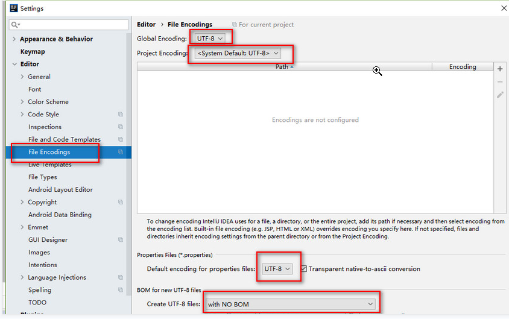

* 配置IDEA里面代码的字体大小以及IDEA控制台的字体大小

  菜单栏的file---->settings----->editor:  font------>改变字体大小

  

* 配置IDEA里面菜单栏字体大小

  菜单栏的file---->settings----->

  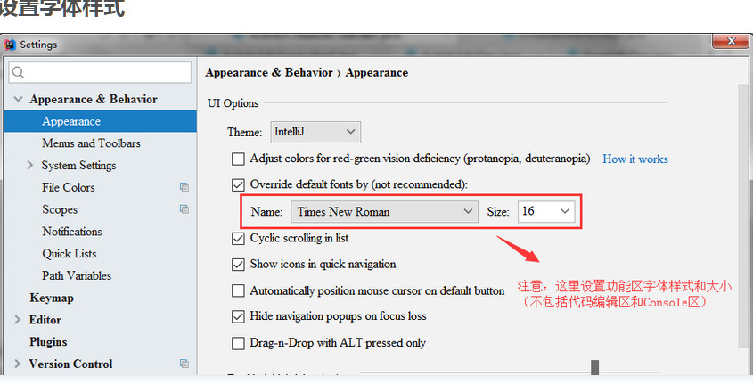

* 设置代码的背景颜色

  菜单栏的file---->settings----->editor--->color Scheme--->General

  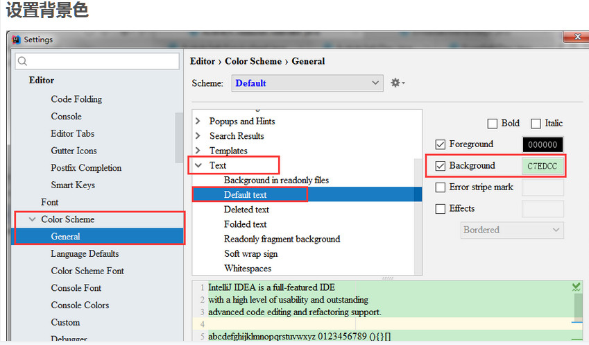

* 设置当前行代码的背景颜色

  菜单栏的file---->settings--->editor--->color Scheme--->General

  

  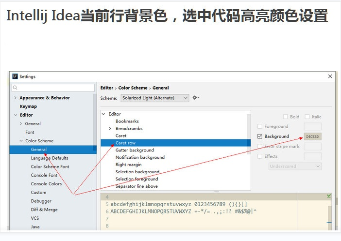

* 设置代码的注释字体的颜色

  file--->settings: 

  

* 设置代码不区分大小写自动提示

  file--->settings: 

  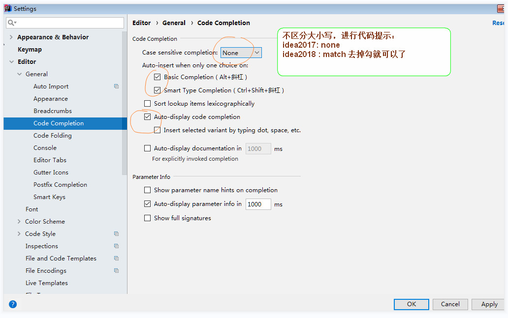

* 设置api自动导入包名

  file--->settings: 

  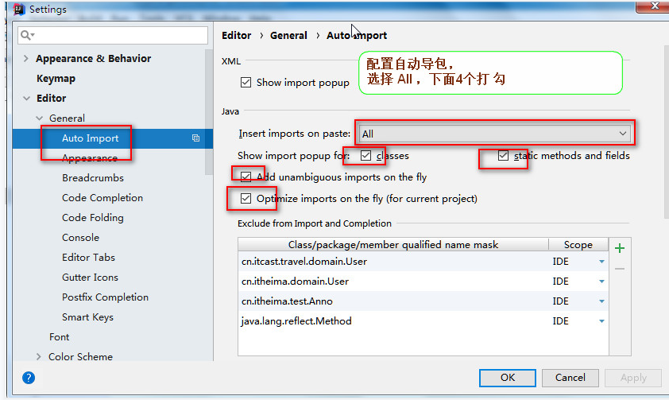

## 1.4 IDEA快捷键

* 常用快捷键

  * 快速编写main方法:

    可以输入: psvm

  * 快速编写打印语句

    可以输入: sout

  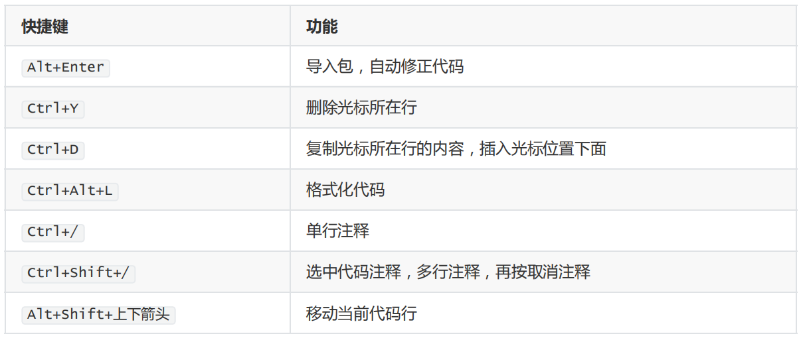

* 快捷键不能用, 怎么办.

  为什么快捷键不能使用?

  IDEA里面的 快捷键与其他软件的快捷键冲突(快捷键盘符都一样).

  解决方案: 修改IDEA的快捷键.

  file--->settings---->keymap---->右侧窗口里面:  main menu ---> 修改快捷键

  * 步骤一:  先删除快捷键

    比如: 删除 Run运行程序的快捷键

    

  * 步骤二: 添加快捷键

    比如: 添加Run运行程序的快捷键, 在弹出的窗口里面,输入自定义的快捷键即可

    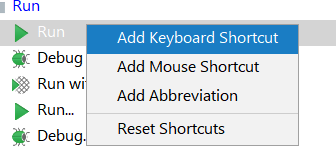

## 1.5 IDEA创建工程(项目)

* 方式一:   创建一个project工程

  file---->new ----->project---->在弹出窗口: 选中java, 点击next----->在弹出窗口里面: 不选择模板, 点击 next----->输出项目名称

* 方式二: 创建一个model模块(其实一个工程,也是项目)

  file---->new ----->model--->在弹出窗口: 选中java, 点击next----->在弹出窗口里面: 输出model的名称.

* project和model区别和关系?

  project和model的关系

  1. project是一个大的工程(大的项目)
  2. model是project工程的一个子项目

  实际开发中:

  开发了一个百度项目, 百度项目里面包含很多个子项目:  百度新闻, 百度娱乐等等

  实际生活场景:

  开发商开发小区(小区是一个大工程), 小区里面很多很多栋楼(每栋楼理解为小区的一个子项目)

* 注意

  file--->project  Structure-->下图:

  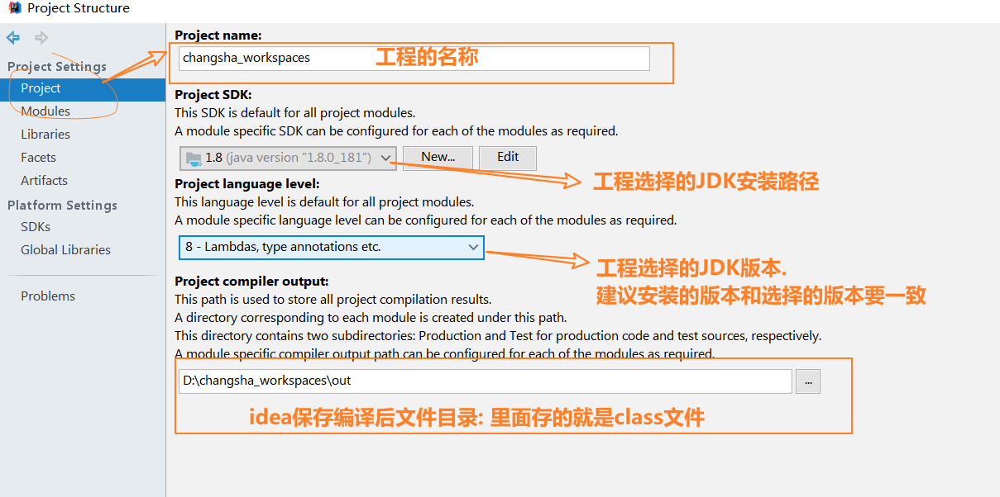


# 二. 流程语句

## 1.1 流程语句概述

指的java每句代码的执行顺序, 每句代码的执行流程对程序运行的结果是有影响的. 

所以我们通过控制每句代码的执行流程, 最终实现我们的效果.

总结:

1. 每句代码的执行顺序会影响执行结果
2. 需要控制每句代码的执行顺序, 来实现我们想要的结果

## 1.2 流程语句的分类和特点

流程控制语句一共分为三类

* 顺序结构的流程控制语句(瀑布流式语句)

  特点: 每句代码的执行顺序,从上向下依次执行.

* 分支结构的流程控制语句(岔路口式语句)

  特点: 在执行分支语句前,会进行判断(比较运算符合逻辑运算符), 选择符合条件的分支语句执行.

* 循环结构的流程控制语句(驴拉磨式语句)

  特点: 重复执行代码.

## 1.3 顺序结构的流程语句

* 顺序结构的流程语句,执行顺序, 如下图

  执行顺序: 从上向下依次执行.

  

​    专业描述,如下图

   					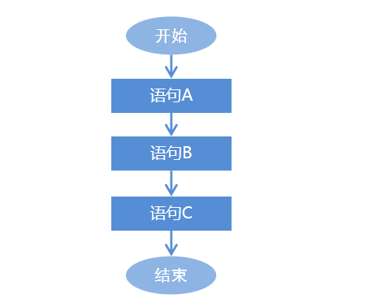

* 代码实现

  生活场景:  小学,----->中学 , ---->高中 ,---->大学

  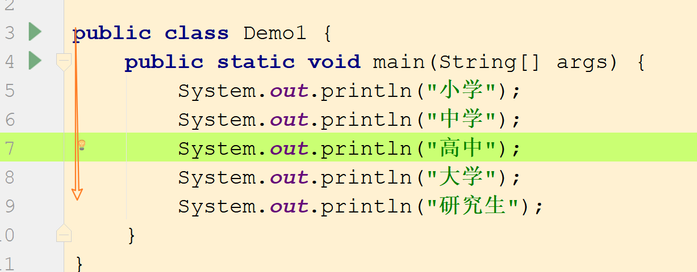


## 1.4 分支结构的流程语句

* 分支结构的流程语句, 如下图

  分支结构语句的特点: 在执行语句时, 会进行判断,选择符合条件的 分支语句执行.

  

* **if分支结构语句**

  语法格式:

  ~~~~java
  if(关系表达式){
       分支语句        
  }
  其它语句
  ~~~~

  if分支语句的流程,如下图:

  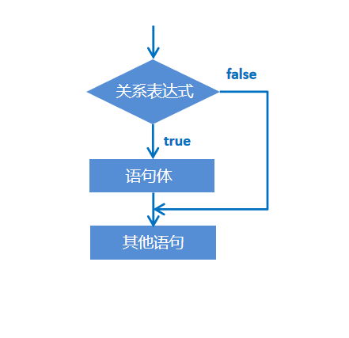

  执行流程:

  1. 会对关系表达式进行判断

  2. 如果是true, 执行if分支的语句

     如果是false,不执行if分支语句

  3. ,执行其他语句, 直到程序执行结束

  if分支语句案例:

  生活场景:   小明考试成绩, 如果考90分以上,奖励新款的IPhone3.其他不奖励.

  ~~~~java
  public class Demo2 {
      public static void main(String[] args) {
          //1.定义变量,用来表示成绩
          double score = 80;
          //2.if分支语句
          if(score>=90){
              System.out.println("老爸奖励新款的iphone13Plus");
          }
          //3.执行其他语句
          System.out.println("该干哈干哈去");
      }
  }
  
  ~~~~

* **if -else分支语句**

  语法格式:

  ~~~~java
  if(关系表达式){
      if分支语句
  }else{
      else分支语句
  }
  ~~~~

  执行流程,如下图:

  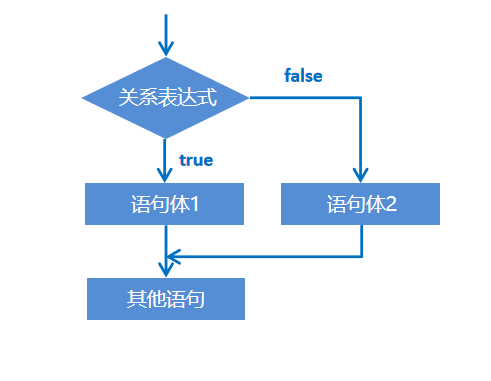

  执行流程:

1. 会对关系表达式进行判断

2. 如果判断结果为true, 执行if的分支语句

   如果判断结果为false, 执行else的分支语句

3. 执行其他语句,直到程序结束.

   案例:

   生活场景:   小明考试成绩, 如果考90分以上,奖励新款的IPhone3.如果低于90分, 打一顿

   ~~~~java
   public class Demo3 {
       public static void main(String[] args) {
           //1.定义变量,表示成绩
           double score = 89.9;//默认浮点类型
           //2.进行判断
           if(score>=90){
               //if分支语句
               System.out.println("老爸奖励个冰镇绿豆雪糕");
           }else{
               //else分支语句
               System.out.println("胖揍一顿");
           }
           //3.执行其他语句
           System.out.println("other----");
       }
   }
   
   ~~~~

* if -else if ---else if --else

  语法格式:

  ~~~~java
  if(关系表达式1){
      if分支语句
  }else if(关系表达式2){
      else-if-3分支语句
  }else if(关系表达式3){
      else-if-3分支语句
  }else if(关系表达式n){
      else-if-n分支语句
  }else{
      else 分支语句
  }
  ~~~~

  流程图: 

  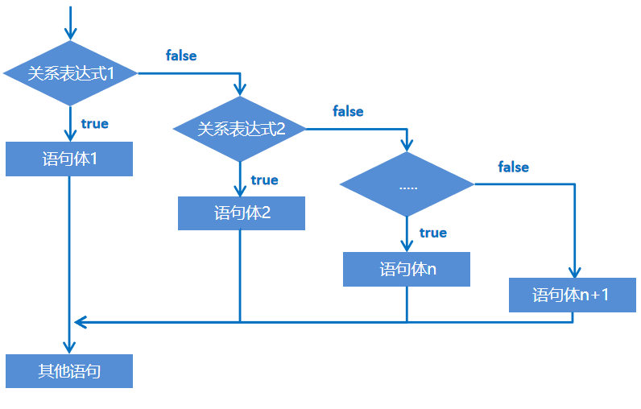

执行流程:

1. 对关系表达式1进行判断

2. 如果关系表达式1的结果为true, 执行if分支语句

   如果关系表达式1的结果为false, 对下个else -if的关系表达式2进行判断

3. 如果关系表达式2 的结果为true, 执行该else-if的分支语句

   如果关系表达式2的结果为false, 继续对下个else -if的关系表达式3进行判断

   继续执行其他else-if分支语句

   -----

4. 如果以上关系表达式的判断结果都为false,执行else里面的分支语句

5. 执行其它语句,直到程序结束

* 案例

  小明如果考100分,奖励一个iphone13Plus;

  小明如果考90-100分之间的话,奖励一个华为P40;

  小明如果考80-90分之间的话,奖励一个小米mate11;

  小明如果考70-80分之间的话,奖励一个魅族9;

  其它成绩, 小明被胖揍一顿

  ~~~~java
  public class Demo4 {
      public static void main(String[] args) {
          //1.定义变量,表示小明的成绩
          double score = 60;
          //2.if判断
          if(score==100){
              System.out.println("奖励一个iphone13Plus");
          }else if(score>=90 && score<100){
              System.out.println("奖励一个华为P40");
          }else if(score>=80 && score<90){
              System.out.println("奖励一个小米mate11");
          }else{
              System.out.println("小明被胖揍一顿");
          }
          System.out.println("other--------------");
      }
  }
  
  ~~~~

* 案例:

  给定一个月份数字, 判定该月份是春季, 或者夏季,或者秋季,或者冬季.

  春季: ,3,4,5

  夏季: 6,7,8

  秋季: 9,10, 11

  冬季:12,1,2

  如果输入其它月份的数字,提示输入错误,不是一个月份数字

  ~~~~java
  public class Demo5 {
      public static void main(String[] args) {
          //1.定义一个月份数字,
          int month=100;
          //2.判断月份是否是春季
          if(month>=3 && month<=5){// month==3 || month==4 || month==5
              System.out.println(month+"月份是春季");
          }else if(month>=6 && month<=8){
              System.out.println(month+"月份是夏季");
          }else if(month>=9 && month<=11){
              System.out.println(month+"月份是秋季");
          }else if(month==1 || month==2 || month==12){
              System.out.println(month+"月份是冬季");
          }else{
              System.out.println("你输入的不是一个月份数字");
          }
  
      }
  }
  ~~~~

  

# 三. Scanner

## 1.1 Scanner概述

它是一个键盘扫描对象, 通过扫描用户输入的内容, 从而通过Scanner的方法可以获取.

## 1.2 常用方法

- `nextInt()`: 获取用户输入的整数
- nextLine(): 获取户输入的一行字符串.

## 1.3 Scanner的使用

* 步骤一:  导入包名+类名

  ```
  import java.util.Scanner;
  ```

* 步骤二: 创建对象

  ~~~~java
    Scanner scanner = new Scanner(System.in);
  ~~~~

* 步骤三: 对象调用方法,获取用户录入的数据, 如下代码

~~~~java
public class Demo6 {
    public static void main(String[] args) {
        //1.导入包.类名
        //2.创建对象, 需要参数: System.in
        Scanner scanner = new Scanner(System.in);
       // System.out.println("录入字符串:");
        System.out.println("请录入一个数字:");
        //3.对象调用方法,获取用户录入的内容
       // String s = scanner.nextLine();//录入字符串
        //4.对象调用方法,获取用户录入的内容
        int i = scanner.nextInt();//录入数字
        System.out.println("获取录入的数字: "+i);
    }
}
~~~~

# 四. switch分支语句

## 1.1 语法格式

~~~~java
switch(常量表达式){
    case  常量1:
        语句;
        break;
    case  常量2:
        语句;
        break;
    case  常量N:
        语句;
        break;
    default:
        语句;
        break;       
}
~~~~

执行流程:

1. 对第一个case进行判断:   拿常量值1  和  switch的常量表达式进行比较, 如果一致, 执行语句,后面的语句都不再执行了
2. 对第一个case进行判断:   拿常量值1  和  switch的常量表达式进行比较, 如果不一致, 执行下个case判断
3. 如果上面的case判断, 里面的常量值和 switch的常量表达式进行比较,如果都不一致,最后执行default的语句
4. 执行其他语句,直到程序的结束.

## 1.2 入门实现

案例要求:  如果输入的数字是8, 打印发发.

~~~~java
public class Demo7 {
    public static void main(String[] args) {
        //1.创建scanner对象
        Scanner s = new Scanner(System.in);
        //2.调用方法,获取用户录入的数字
        System.out.println("请录入一个数字:");
        int number= s.nextInt();
        //3. switch分支语句
        switch (number){
            case 1:
                System.out.println("小发发");
                break;
            case 2:
                System.out.println("小发发");
                break;
            case 3:
                System.out.println("小发发");
                break;
            case 8:
                System.out.println("大发发发-------");
                break;
            default:
                System.out.println("other------");
                break;
        }
        System.out.println("程序执行结束");
    }
}

~~~~


## 1.3 switch注意细节

* 常量表达式的数据类型

  1. 整数类型: byte, short ,int 
  2. 字符类型: char
  3. 枚举类型: enum, 从JDK1.5之后switch才支持枚举类型
  4. 字符串类型: String, 从JDK7之后switch才支持String类型

* break关键字的作用

   break的作用:  结束分支语句的执行.

* break缺失:

  如果没有写break, 出现"穿透"现象,

  什么是穿透现象? 即使case后面的常量值  和 switch的常量表达式不匹配,也会执行.

* 改造春夏秋冬案例

  ~~~~java
  public class Demo8 {
      public static void main(String[] args) {
           //1.创建scanner对象
          Scanner scanner = new Scanner(System.in);
          //2.录入一个数字
          System.out.println("录入一个数字");
          int month= scanner.nextInt();
          //3.switch分支语句
          switch (month){
              case 3:
              case 4:
              case 5:
                  System.out.println(month+"月份是春季");
                  break;
              case 6:
              case 7:
              case 8:
                  System.out.println(month+"月份是夏季");
                  break;
              case 9:
              case 10:
              case 11:
                  System.out.println(month+"月份是秋季");
                  break;
              case 1:
              case 2:
              case 12:
                  System.out.println(month+"月份是冬季");
                  break;
              default:
                  System.out.println(month+"不是一个月份数字");
                  break;
          }
      }
  }
  ~~~~

## 1.4  switch和if的区别

* switch的常量表达式的数据类型有限制, 在开发中我们判断的数据有很多类型, 所以switch的数据类型有时不满足需要
* if分支语句进行条件判断时, 对数据的类型没有限制, 所以企业开发中一般使用if分支语句

# 五. 案例

* 案例一: 键盘录入三个数字,获取最大的数字

  ~~~~java
  /**
   * 案例一: 键盘录入三个数字,获取最大的数字
   */
  public class Demo1 {
      public static void main(String[] args) {
          //1.创建录入对象
          Scanner s = new Scanner(System.in);
          System.out.println("请录入第一个数字:");
          int first = s.nextInt();
          System.out.println("请录入第二个数字:");
          int two = s.nextInt();
          System.out.println("请录入第三个数字:");
          int three = s.nextInt();
          //2.获取用户录入的三个数字
          //3.获取最大数字
          //3.1 使用三目运算符 让 第一个数字和第二个数字进行比较,获取较大的数字
          int max1 = (first>=two)?first:two;
          //3.2 拿第一步判断的数字和第三个数字进行比较,最终获取最大的数字
          int max2 = (max1>=three)?max1:three;
          System.out.println("最大的数字为:"+max2);
      }
  }
  ~~~~

  ~~~~java
  public class Demo11 {
      public static void main(String[] args) {
          //1.创建录入对象
          Scanner s = new Scanner(System.in);
          System.out.println("请录入第一个数字:");
          int first = s.nextInt();
          System.out.println("请录入第二个数字:");
          int two = s.nextInt();
          System.out.println("请录入第三个数字:");
          int three = s.nextInt();
          //2.获取用户录入的三个数字
          //3.获取最大数字
          //3.1 使用三目运算符 让 第一个数字和第二个数字进行比较,获取较大的数字
          //3.2 拿第一步判断的数字和第三个数字进行比较,最终获取最大的数字
          int max=0;
          if(first>=two && first>=three){
            max= first;
          }else if(two>=first && two>=three){
           max=two;
          }else{
            max=three;
          }
          System.out.println("最大值为:"+max);
  
  
      }
  
      private static void test1() {
          //1.创建录入对象
          Scanner s = new Scanner(System.in);
          System.out.println("请录入第一个数字:");
          int first = s.nextInt();
          System.out.println("请录入第二个数字:");
          int two = s.nextInt();
          System.out.println("请录入第三个数字:");
          int three = s.nextInt();
          //2.获取用户录入的三个数字
          //3.获取最大数字
          //3.1 使用三目运算符 让 第一个数字和第二个数字进行比较,获取较大的数字
          //3.2 拿第一步判断的数字和第三个数字进行比较,最终获取最大的数字
          if(first>=two && first>=three){
              System.out.println("最大的数字为:"+first);
          }else if(two>=first && two>=three){
              System.out.println("最大的数字为:"+two);
          }else{
              System.out.println("最大数字为:"+three);
          }
      }
  }
  ~~~~

  

* 案例二: 键盘录入一个年份, 判断该年份是不是闰年

  闰年的判断条件:   

  条件一:  与4取模==0 并且 与100取模不等于0

  条件二: 与400取模等于0

* 案例三: 录入一个百位数字, 判断该数字是否是水仙花数字.

  ~~~~java
  /**
   * 案例三: 录入一个百位数字, 判断该数字是否是水仙花数字.
   * 特点: 水仙花数字 = 百位数字的3次方+ 十位数字的3次方+个位数字的3次方
   */
  public class Demo2 {
      public static void main(String[] args) {
          //1.创建键盘录入对象,录入一个百位数字
          Scanner scanner = new Scanner(System.in);
          System.out.println("录入一个百位数字:");
          int number = scanner.nextInt();
          //2.获取百位数字, 十位数字,个位数字
          int d =  number%10;
          int c = (number/10)%10;
          int h = (number/100)%10;
          int sum = d*d*d+c*c*c+h*h*h;
          //3. 进行判断
          if(sum==number){
              System.out.println(number+"是一个水仙花数字");
          }else{
              System.out.println("该数字不是一个水仙花数字");
          }
  
      }
  
      private static void test1() {
          //思路:获取百位数字, 十位数字, 个位数字
          int number = 153;
          int d =  number%10;
          int c = (number/10)%10;
          int h = (number/100)%10;
          System.out.println("个位:"+d+",十位:"+c+",百位:"+h);
      }
  }
  ~~~~

  

* 案例四: 编写一个系统, 让用户录入年龄和身高, 判断高中生是否符合招录飞行员的条件

  需求:

  1.  年龄:      大于等于15,  小等于 18
  2. 身高:       大于等于170 , 小等于183

~~~~java
/**
 * 案例四: 编写一个系统, 让用户录入年龄和身高, 判断高中生是否符合招录飞行员的条件

 需求:

 1.  年龄:      大于等于15,  小等于 18
 2. 身高:       大于等于170 , 小等于183
 */
public class Demo3 {
    public static void main(String[] args) {
        //1.创建一个scanner对象
        Scanner scanner = new Scanner(System.in);
        //2.录入年龄
        System.out.println("录入一个年龄: ");
        int age= scanner.nextInt();
        //3.录入身高
        System.out.println("录入一个身高: ");
        double h = scanner.nextDouble();
        //4.判断是否符合高中招录飞行员的条件
        //4.1 满足第一个条件: 年龄符合标准
        if(age>=15  &&  age<=18){
            //4.2 满足第二个条件
            if(h>=170 && h<=183){
                System.out.println("恭喜您,未来人生辉煌路");
            }else{
                System.out.println("差一点啊,孩子,你身高不符合要求");
            }
        }else{
            System.out.println("年龄不符合要求");
        }
    }
}
~~~~


* 扩展内容:

  多层分支语句, 这时就需要对分支语句进行嵌套.

  比如:

  ~~~~~java
  if(关系表达式){
      if(关系表达式){
          
      }    
  }
  
  if(关系表达式){
      if(关系表达式){
          
      }else{
          
      }    
  }
  if(关系表达式){
      if(关系表达式){
          
      }else if(关系表达式){
          
      }else{
          
      }  
  }
  ~~~~~

  

# 六. 内容总结

* Idea的下载,安装,配置,常用快捷键(掌握)

* 流程控制语句(掌握)

* if分支语句, if-else分支, if-else if-else(掌握)

* Scanner对象的使用(掌握)

* switch分支语句(掌握)

  


