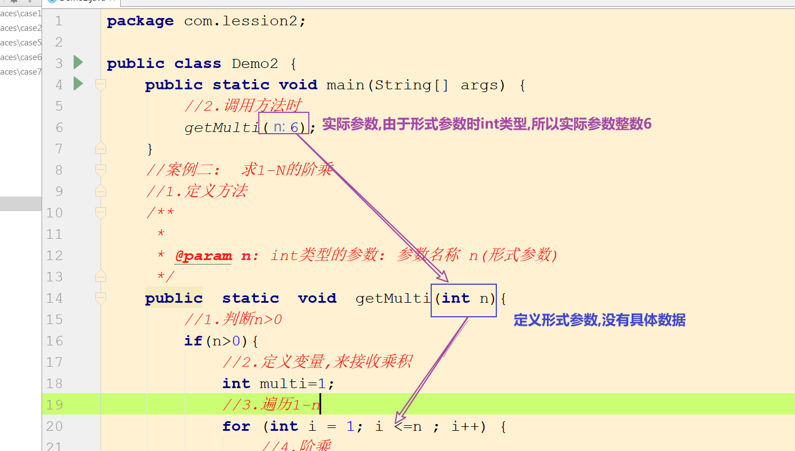
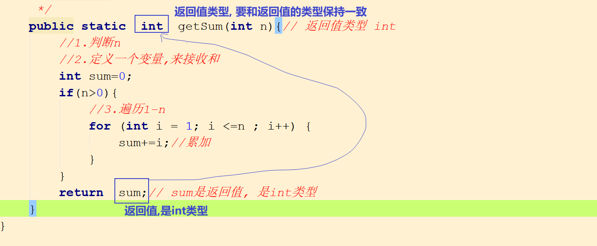
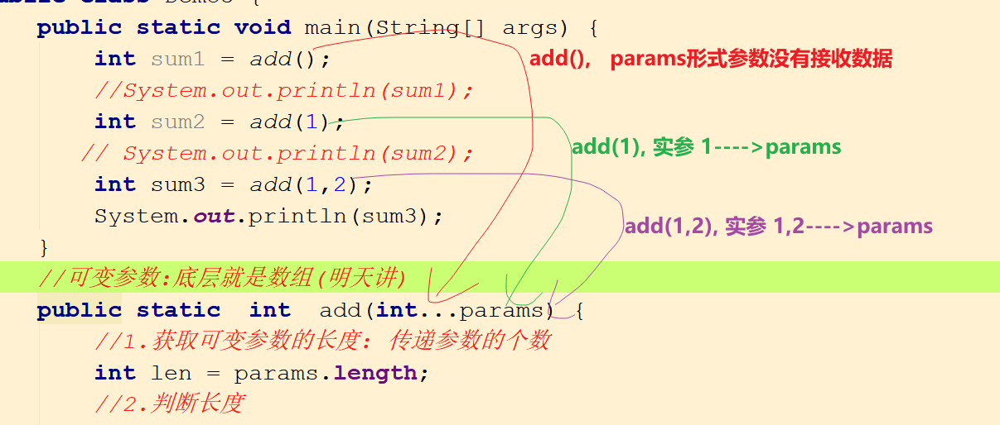
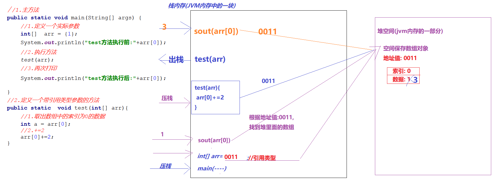

**今日内容**

1. 方法概述:方法的定义, 方法的特点

2. 方法的参数:形参, 实参

   比如:变量赋值第二种方式 **形参  int a**  ,  **实际参数 a=1**

3. 方法的返回值和返回值类型:return

4. 方法的重载: 方法的重载, 可变参数

5. 细节:成员变量和局部变量, 基本类型的变量和引用类型的变量区别

6. 综合案例

7. 扩展: 递归

# 一. 方法概述

## 1.1 方法的介绍

* 需求:  在控制台打印李白的静夜思,每个诗句后面加上10个---

  ```java
  /**
   * 问题: 代码存在冗余(重复)  System.out.println("----------");
   * 操作: 将冗余的代码(实际功能意义的代码)抽取出来,封装成一个成体
   */
  public class Demo1 {
      public static void main(String[] args) {
          //需求:  在控制台打印李白的静夜思,每个诗句后面加上10个-
          System.out.println("床前明月光");
          printSeparator();
          System.out.println("疑是地上霜");
          printSeparator();
          System.out.println("举头望明月");
          printSeparator();
          System.out.println("低头思故乡");
          printSeparator();
  
      }
  
      private static void  printSeparator() {
          for (int i = 1; i <=10 ; i++) {
              System.out.print("-");
          }
          System.out.println();
      }
  }
  ```

* 方法(method, function)介绍:

   指的将具有实际功能意义的代码抽取出来,封装成一个整体, 这个整体就是我们的方法

* 特点:

  优点: 解决了代码中的冗余问题, 可以重复使用.

* 方法的使用

  * 步骤一: 定义方法
  * 步骤二: 调用方法


## 1.2 定义方法的语法格式

* 定义语法

  ~~~~java
  //public 关键字, 修饰方法,表示方法是公共的, 可以在任意地方使用
  //static 关键字, 修饰方法, 表示方法是静态的,可以直接在main方法中使用(调用)
  //void  关键字,修饰方法, 表示方法没有返回值(返回值稍后再讲),
  //方法名称  标识符(identifier,由数字,下划线,英文字母,美元符号,不能以数字开头),方法名称的命名遵循小驼峰命名法
  public static void 方法名称(){
      
     方法体;// 实际功能意义的代码
  }
  ~~~~

* 注意事项

  1. 定义方法时,使用static修饰的,可以直接在main方法中调用
  2. 定义方法时, 位置和main同一个级别(指的定义的方法都在类的内部).
  3. 定义方法时,不要在方法内部嵌套方法.

* 案例

  案例一:  给定一个整数,判断整数是否是偶数,如果是偶数,打印true,否则打印false

  ~~~~java
  public class Demo2 {
  
      public static void main(String[] args) {
          //步骤二: 调用方法
          isEven();
      }
      //步骤一: 定义方法
      //案例一:  给定一个整数,判断整数是否是偶数,如果是偶数,打印true,否则打印false
      public static  void  isEven(){
          //1.定义一个整数
          int  number = 11;
          //2.判断
          if(number%2==0){
              System.out.println(true);
          }else {
              System.out.println(false);
          }
  
      }
      
      
  }
  ~~~~

## 1.3 案例

* 案例一:  求1-100之间的和

  ~~~~java
  public class Demo3 {
      public static void main(String[] args) {
          //2.调用方法
          getSum();
      }
      //案例一:  求1-100之间的和
      //1.定义方法
      public static  void getSum(){
          //1.定义一个变量,来接收和
          int sum = 0;
          //2.遍历
          for (int i = 0; i <=100 ; i++) {
              sum+=i;//累加
          }
          System.out.println(sum);
      }
  }
  ~~~~

* 案例二:  求1-5的阶乘

  ~~~~java
  public class Demo4 {
      public static void main(String[] args) {
          //2.调用方法
          getMulti();
      }
      //案例二:  求1-5的阶乘
      //1.定义方法
      public static void  getMulti(){
          //1.定义变量,来接收乘积
          int multi = 1;
          //2.遍历从1到5
          for (int i = 1; i <=5 ; i++) {
              multi*=i;//阶乘
          }
          //3.打印
          System.out.println(multi);
      }
  }
  ~~~~

* 案例三:  求1-100之间奇数的和(省略)


# 二. 方法的参数

* 分析: 上述案例存在的问题

  比如:  求1-100之间的和

  比如:  求1-5的阶乘

  存在的问题:  代码就写死了, 不灵活.

  提出新的需求,上述代码就不满足要求

  比如: 求1-90之间的和(比如: 1-80)

  比如: 求1-10之间的阶乘(比如: 1-20).

  解决问题: 通过给方法设置参数就可以了.

## 1.1 方法的参数概述

* 参数区分

  1. 形式参数

     形式参数在定义方法时, 在方法后面的小括号里面来使用.

     基本语法:

     ~~~~java
     public  static void 方法名称(类型 形式参数的名称){}
     
     比如: 定义一个int类型的变量 : int  a;
     形式参数的定义 和 定义变量不赋值 是一样一样的.
     ~~~~

     

  2. 实际参数

     实际参数在调用方法时, 根据定义方法的形参类型赋值

     基本语法:

     ~~~~~java
     public static void main(String[] args){
     
     	//调用方法
         方法名称(具体的数据);// 具体的数据就是实际参数. int a;   a=10;
     
     }
     ~~~~~

     

如图:


## 1.2 案例

* 如图所示:  实际参数和形式参数之间的关联

  

* 案例一:  求1-N之间的和(省略)

* 案例二:  求1-N的阶乘

  ~~~~java
  public class Demo2 {
      public static void main(String[] args) {
          //2.调用方法时
          getMulti(6);
      }
      //案例二:  求1-N的阶乘
      //1.定义方法
      /**
       *
       * @param n: int类型的参数: 参数名称 n(形式参数)
       */
      public  static  void  getMulti(int n){
          //1.判断n>0
          if(n>0){
              //2.定义变量,来接收乘积
              int multi=1;
              //3.遍历1-n
              for (int i = 1; i <=n ; i++) {
                  //4.阶乘
                  multi*=i;
              }
              //5.打印
              System.out.println(multi);
          }
  
      }
  }
  
  ~~~~

  

* 案例三: 求两个整数的和

  ~~~~java
  public class Demo1 {
      public static void main(String[] args) {
          //调用方法,赋值
          addTwo(1,10);
      }
      //案例三: 求两个整数的和
      /**定义一个带有两个整数的方法
       * @param a: 形式参数a
       * @param b: 形式参数b
       */
      public static  void addTwo(int a, int b){
          //1.求和
          int sum = a+b;
          //2.打印
          System.out.println(sum);
      }
  }
  ~~~~

  

* 案例四: 求商品打折后价格

  ~~~~java
  
  public class Demo3 {
      public static void main(String[] args) {
          //调用方法, 使用实际参数给形式参数赋值
          productPrice(100,0.5);
      }
      //案例四: 求商品打折后价格
      /**
       * 定义一个带有整数和浮点数类型的方法
       * @param sourcePrice:商品的原始价格
       * @param hu: 商品的折扣
       */
      public static  void productPrice(int sourcePrice, double hu){
          //1.求商品打折后的价格.
          double price = sourcePrice*hu;
          //2.打印
          System.out.println(price);
      }
  }
  
  ~~~~

* 案例五:  比较两个整数的大小,求较大的数据(省略)
* 案例六:  比较三个整数的大小,求较大的数据(省略)


# 三. 方法的返回值和返回值类型

* 分析: 上述商品打折案例存的问题.

  商品的折扣代码:   public static  void productPrice(int sourcePrice, double hu){----}

  需求: A商家 和 B 商家 比较他们店铺同一款商品的价格, 需要拿到商品打折后大价格

  原始代码: 存在的问题:  拿不到商品打折后的价格, 也就无法进行比较

  ```
  //1. A商家的打折价格
  productPrice(100,0.5);
  //2. B商家的打折价格
  productPrice(100,0.68);
  ```

  解决上述问题的方法: 通过设置方法的返回值

  改造上述代码:

  ~~~~java
  public class Demo4 {
      public static void main(String[] args) {
          //调用方法, 使用实际参数给形式参数赋值
          //1. A商家的打折价格
          double aPrice = productPrice(100,0.5);
          //2. B商家的打折价格
          double bPrice = productPrice(100,0.68);
          //3.可以进行比较
          if(aPrice>=bPrice){
              System.out.println("A商家的价格高了");
          }else{
              System.out.println("B商家的价格高了");
          }
      }
      //案例四: 改造求商品打折后价格
      /**
       * 定义一个带有整数和浮点数类型的方法
       * @param sourcePrice:商品的原始价格
       * @param hu: 商品的折扣
       */
      public static  double productPrice(int sourcePrice, double hu){
          //1.求商品打折后的价格.
          double price = sourcePrice*hu;
          //2.打印
          // System.out.println(price);
          //3.返回打折后的价格
          return  price;
      }
  }
  
  ~~~~

  

## 1.1 定义方法的返回值基本语法

* 方式一:

      ~~~~~java
public static  返回值类型  方法名称(形式参数){
    //1.计算后的数据是什么类型, 返回数据时,返回对应的类型
    //2. 通过return 关键字 返回数据
    return  返回值;
}
      ~~~~~

* 方式一注意:

1. 返回值是通过关键字return实现的.
2. 返回值类型 一定 和 return 后面的数据类型,保持一致.

* 方式二: 

  ~~~~java
  public static void 方法名称(形式参数){
      方法体;
      return;  //这样写, 语法行得通, 但是没有实际意义,return其实表示方法结束 
  }
  ~~~~

  ~~~~java
  public class Demo4 {
      public static void main(String[] args) {
          //test();
          test2();
      }
      //方式二
      /**
       * 虽然有return, 但是不表示方法有返回值, 只是用来结束方法的执行
       */
      public  static  void test1(){
          System.out.println("测试");
          return;
      }
  
      /**
       * 虽然没有return,那么等方法执行完成,也会正常结束
       */
      public  static  void test2(){
          System.out.println("测试");
      }
  
      /**
       * @return:方法有返回值
       */
      public  static  int test3(){
          return  1;
      }
  }
  
  ~~~~

  如图:return后面写代码报错

  

## 1.2 综合 案例

* 返回值和返回值类型(数据类型)的关联

  如图

  

* 案例一:  求1-N之间的和(省略),返回求和数据

  ~~~~java
  public class Demo1 {
      public static void main(String[] args) {
          //2.调用方法
          int sum = getSum(10);
          System.out.println(sum);
      }
      //案例一:  求1-N之间的和(省略),返回求和数据
  
      /**
       * 定义了一个带有参数,并且有返回值的方法
       * @param n:  形式参数
       * @return:  返回1-n的和
       */
      public static  int  getSum(int n){// 返回值类型 int
          //1.判断n
          //2.定义一个变量,来接收和
          int sum=0;
          if(n>0){
              //3.遍历1-n
              for (int i = 1; i <=n ; i++) {
                  sum+=i;//累加
              }
          }
          return  sum;// sum是返回值, 是int类型
      }
  }
  ~~~~

  

* 案例二:  求1-N的阶乘,返回乘积(省略)

* 案例三:  求两个整数的和,返回和(省略)

* 案例四:  比较两个数据的大小, 返回较大的数据

  ~~~~java
  public class Demo2 {
      public static void main(String[] args) {
          //2.调用方法
          double max = getMax(1.0, 3.99);
          System.out.println(max);
      }
      //案例四:  比较两个数据的大小, 返回较大的数据
  
      /**
       * 定义了两个参数的方法, 返回值类型是double
       * @param number1: double类的形式参数1
       * @param number2: double类的形式参数2
       * @return: 返回的数据类型也是double
       */
      public static  double getMax(double number1,double number2){
          //1.使用三目运算符比较
            double maxNumber  = (number1>=number2)?number1:number2;
          //2.返回较大的值
          return  maxNumber;// maxNumber是返回值,是double类型
      }
  }
  
  ~~~~

  

* 案例五: 求商品打折后的价格,并返回

  ~~~~java
  public class Demo3 {
      public static void main(String[] args) {
          //2.调用方法: 设置实际参数给形式参数赋值
          double price = getPrice(100, 0.5);
          System.out.println(price);
      }
      //案例五: 求商品打折后的价格,并返回
      /**
       *定义一个带有int和double类型的方法,返回值是double
       * @param sourcePrice: 商品的原始价格是int
       * @param hu: 商品的折扣, 是double
       * @return: 是double
       */
      public static double getPrice(int sourcePrice ,double hu){
          //1.计算商品打折后的价格
          double price = sourcePrice*hu;
          //2.返回
          return price;
      }
  }
  ~~~~


# 四. 方法的重载

## 1.1 方法重载概述

* 介绍

  方法重载指的方法名称相同, 方法的参数个数和参数类型不同.

* 特点

  1. 方法重载, 方法的名称必须相同
  2. 方法重载, 方法的参数个数可以不同
  3. 方法重载, 方法的参数类型可以不同
  4. 方法重载, 与方法是否有返回值无关

## 1.2  案例

* 案例一: 求两个数的和,并返回

* 案例二: 求三个数的和,并返回

* 案例三: 求四个数的和, 并返回

* 代码如下:

  * **存在的问题: 方法的功能都是一样的, 但是方法名称不一样,对于开发者来说, 额外增加了学习成本.**

   * **解决上述问题: 方法的重载解决上述方法名称过多的问题.**

  ```java
  /*
   * 案例一: 求两个数的和,并返回
   * 案例二: 求三个数的和,并返回
   * 案例三: 求四个数的和, 并返回
   */
  public class Demo1 {
      public static void main(String[] args) {
          
      }
      //案例一: 求两个数的和,并返回
      public static  int addTwo(int a, int b){
          return a+b;
      }
      //案例二: 求三个数的和,并返回
      public static  int addThree(int a, int b ,int c){
          return  a+b+c;
      }
      //案例三: 求四个数的和, 并返回
      public static  int addFour(int a, int b ,int c,int d){
          return  a+b+c+d;
      }
  }
  ```

* 方法重载改造上述代码

  ~~~~java
  public class Demo2 {
      public static void main(String[] args) {
          int sumTwo = add(1,2);
          int sumThree = add(1,2,3);
      }
      //功能相同, 只不过参数个数不同而已,使用方法的重载
      //1.两个参数求和的方法
      public static  int add(int a,int b){
          return  a+b;
      }
      //2.三个参数求和的方法
      public static  int add(int a,int b,int c){
          return  a+b+c;
      }
  }
  
  ~~~~

## 1.3 可变参数介入

* 分析下面代码存在的问题

  存在的问题:  仅仅因为参数个数不同, 然后定义了很多个方法.

  解决方案: 可以使用可变参数(可以是0个参数可以是1个参数, 可以是2个参数等等)

  ~~~~java
     
      //1.两个参数求和的方法
      public static  int add(int a,int b){
          return  a+b;
      }
      //2.三个参数求和的方法
      public static  int add(int a,int b,int c){
          return  a+b+c;
      }
  ~~~~

* 改造上述代码

  ~~~~~java
   public static void main(String[] args) {
          int sum1 = add();
          //System.out.println(sum1);
          int sum2 = add(1);
         // System.out.println(sum2);
          int sum3 = add(1,2);
          System.out.println(sum3);
      }
      //可变参数:底层就是数组(明天讲)
      public static  int  add(int...params) {
          //1.获取可变参数的长度: 传递参数的个数
          int len = params.length;
          //2.判断长度
          if (len > 0) {
              if (len == 1) {//指的调用方法时,传递了一个参数
                  int num = params[0];//从数组中获取数据
                  return num;
              } else {
                  int sum = 0;
                  //遍历数组
                  for (int i = 0; i < len; i++) {
                      sum += params[i];
                  }
                  return sum;
              }
  
          } else {
                  return 0;
          }
      }
  
  
  }
  
  ~~~~~

* 可变参数的参数传递流程:

  如图:

  

## 1.4 可变参数的使用

* 语法格式

  ~~~~~java
  public static void  方法名称(数据类型... 可变参数名称){
      方法体;
  }
  
  public static 返回数据类型  方法名称(数据类型... 可变参数名称){
      方法体;
      return  返回数据;
  }
  public static 返回数据类型  方法名称(数据类型 形式参数名称, 数据类型... 可变参数名称){
      方法体;
      return  返回数据;
  }
  ~~~~~

* 注意细节

  1. 可变参数在方法的参数里面有且仅有一个

  2. 可变参数在和其它参数一块使用时, 可变参数必须放在参数列表的最后面.

  3. 如图,错误的写法

     

## 

## 1.5 数组的引入(明天详细讲)

* 数组概述

  1. 介绍: 数组用来保存同一种数据类型,多个数据的"容器"

  2. 特点:
     * 1. 数组里面保存的数据类型是一样
     * 2. 数组里面可以保存多个数据
     * 3. 数组的长度是固定的

* 常的数组的创建

* 常的数组的创建

  1. 方式一:  创建一个动态数组(可以动态赋值)

     数据类型[]  数组名称 = new  数据类型[数组长度];

     或者

     数据类型  数组名称[] = new  数据类型[数组长度];

  2. 方式二: 创建一个静态数组(已经赋值了)

     数据类型[]  数组名称  = {值1, 值2, 值3,---值N};

     或者

     数据类型  数组名称[] = {值1, 值2, 值3,---值N};

* 数组的使用

  1. 数组的长度(指的数组中保存数据的个数)

  2. 数组取值和赋值

     * 索引解释,如下图

       

     * 索引:  索引指的每个数据的唯一标识, 索引是正整数,从0开始, 0表示数组中的第一个数据.

     * 取值

       数据类型  名称 = 数组对象[索引值];

     * 赋值

       数据对象[索引]= 赋的具体数据;

* 数组遍历

  ~~~~java
  /**
   * 1. 方式一:  创建一个动态数组(可以动态赋值)
      数据类型[]  数组名称 = new  数据类型[数组长度];
      数据类型  数组名称[] = new  数据类型[数组长度];
   2. 方式二: 创建一个静态数组(已经赋值了)
   数据类型[]  数组名称  = {值1, 值2, 值3,---值N};
   数据类型  数组名称[] = {值1, 值2, 值3,---值N};
   */
  public class Demo1 {
      public static void main(String[] args) {
         //1.创建一个静态数组: 长度为3
          String[] names = {"小明","小米","小雷"};
          //2.获取数组的长度:
          int len = names.length;
          System.out.println("names的数组人名个数: "+len);
          //3.遍历数组: 数组的索引从0开始的,最大索引= 数组的长度-1
          //index表示names数组的索引
          //for (int index = 0; index <=len-1 ; index++) {
          for (int index = 0; index < len ; index++) {
              //4.取出数组中的数据
              String c = names[index];
              //5.打印人名
              System.out.println(c);
          }
  
      }
  
      private static void test1() {
          //1.创建数组: scores保存3个数据
          int[] scores = new int[3];
          //2.给数组赋值
          scores[0]=90;
          scores[1]=91;
          scores[2]=92;
          //3.取值
          int firstData = scores[0];
          int twoData = scores[1];
          int threeData = scores[2];
          System.out.println(firstData);
          System.out.println(twoData);
          System.out.println(threeData);
      }
  }
  ~~~~

  

## 1.6  数组改造可变参数的案例

* 可变参数底层保存数据: 依赖的数组

  ~~~~java
  public class Demo2 {
      public static void main(String[] args) {
          //1.准备数组, 添加数据
          int[] arr = {1,2,5};
          //2.调用方法
          System.out.println(getSum(arr));
      }
      //1需求: 求多个数的和, 比如: 0个数, 1个数, 2个数, 3个数等等
      //方案一: 使用可变参数来接收多个参数
      //方案二: 使用数组来接收多个参数
      /**
       * @param numbers: int[]数组,用来接收多个参数
       * @return: 返回数组中数据的总和
       */
      public static  int getSum(int[] numbers){
          //1.获取数组的长度
          int len = numbers.length;
          //2.判断数组的长度
          if(len==0){
              //3.数组的长度为0, 说明没有传递参数, 返回 0
              return  0;
          }else{
              //4.数组的长度不为0,说明传递参数
              //5.遍历数组,累加求和
              //6.定义一个变量
              int sum =0;
              for (int index = 0; index <len ; index++) {
                  //7.取出数组中的数据
                  int num = numbers[index];
                  //8.累加求和
                  sum+=num;
              }
              return  sum;
          }
  
      }
  }
  
  ~~~~

  

# 五. 方法的细节

## 1.1 成员变量和局部变量

* 成员变量:

  定义在方法外部的变量,称之为成员变量

* 局部变量

  定义在方法内部的变量称之为局部变量.

* 成员变量和局部变量的区别(大家不用死记硬背,用的多了,自然就会了)

  1. 成员变量一般可以被权限修饰符修饰(比如public)

  2. 局部变量不可以使用权限修饰符修饰

  3. 成员变量可以在类的任意方法内部使用

  4. 局部变量不可以在其它方法内部使用

  5. 成员变量可以不用赋值,一般都有默认值

     基本类型的成员变量

     int  ,默认值是0

     double, 默认是0.0

     引用类型的变量没有赋值,默认值是null.

     注意: 不能直接打印null

  6. 局部变量必须赋值

* 补充说明

  ~~~~java
  public class Demo1 {
      //1.定义成员变量,有初始值
      public static  int a=10;
      //2.定义成员变量,没有初始值, 默认值0
      public static  int b;
      //3.成员变量不被static修饰
      public  int c=100;
      //4. 成员变量不被static修饰,不被public修饰,具体后面在讲
      int d=10;
      
      //3.主方法: main方法是被static修饰的方法, 
      // mian如果使用成员变量,
      // 情况一: 成员变量被static修饰,可以直接使用, 比如:  static  int a=10;
      // 情况二: 成员变量不被static修饰,可以直接使用, 比如: new Demo1().c
      public static void main(String[] args) {
          System.out.println(a);
          System.out.println(new Demo1().c);
      }
  }
  ~~~~

  

## 1.2 方法参数之基本类型和引用类型的区别

* 回顾基本类型

  整数类型:  byte  short  int  long

  浮点类型: float,  double 

  字符类型: char

  布尔类型: boolean

* 程序运行的流程

  *.java(源码文件)------>编译:  *.class(字节码文件)---------->直接在jvm虚拟机上运行

* JVM内存分配(先说2块内存)

  1. 栈内存:  保存要执行的方法(包含方法内部的方法体, 基本类型的局部变量,基本类型的参数等)
  2. 堆内存:  保存引用类型的对象

* 方法定义的基本类型的参数

  特点:

  **方法的参数是基本类型, 方法执行完毕,方法出栈,那么基本类型 的参数也会从栈中移除**

  如图:

  

* 方法的参数是引用类型

  特点:

  **方法的参数是引用类型, 引用类型的数据在堆空间保存, 方法执行完毕出栈,不影响引用类型 的参数.**

  


# 六 .案例


* 案例一: 

  横店群众演员花姐, 离家出走到横店,口袋里面没有拿一分钱, 到现在为止杳无音信.

  ~~~~java
  //定义: 一个没有参数没有返回值的方法
  public static void 方法名称(){
      方法体;
  }
  ~~~~

* 案例二:

  赵丽颖从邢台老家,口袋里面没有拿一分钱去横店, 回家时,给爸爸妈妈带了很多钱

  ~~~~java
  //定义: 一个没有参数, 有返回值的方法
  public  static 返回类型  方法名称(){
      方法体;
      return  返回数据;
  }
  ~~~~

  

* 案例三:

  XX从老家出发拿了很多钱, 去横店发展,到现在为止杳无音信.

  ~~~~java
  //1.定义:  一个有参数, 没有返回值的方法
  public static void 方法名称(形式参数1,----形式参数N){
      方法体;
  }
  ~~~~

* 案例四:

  王宝强从邢台老家,口袋里面拿了100钱去北影, 回家时,给爸爸妈妈带了很多钱

  ~~~~java
  //1.定义:  一个有参数, 有返回值的方法
  public static 返回类型 方法名称(形式参数1,----形式参数N){
      方法体;
      return 返回数据;
  }
  ~~~~

  

# 七. 方法递归

* 什么是递归

  简单理解: 方法递归指的在方法内部调用当前方法.

  注意细节:

  1. 不能出现无穷递归
  2. 找到递归的出口(指的递归何时结束)

  应用场景:

  企业开发中,如果需要层层去分析,要使用方法的递归.

  比如: 

  分析某个目录下面有什么文件以及子目录就要使用递归.

  如下代码

  ```java
  //无穷递归: 死循环,造成内存溢出
  public class Demo1 {
      public static void main(String[] args) {
          //调用测试方法
          test();
      }
      public  static  int count =1;
      //1.演示方法的递归调用
      public static  void test(){
          System.out.println(count++);
          //在test方法内部: 调用自己的方法
          test();
      }
  }
  ```

* 递归应用案例

  案例一:求1-100之间的和(省略)

  案例二: 求1-5的阶乘

  * 递归出口: 5, 当阶乘到5时递归结束

  * 递归时,传递的数据是1,不能递归.

  * 代码如下

    ~~~~java
    public class Demo2 {
        public static void main(String[] args) {
            //测试
            //int multi = getMulti(5);
            //System.out.println(multi);
            System.out.println(getMulti2(5));
        }
        //1.递归: 实现1*5的阶乘
        public static  int  getMulti2(int number){
                //1.判断,传递的参数是1,不能递归,错误的写法
                return number*getMulti2(number-1);//1* getMulti2(0)
    
        }
        //1.递归: 实现1*5的阶乘
        public static  int  getMulti(int number){
            //1.判断,传递的参数是1,不能递归
            if(number==1){
                return  1;
            }else{
                //2.定义一个变量来接收递归的乘积
                int mu=1;
                mu = number*getMulti(number-1);//递归
                return mu;
            }
        }
    }
    
    ~~~~

    

案例三:  不死神兔(斐波那契数列)

需求：

有一对兔子，从出生后第3个月起每个月都生一对兔子，小兔子长到第三个月后每个月又生一对兔子， 

假如兔子都不死，问第二十个月的兔子对数为多少？注意（小兔子：一公一母）

1月份，  2月份， 3月份,  4月份 ,5月份, 6月份，7月份

1		1            2       3         5           8           13----

规律:

第1个数字, 第2个数字,都是1

从第3个数字开始

数字= (n-1)+(n-2)

~~~~java
public class Demo3 {
    public static void main(String[] args) {
        //测试
        System.out.println(getCount(20));
    }
    //案例三:不死神兔

    /**
     * @param count: 表示的第几位位置的数据
     * @return
     */
    public static  int getCount(int count){
        //1.第1个数字和第2个数字,不能递归
        if(count<=2){
            return  1;
        }else{
            //2.定义一个变量来接收第count位置的数据
            int sum =0;
            sum = getCount(count-1)+ getCount(count-2);
            return sum;
        }
    }
}

~~~~


# 八. 内容总结

* 方法的定义(四种方式)掌握
* 方法形式和实际参数(掌握)
* 局部变量和成员变量(掌握)
* 方法的重载(掌握)
* 可变参数(理解)
* 数组(了解)
* 基本类型的参数和引用类型的参数的区别(了解)
* 方法的递归(掌握)


