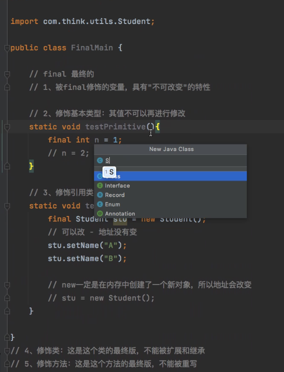
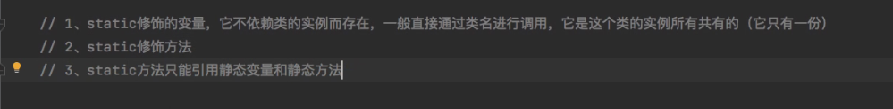

# 听课笔记

## OOP

面向对象的程序设计

面向对象三大特征：封装、继承、多态

## 继承

解决代码复用问题

父类的private属性不能继承，只能通过getter和setter方法取值和赋值

类名大写区分创建对象时的变量名

## 多态

主要是针对行为而不是属性，一个行为在不同条件下有不同的执行结果

Electricityequipment ee = new Electricityequipment();

Mobile m =(Mobile)ee;

//这样是错误的映射错误	 #cast转换

（可以这样理解子类是对父类的扩展和重写，因此父类是没有子类的特性，强转不了）

### 向上转型

是自动向上提升的，就像byte->int自动提升一样

### 向下转型


### 重载和重写的区别

==（数字大小比较，引用类型比较地址值）、equals（字符串比较），但他们两对于对象判断为false,这里重写（为了比较某些属性）了父类的equals方法


### 

重写方法（一般出现在类的继承里面）的规则：

1）、参数列表必须完全与被重写的方法相同，否则不能称其为重写而是重载。

2）、返回的类型必须一直与被重写的方法的返回类型相同，否则不能称其为重写而是重载。


### instanceof 

严格来说是Java中的一个双目运算符，用来测试一个对象是否为一个类的实例，用法为：

```java
boolean result = obj  instanceof Class
```

编译器会检查 obj 是否能转换成右边的class类型，如果不能转换则直接报错

### 短路原则

尽早让不合格的先行离开


lombok简化代码（getter和setter以及equals）的插件

## 抽象类


### final

修饰基本类型，表示是常量，不可修改

修饰类，表示类不能被继承，不可扩展

修饰引用还可以通过setXXX()修改值，但不能重新new一个对象给她 

修饰方法，表示最终版本，并不能被重写

新特性：final 修饰的变量可以在构造器中进行第一次赋值初始化



### static

静态（只有一份，只加载一次）优先，父类优先，new对象打印再构造方法打印



```java
hasNextInt()//判断下一一个输入是否是整数，如是返回TRUE
Class.forName(className).newInstance()//创建这个类的实例对象
```